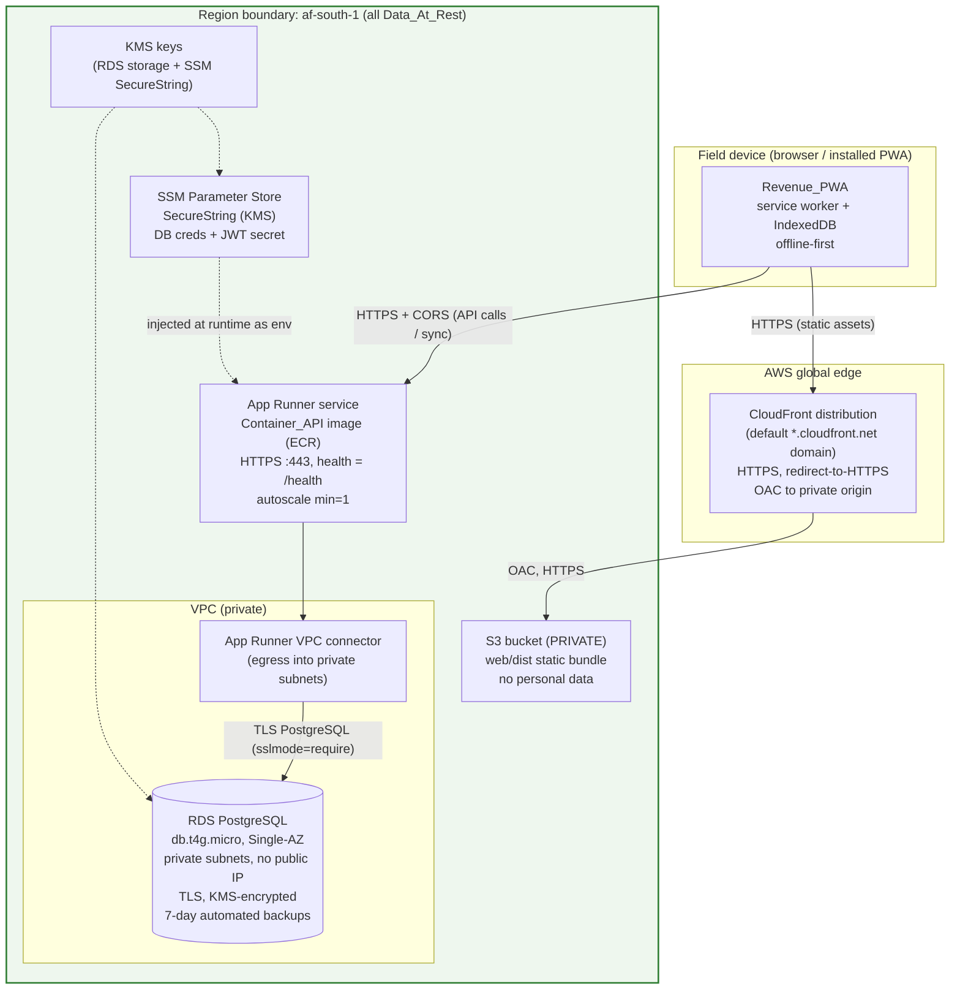

# Design Document: Spec 3.5 — Deployment

## Overview

This design specifies the **first production deployment** of the already-built FunHouse Operating System (Phase 0 pipeline, Container API, Revenue PWA) to AWS `af-south-1`, derived strictly from **PRD §3.1 (Portable Core)** and its post-credits migration table. It provisions **infrastructure, deployment, secrets, cost controls, and operability** — it adds **no new application features**.

The three shipped artifacts are deployed as-is:

| Artifact | What is deployed | How it is deployed here |
| --- | --- | --- |
| **Phase 0 pipeline** (`funhouse_pipeline/`) | 14-table schema + idempotent `run_migrations` + seed; already archives to S3 in af-south-1 over TLS | `run_migrations` is executed once as a maintenance job against RDS (Req 3) |
| **Container API** (`funhouse_api/`) | Single FastAPI Docker image; only dependency is PostgreSQL; reads all config from env (`funhouse_api/config.py`) | Runs on **App Runner** over HTTPS, DB reached privately via a **VPC connector** (Req 4, 7) |
| **Revenue PWA** (`web/`) | Static Vite build `dist/` (service worker + manifest) | Served from **S3 + CloudFront** over HTTPS (Req 6) |

**Hard portability rule (PRD §3.1).** The deployment provisions **only**: RDS for PostgreSQL, App Runner, S3 + CloudFront, and a secrets store. It provisions **no** load balancer (ALB/NLB), **no** Kubernetes/EKS, **no** ECS cluster, **no** additional managed service, and **no** monitoring beyond CloudWatch defaults (Req 12). Every AWS component has a documented non-AWS equivalent (the Migration-Equivalence Table) so that standing up Location 2 or migrating away in June 2027 is a **re-run, not a memory exercise**. Total burn at Location 1 scale must stay **under US$80/month** (Req 11).

**Phase 2 (Bedrock Lesson Engine) is gated and out of build scope.** This design only records the **cross-region model-inference residency rule** (Req 13); it builds no AI feature.

### Founder-Approved Decisions (resolving the requirements' Open Questions)

The requirements deferred six items to the founder. All six are now **decided**; each is recorded here as a documented decision and threaded through the component designs, cost table, and migration table below.

| # | Open Question (req'ts §Assumptions) | **Decision** | Rationale / cost + migration implication |
| --- | --- | --- | --- |
| D1 | API→DB connectivity / DB network exposure (Assumptions 1, 2) | **Private.** App Runner egresses through a **VPC connector** into a VPC; **RDS lives in private subnets** and is **not publicly accessible**. | The API's only outbound dependency is RDS (Bedrock/Phase 2 is gated), so **no NAT gateway is required** — **$0** extra, no extra infra. The VPC connector is a **native App Runner feature** (not a load balancer, not a new managed service), so it stays within §3.1. *If a future phase needs outbound internet (e.g. Bedrock), the change would be a NAT gateway (~US$32/mo + data) or VPC endpoints — named, not built now.* |
| D2 | Secrets store choice | **AWS SSM Parameter Store**, SecureString, **standard tier (free)**. | Chosen over Secrets Manager to minimize cost (Secrets Manager ≈ $0.40/secret/mo + API calls). Stores DB credentials + JWT secret; App Runner injects them at runtime. *Alternative if rotation is later needed: Secrets Manager — a documented swap.* |
| D3 | RDS sizing | **db.t4g.micro**, **Single-AZ**, automated backups **7-day retention**, **storage encrypted at rest (KMS)**, af-south-1. | Smallest class that supports Location 1 scale (Req 2.2). Single-AZ keeps cost low; 7-day PITR is the recoverability floor. *Scaling up = change one Terraform variable; Multi-AZ = a documented, costed upgrade.* |
| D4 | Custom domains / TLS | **Platform-default HTTPS endpoints** — App Runner default URL + CloudFront default domain. **No** custom domain / ACM / Route 53 for Location 1. | Zero DNS/cert cost and zero cert lifecycle. *Custom domains are a later, easy add: ACM cert (free) + CloudFront alias + App Runner custom domain + Route 53 (~$0.50/hosted zone/mo).* |
| D5 | CloudFront regional footprint | **Accept global edge caching** with the **S3 origin bucket in af-south-1**. S3 bucket **private**, served only via **CloudFront Origin Access Control (OAC)**; HTTPS with redirect-to-HTTPS. | POPIA governs **data at rest**, which stays in af-south-1. The static bundle carries **no personal data** (it is compiled JS/CSS/HTML), so edge replication of the *bundle* is POPIA-defensible. Documented explicitly so the residency posture is auditable. |
| D6 | IaC tool + state | **Terraform**, committed under `infra/`, idempotent/re-runnable. **Location 2 = re-apply with a different var set** (a `tfvars` file per location; workspaces optional). **State: a versioned, encrypted S3 state bucket in af-south-1** with DynamoDB-free locking via S3 native lockfile (Terraform ≥1.10) — or documented local state for a first MVP run. | Remote state in af-south-1 keeps state (which can contain resource metadata) in-region and enables a second operator to re-apply safely. The state bucket is an S3 bucket (already a §3.1 primitive), not a new managed service. *Chosen: S3 remote state; justified in the cost table (~$0).* |

> **Steering note (recommendations shown):** Every decision above carries an explicit "recommended" resolution and its alternative, per the founder's request to always show what is recommended. Because all six open questions were pre-approved, no live decision prompt is required during the design phase; any *new* genuinely-required component discovered while designing is surfaced in **§ Open Questions for Founder** rather than added silently.

## Architecture

The deployment is a **four-primitive topology**: a CDN-fronted static bucket for the PWA, a container service for the API, a private managed database, and a secret store — all data-at-rest pinned to **af-south-1**.



**Observability posture (Req 12.3):** CloudWatch **defaults only** — App Runner application/service logs and RDS default metrics land in CloudWatch automatically. **No** dashboards, alarms, custom log groups, X-Ray, or third-party monitoring are provisioned.

### End-to-end request paths

- **Static load / install (Req 6):** device → CloudFront (HTTPS) → OAC → private S3 origin → returns `index.html`, hashed JS/CSS, `manifest.webmanifest`, and the injected service worker (`sw.js`). Client-side routing 404s fall back to `index.html` (SPA fallback).
- **API / sync (Req 4, 7):** device → App Runner default HTTPS URL → FastAPI → **VPC connector** → RDS over TLS. The PWA's `ContainerApiClient` already **refuses non-HTTPS base URLs** for non-loopback hosts (`web/src/api/client.ts`), so HTTPS is enforced client- and server-side.
- **Secret hydration (Req 5):** at container start App Runner resolves SSM SecureString references into environment variables that `funhouse_api/config.py` / `funhouse_pipeline` read; no secret is baked into the image or committed.

## Components and Interfaces

### C1. Networking — VPC (minimal, D1)

- **VPC** with a small CIDR, e.g. `10.20.0.0/16`.
- **Two private subnets** in two af-south-1 AZs (`10.20.1.0/24`, `10.20.2.0/24`) — two AZs only to satisfy the RDS **DB subnet group** requirement; the instance itself is Single-AZ (D3).
- **No public subnets, no Internet Gateway, no NAT gateway** — nothing in the VPC needs outbound internet (D1). Route tables are local-only.
- **Security groups:**
  - `sg-rds` — inbound TCP 5432 **only** from `sg-apprunner-connector`; no other ingress; no public ingress.
  - `sg-apprunner-connector` — the ENIs the App Runner VPC connector creates; egress to `sg-rds:5432`.
- **App Runner VPC connector** — a native App Runner egress resource attached to the two private subnets and `sg-apprunner-connector`. This is the *only* networking primitive beyond the VPC/subnets/SGs, and it is a first-class App Runner feature, not a load balancer or managed service (stays within §3.1).

### C2. RDS PostgreSQL (Req 2, D3)

| Setting | Value | Requirement / decision |
| --- | --- | --- |
| Engine | PostgreSQL (pin a current supported major, e.g. 16.x) with `gen_random_uuid()` core support | Req 2.1; matches Phase 0 (`pgcrypto`-free) |
| Instance class | **db.t4g.micro** (2 vCPU burstable, 1 GiB) | Req 2.2 — smallest supporting Location 1 |
| Availability | **Single-AZ** | D3 (cost) |
| Storage | **gp3, 20 GiB** (baseline), autoscaling cap e.g. 50 GiB | Req 2; cost |
| Encryption at rest | **enabled (KMS CMK or aws/rds)** | Req 1.1, D3 |
| Backups | **automated, 7-day retention**, PITR on | Req 2.3, 2.4, D3 |
| Publicly accessible | **false** | D1, Req 12 |
| Subnet group | the two private subnets (C1) | D1 |
| Security group | `sg-rds` (ingress only from connector) | D1 |
| Region | **af-south-1** | Req 1, 2.5 |
| Parameter group | `rds.force_ssl = 1` (require TLS in transit) | Req 4.6, 7.2 |

The database name, master user, and password are **created by Terraform from SSM-sourced values** (see C4) — never inline literals in the repo (Req 5.2, 5.4).

### C3. App Runner service (Req 4, D1, D4)

| Setting | Value | Requirement / decision |
| --- | --- | --- |
| Image source | the **existing Container_API image in Amazon ECR** (private repo `funhouse-api`) | Req 4.1 |
| Access role | App Runner **access role** to pull from ECR | supports image pull (Assumption 1 resolved: ECR + access role, both §3.1-native) |
| Port | container listens on the API port (e.g. 8000); App Runner fronts it on **:443 HTTPS** | Req 4.2 |
| Protocol | **HTTPS only** via the default `*.awsapprunner.com` domain (TLS managed by App Runner) | Req 4.2, 4.3, D4 |
| Health check | HTTP path **`/health`** (public, no DB access — see `funhouse_api/health.py`) | Req 4; liveness even when DB down |
| Networking | **VPC connector** egress (C1) so it can reach private RDS | Req 4.5, 7.2, D1 |
| Instance role | IAM role granting `ssm:GetParameters` + `kms:Decrypt` for the SecureString params | Req 5.3 |
| Env / secrets | plain env vars + **SSM SecureString references** (see C4/Data Models) | Req 4.4, 5.1, 5.3 |
| Autoscaling | **min instances = 1** (accept warm baseline for predictable sync latency), max small (e.g. 2) | Req 11 cost — biggest single lever |
| Region | af-south-1 | Req 1 |

**HTTPS enforcement (Req 4.3):** App Runner's default endpoint is HTTPS-only; there is no plaintext listener to redirect from. As an in-app backstop the API's existing TLS-required middleware (`TLS_REQUIRED=true`, inspecting `X-Forwarded-Proto`) rejects any non-HTTPS-forwarded request.

### C4. Secrets — SSM Parameter Store (Req 5, D2)

- **Parameters** (SecureString, KMS-encrypted, standard tier, af-south-1), namespaced per location:

  | Parameter name | Type | Holds |
  | --- | --- | --- |
  | `/funhouse/loc1/db/password` | SecureString | RDS master password |
  | `/funhouse/loc1/db/user` | SecureString | RDS master user |
  | `/funhouse/loc1/jwt/secret` | SecureString | API JWT signing secret |
  | `/funhouse/loc1/db/host` | String | RDS endpoint (non-secret, convenience) |
  | `/funhouse/loc1/db/name` | String | database name |

- **Injection:** App Runner references these by ARN in its service config; the instance IAM role permits `ssm:GetParameters` + `kms:Decrypt`. Values are resolved into env vars at container start (Req 5.3).
- **Terraform references the parameter ARNs, never inline secret values** (Req 5.4). The secret *values* are seeded out-of-band (runbook step) or via `-var` at first apply and are **not** committed (Req 5.2). The `.gitignore` already excludes `*.tfvars` holding secrets.

### C5. S3 + CloudFront static hosting (Req 6, D5)

- **S3 bucket** (af-south-1, Req 6.3): **private** (Block Public Access on), holds the contents of `web/dist/` — hashed assets, `index.html`, `manifest.webmanifest`, `sw.js`, icons. Default SSE-S3 encryption.
- **CloudFront distribution** (D4, D5):
  - Default `*.cloudfront.net` domain, **Viewer Protocol Policy = redirect-to-HTTPS** (Req 6.2, 6.5).
  - **Origin Access Control (OAC)** — the S3 bucket policy grants read only to this distribution; no public S3 access.
  - **SPA fallback:** custom error responses map `403`/`404` → `/index.html` with HTTP 200, so the client router handles deep links.
  - **Cache behavior:** long-lived cache for hashed assets; **`sw.js` and `index.html` served with no-cache / short TTL** so PWA updates propagate (the SW uses `registerType: autoUpdate`).
  - Service worker + manifest published so the PWA is **installable** (Req 6.4).

### C6. Schema application via `run_migrations` (Req 3)

Schema is applied by **executing the repository's own `run_migrations`** (`funhouse_pipeline/db/migrations.py`), **never** hand-authored SQL (Req 3.1). It is idempotent by construction (`CREATE TABLE IF NOT EXISTS`, `DROP CONSTRAINT IF EXISTS`), so re-runs converge to the same schema (Req 3.2), including the additive `003_role_facilitator.sql`.

**Execution model — one-off, repeatable maintenance job:**

1. The operator runs a short migration entry-point from a **maintenance context that can reach the private RDS** — options, in preference order:
   - **(recommended)** a temporary run **from within the VPC** (e.g. an ephemeral small task/instance, or a bastion-less SSM session on a throwaway host) so the private RDS is reachable; torn down immediately after; **or**
   - a **one-time Terraform `null_resource`/local-exec** that opens a temporary connection path, gated behind a flag, documented as teardown-after-use.
2. DB credentials are pulled from **SSM SecureString** (never typed inline), assembled into the standard libpq DSN via the reused `DatabaseConfig.dsn()` with `DB_SSLMODE=require`.
3. A tiny wrapper (documented in the runbook, e.g. `python -m funhouse_pipeline.db.apply_migrations` or an inline `python -c` calling `connect()` + `run_migrations(conn)`) applies all `sql/*.sql` and prints the created/already-present report.

Because the private-RDS reachability for this one-off is the only place a temporary in-VPC step is needed, and it uses **no new standing service**, it stays within §3.1. See **§ Open Questions for Founder** if the founder prefers to avoid any temporary in-VPC compute.

### Config / secret flow (Req 4.4, 5, 7.3)

The container reads **only environment variables** (`funhouse_api/config.py` + reused `funhouse_pipeline/config`). Exact mapping:

| Env var | Source | Secret? | Purpose |
| --- | --- | --- | --- |
| `JWT_SECRET` | SSM `/funhouse/loc1/jwt/secret` | **SecureString** | JWT HS256 signing (Req 5.1) |
| `DB_PASSWORD` | SSM `/funhouse/loc1/db/password` | **SecureString** | RDS auth (Req 5.1) |
| `DB_USER` | SSM `/funhouse/loc1/db/user` | SecureString | RDS auth |
| `DB_HOST` | SSM `/funhouse/loc1/db/host` (or Terraform output) | plain | RDS endpoint |
| `DB_PORT` | App Runner env | plain | `5432` |
| `DB_NAME` | SSM `/funhouse/loc1/db/name` | plain | database |
| `DB_SSLMODE` | App Runner env | plain | **`require`** → TLS to RDS (Req 4.6, 7.2) |
| `TLS_REQUIRED` | App Runner env | plain | **`true`** → API rejects non-HTTPS (Req 4.3) |
| `JWT_TTL_SECONDS`, `ALERT_EXPIRY_HORIZON_DAYS`, `LOCATION_TIMEZONE` | App Runner env | plain | app tuning (defaults fine) |
| `AWS_REGION` | App Runner env | plain | `af-south-1` |
| `FUNHOUSE_CORS_ORIGINS` (new env, see below) | App Runner env | plain | allow the CloudFront PWA origin |

**CORS (Req 7.3):** the PWA origin (`https://<dist-id>.cloudfront.net`) differs from the API origin (`https://<svc-id>.awsapprunner.com`), so the API must send `Access-Control-Allow-Origin` for the PWA origin. The API's FastAPI app configures CORS from an env-supplied allowlist (the CloudFront domain), set by Terraform after the distribution is created. **Circular-reference note:** App Runner and CloudFront each need the other's default domain (App Runner for CORS; the PWA build for its API base URL). Resolution order in the runbook: (1) create App Runner → get its URL, build/publish the PWA against it; (2) create CloudFront → get its domain; (3) update App Runner's `FUNHOUSE_CORS_ORIGINS` env with the CloudFront origin (a cheap App Runner config update, no rebuild).

## Data Models

This is an infrastructure spec; the "data models" are the **declarative resource specifications** and the **config contract**, not application entities. The application schema (14 tables) is **unchanged** and applied verbatim by `run_migrations` (C6).

### Terraform resource model (logical)

```
module "network"   -> aws_vpc, aws_subnet[private x2], aws_route_table,
                       aws_security_group.rds, aws_security_group.connector,
                       aws_apprunner_vpc_connector
module "database"  -> aws_db_subnet_group, aws_db_parameter_group(force_ssl),
                       aws_kms_key.rds (optional CMK), aws_db_instance (t4g.micro, single-AZ,
                       7-day backups, encrypted, publicly_accessible=false)
module "secrets"   -> aws_ssm_parameter[SecureString: db_password, db_user, jwt_secret],
                       aws_ssm_parameter[String: db_host, db_name], aws_kms_key.ssm (optional)
module "api"       -> aws_ecr_repository (or data source), aws_iam_role.apprunner_access,
                       aws_iam_role.apprunner_instance (ssm+kms), aws_apprunner_service
module "web"       -> aws_s3_bucket (private, af-south-1), aws_s3_bucket_public_access_block,
                       aws_cloudfront_origin_access_control, aws_cloudfront_distribution,
                       aws_s3_bucket_policy (OAC read)
backend "s3"       -> versioned, encrypted state bucket in af-south-1 (D6)
```

**Per-location variables** (`locations/loc1.tfvars`, `locations/loc2.tfvars`): `location_slug`, `region=af-south-1`, `db_instance_class`, `vpc_cidr`, `apprunner_min_instances`, `ssm_prefix`. Location 2 = `terraform apply -var-file=locations/loc2.tfvars` (Req 8.4).

## Correctness Properties / Verification

*A property is a characteristic that should hold true across all valid executions of the system.* For an **infrastructure** deliverable, most acceptance criteria are **not** input-varying logic, so — mirroring how the funhouse-api design marked deployment/config items as **SMOKE/config checks** — verification is framed as **(a) the Smoke-Test Checklist, (b) Terraform plan/config assertions, and (c) plan-idempotency**, not property-based tests over generated inputs.

### Verification prework (per requirement)

| Req | Verifies | Classification | Verification method |
| --- | --- | --- | --- |
| 1 Residency af-south-1 | every Data_At_Rest resource in af-south-1 | **CONFIG-ASSERT** | Plan/state assertion: every S3/RDS/backup/SSM resource has `region`/provider = af-south-1 |
| 2 RDS provisioning/backups | class, single datastore, backups, retention | **CONFIG-ASSERT + SMOKE** | Assert `instance_class`, `backup_retention_period=7`, `storage_encrypted=true`; one describe-DB check |
| 3 Schema via `run_migrations` | idempotent, no hand SQL, documented cmd | **PROPERTY (already owned by Phase 0) + SMOKE** | Idempotency is already property-tested in `tests/test_schema_properties.py`; deployment adds a smoke run against RDS |
| 4 App Runner HTTPS | hosted, HTTPS-only, env, TLS to DB | **SMOKE + CONFIG-ASSERT** | Curl `/health` over HTTPS; assert HTTPS-only + VPC connector + `sslmode=require` |
| 5 Secrets | in SSM, not in repo, injected | **CONFIG-ASSERT + SMOKE** | grep repo for secret literals (none); assert SecureString + IAM; container reads env at boot |
| 6 PWA S3/CloudFront | HTTPS, af-south-1 origin, installable | **SMOKE + CONFIG-ASSERT** | Load app over HTTPS; assert redirect-to-HTTPS, private bucket+OAC, manifest/sw published |
| 7 End-to-end connectivity | every hop encrypted, CORS | **SMOKE** | Smoke-Test Checklist login→sync→read-back; CORS preflight succeeds |
| 8 Reproducible setup | IaC committed, idempotent, provisions all | **PLAN-IDEMPOTENCY** | `terraform apply` twice → second plan = "No changes" |
| 9 Runbook | end-to-end, teardown, secrets | **REVIEW** | Checklist review that a non-founder can follow |
| 10 Smoke-test checklist | login/offline/sync/read-back, expected results | **REVIEW + EXECUTE** | Execute the checklist |
| 11 Cost ceiling | per-component, sum < $80 | **REVIEW** | Cost table sums < $80 (§ Cost Estimate) |
| 12 Portability/no-extra | only §3.1 services, no ALB/EKS/ECS, CW defaults | **CONFIG-ASSERT** | "No forbidden services" plan scan; Migration-Equivalence Table complete |
| 13 Cross-region inference rule | data-at-rest in af-south-1; documented rule | **CONFIG-ASSERT + DOC** | Residency assertion (Req 1) + documented rule present |

### Verification properties (config/plan-level, not PBT)

- **V1 — Residency assertion.** *For every* resource that stores Data_At_Rest (RDS instance, RDS automated backups, S3 bucket, SSM parameters, any data-bearing log group), its region resolves to **af-south-1**. Machine-checkable over the Terraform plan/state. **Validates: Req 1.1, 1.2, 5.5, 6.3, 13.1**
- **V2 — Plan idempotency.** *For any* already-applied environment, a second `terraform plan` reports **no changes** (re-run = no-op), matching the idempotency of `run_migrations`. **Validates: Req 8.2**
- **V3 — No forbidden services.** *For the whole* plan, there exists **no** resource of type load balancer (`aws_lb`/ELB/`aws_alb`), EKS (`aws_eks_*`), ECS (`aws_ecs_*`), or any managed service outside {RDS, App Runner, S3, CloudFront, SSM, plus the VPC/IAM/KMS/ECR primitives they require}; **no** CloudWatch alarms/dashboards are declared. **Validates: Req 12.1, 12.2, 12.3**
- **V4 — Encryption everywhere.** *For every* hop and store: RDS `storage_encrypted=true`; RDS `force_ssl=1`; App Runner endpoint HTTPS-only; CloudFront redirect-to-HTTPS; S3 private + OAC; SSM SecureString. **Validates: Req 1, 4.2, 4.3, 4.6, 6.2, 6.5, 7.2, 7.4**

These are asserted via **plan/state review and a small assertion script** (e.g. `terraform show -json` parsed for the above), not Hypothesis. **PBT is explicitly not used here** because the resources are declarative configuration whose behavior does not vary with generated inputs — running 100 iterations of a plan check adds no coverage over one (consistent with the funhouse-api design's SMOKE/config treatment of deployment items).

## Error Handling / Operational Concerns

| Condition | Handling |
| --- | --- |
| **Failed migration** (`run_migrations` errors mid-apply) | Statements run in a transaction/committed only on success; failure raises before commit → no partial schema. Operator re-runs after fixing connectivity/creds; idempotency makes re-run safe (Req 3.2). Runbook documents reading the created/already-present report. |
| **App Runner deploy failure** | App Runner's **default rollback**: a failed deployment (image pull or failing health check on `/health`) does **not** replace the running version; the previous healthy version keeps serving. Operator inspects CloudWatch service logs, fixes, redeploys. No manual traffic shifting (no LB). |
| **RDS unavailable** (maintenance, reboot, storage) | `/health` stays green (no DB access) so App Runner keeps the instance; DB-backed endpoints return 5xx until RDS returns. Single-AZ means a brief window during maintenance; 7-day PITR covers data-loss recovery. Documented as an accepted Location-1 trade-off (Multi-AZ is a costed upgrade). |
| **Secret missing / unreadable** | Container fails fast at startup (config load) or on first DB connect; App Runner rollback keeps the prior version. Runbook: verify SSM parameter names + instance-role `ssm:GetParameters`/`kms:Decrypt`. |
| **CloudFront serving stale PWA after redeploy** | Redeploy = sync `web/dist/` to S3 **then create a CloudFront invalidation** (`/index.html`, `/sw.js`, and `/*` if needed). Hashed assets are content-addressed so only `index.html`/`sw.js` need invalidation; `autoUpdate` SW then pulls the new bundle. Runbook includes the invalidation command. |
| **Terraform state conflict / partial apply** | Remote S3 state with lockfile (D6) prevents concurrent applies; a partial apply is resumed by re-running `apply` (idempotent). |

## Cost Estimate (Location 1, af-south-1, monthly) — Req 11

Figures are realistic af-south-1 estimates at Location-1 scale (single site, light traffic). af-south-1 carries a modest premium over us-east-1; values are rounded conservatively (upper-ish) to keep the ceiling honest.

| Component | Configuration | Est. USD/mo |
| --- | --- | --- |
| **RDS PostgreSQL** | db.t4g.micro, Single-AZ, on-demand | ~$16 |
| **RDS storage** | gp3, 20 GiB | ~$3 |
| **RDS backups** | ~20 GiB within/near free backup allotment; small overage buffer | ~$1 |
| **App Runner** | 1 provisioned+active instance (0.25 vCPU / 0.5 GB baseline), min=1, light requests | ~$25–35 |
| **S3 (static bundle)** | <1 GiB storage + minimal requests | ~$0.50 |
| **CloudFront** | low traffic, few GB egress + requests (largely within free tier) | ~$1–3 |
| **SSM Parameter Store** | standard tier SecureString | **$0** |
| **KMS** | ~1–2 CMKs @ ~$1/key (or use AWS-managed keys @ $0) | ~$1–2 |
| **VPC connector** | native App Runner egress | **$0** |
| **NAT gateway** | **not provisioned** (no outbound internet need) | **$0** |
| **S3 Terraform state** | tiny bucket, versioned | ~$0.10 |
| **CloudWatch** | defaults only, low volume (mostly free tier) | ~$0–1 |
| **Total** | | **≈ $48–62 / mo** |

**Under the US$80 ceiling** (Req 11.2). **Biggest cost sensitivities:** (1) **App Runner min instances** — keeping `min=1` is the single largest line; dropping to scale-to-zero would cut cost but add cold-start latency to sync (a documented trade-off). (2) **RDS storage growth** — gp3 scales linearly; monitor and adjust the `db_allocated_storage` variable. If a future change pushes the sum toward the ceiling, it is recorded as an open question (Req 11.3) rather than absorbed silently.

## Migration-Equivalence Table (Req 12.4, 12.5) — ties to PRD §3.1 post-credits migration table

| AWS component (this deployment) | Documented non-AWS equivalent | Migration action (June 2027 / Location 2 off-AWS) |
| --- | --- | --- |
| **RDS for PostgreSQL** | Any managed Postgres (e.g. a VPS provider's managed PG) **or** self-hosted PostgreSQL | Point `DB_HOST`/`DB_*` env at the new server, `DB_SSLMODE=require`, run `run_migrations` + `seed`. No code change. |
| **App Runner** | Any **Docker host / VPS** + a reverse proxy (Nginx/Caddy) for TLS termination | `docker run` the same image; proxy terminates TLS; set the same env vars (secrets from host env/Vault). |
| **S3 + CloudFront** | Any **object store + CDN**, or an Nginx static host | `rsync web/dist/` to the host/bucket; front with the CDN/Nginx; enable HTTPS (Let's Encrypt). |
| **SSM Parameter Store** | **Host environment variables / `.env`** (uncommitted) or **HashiCorp Vault** | Recreate the same keys as env/Vault entries; App/proxy read them at boot. |
| **CloudWatch (defaults)** | **Host/container logs** (`docker logs`, journald) | No app change; logs go to the host log system. |
| **VPC connector + private subnets** | Host-local networking / firewall rules (DB reachable only from the app host) | Firewall the DB to the app host; no managed connector needed. |
| **KMS** | Provider-managed disk encryption / LUKS | Enable volume encryption on the host/DB. |
| **ECR** | Any container registry (Docker Hub, GHCR, self-hosted registry) | Push the same image; pull on the host. |

Because the Container_API depends only on a **standard libpq DSN via env** and runs auth in-process (per the funhouse-api Migration Note), the whole migration is **env changes + a re-run of `run_migrations`**, not a rewrite.

## Deliverable Designs

### (a) Terraform IaC — `infra/` structure

```
infra/
  README.md                 # how to init/plan/apply, prerequisites
  backend.tf                # S3 remote state (af-south-1, versioned, encrypted) [D6]
  providers.tf              # aws provider pinned to af-south-1
  variables.tf              # shared variable declarations
  main.tf                   # module wiring
  outputs.tf                # apprunner_url, cloudfront_domain, rds_endpoint, ssm ARNs
  modules/
    network/                # VPC, private subnets, SGs, VPC connector (C1)
    database/               # RDS + subnet group + parameter group + KMS (C2)
    secrets/                # SSM SecureString/String params + KMS (C4)
    api/                    # ECR ref, IAM roles, App Runner service (C3)
    web/                    # S3 (private) + CloudFront + OAC + bucket policy (C5)
  locations/
    loc1.tfvars             # Location 1 variable set
    loc2.tfvars             # Location 2 variable set (re-apply target) [Req 8.4]
  scripts/
    assert_residency.sh     # V1: parse `terraform show -json`, fail if any store not af-south-1
    assert_no_forbidden.sh  # V3: fail if plan contains LB/EKS/ECS/extra managed services
```
Idempotent and re-runnable (Req 8.1, 8.2); provisions RDS, App Runner, S3+CloudFront, and SSM (Req 8.3); Location 2 is a second `-var-file` apply (Req 8.4).

### (b) Deployment Runbook — `docs/deployment-runbook.md` (Req 9)

Ordered, non-founder-followable sections, each with exact commands and expected output:

1. **Prerequisites** — AWS creds/region, Terraform ≥1.10, Docker, built `web/dist/`, built API image.
2. **Seed secrets** — create SSM SecureString values (db password, jwt secret) via CLI (values never committed) (Req 9.3).
3. **Provision** — `terraform init` (S3 backend), `apply -var-file=locations/loc1.tfvars`; capture outputs (Req 9.2).
4. **Publish API image** — build + push to ECR; App Runner deploys the image.
5. **Apply schema** — run `run_migrations` against RDS from the documented maintenance context, creds from SSM, `sslmode=require`; verify created/already-present report (Req 3.3, 9.2).
6. **Publish PWA** — build `web/` against the App Runner HTTPS URL; `aws s3 sync web/dist/ s3://<bucket>`; create CloudFront invalidation (Req 9.2).
7. **Wire CORS** — set App Runner `FUNHOUSE_CORS_ORIGINS` to the CloudFront origin (config update).
8. **Verify** — run the Smoke-Test Checklist (c).
9. **Teardown** — `terraform destroy -var-file=...`; delete SSM secret values; empty+remove S3 buckets; confirm nothing lingers (Req 9.4).

### (c) Smoke-Test Checklist — `docs/smoke-test-checklist.md` (Req 10)

Each step states the **exact action** and the **unambiguous expected result** (pass/fail):

| # | Step | Action | Expected result (pass) |
| --- | --- | --- | --- |
| 1 | **Load PWA over HTTPS** | Open the CloudFront URL | App loads over `https://`; `http://` redirects to `https://`; installable (manifest + SW registered) — Req 6 |
| 2 | **Login** | Authenticate against the live API via the PWA | 200 + JWT stored; protected view renders — Req 10.2 |
| 3 | **Offline capture** | Disable network; capture a record in the PWA | Record queued locally (IndexedDB); UI confirms offline capture — Req 10.3 |
| 4 | **Sync** | Re-enable network; trigger/allow background sync | `POST /sync` returns 200 with the action `applied` — Req 10.4 |
| 5 | **Read-back** | Query the record through the API (e.g. player/history/roster) | The synced record is returned by the API, matching what was captured — Req 10.5 |
| 6 | **CORS** | Observe the cross-origin API call from the CloudFront origin | Browser makes the call without CORS error (preflight allowed) — Req 7.3 |

Step 6 makes the PASS criterion for each hop observable and unambiguous (Req 10.6).

## Bedrock Cross-Region Model-Inference Residency Rule (Req 13)

- **Rule (in force now):** **All Data_At_Rest remains in af-south-1** regardless of any future model-inference configuration (Req 13.1). This deployment provisions **no** Bedrock and **no** cross-region path.
- **Phase 2 is gated / out of scope:** the Lesson Engine using Amazon Bedrock is not built here; this section records the governing rule only (Req 13.4).
- **If cross-region inference is ever required:** it MUST be a **named, POPIA-justified documented decision** that (a) names the chosen inference region, (b) states exactly **which data transits** the region boundary and why, and (c) explains why the arrangement remains POPIA-defensible (Req 13.2, 13.3).
- **Candidate to name later (not built):** at time of writing Amazon Bedrock is not offered in af-south-1; should Phase 2 proceed, the nearest/appropriate Bedrock region (e.g. an EU region such as `eu-central-1`, or another region with the required Claude model availability) would be the **candidate to evaluate and name** in that future decision — recorded here only so the future decision has a documented starting point, with **no** infrastructure built now. Enabling it would also require the outbound-internet change noted in D1 (NAT gateway/VPC endpoints, costed then).

## Open Questions for Founder

Only surfaced items that could touch §3.1 beyond the six resolved decisions; nothing is added silently (Req 12.6).

1. **Schema-migration execution context (C6).** Applying `run_migrations` to a **private** RDS requires momentary in-VPC reachability (an ephemeral throwaway host/task, torn down after). This uses **no standing service** and is $0 ongoing, but it is a temporary compute touch. **Recommended:** the ephemeral in-VPC one-off (simplest, no standing infra). *Alternative if the founder wants zero temporary compute:* temporarily flip RDS to publicly-accessible behind a locked security group for the single migration then flip back (weakens the private posture briefly) — **not recommended**. Confirm the recommended approach.
2. **KMS CMK vs AWS-managed keys.** Using dedicated CMKs adds ~$1/key/mo but gives explicit key policies/rotation; AWS-managed keys are $0. **Recommended:** AWS-managed keys for Location 1 (cost), CMK later if audit requires. Confirm.

*(Both are within §3.1; they are raised only because they sit near the private-networking / cost edges.)*

## Requirements Coverage Summary

- **Residency (1, 13):** af-south-1 pinned for all stores; V1 residency assertion; cross-region rule documented; **Decisions D1, D5**.
- **RDS (2):** db.t4g.micro, Single-AZ, 7-day backups, encrypted, private — **D3**; C2.
- **Schema (3):** `run_migrations` one-off, idempotent — C6; Phase 0 already property-tests idempotency.
- **API hosting (4, 7):** App Runner HTTPS + VPC connector + TLS to RDS + CORS — C3, config flow; **D1, D4**.
- **Secrets (5):** SSM SecureString, injected, never committed — C4; **D2**.
- **PWA (6):** S3 private + CloudFront OAC + redirect-to-HTTPS + SPA fallback + SW/manifest — C5; **D4, D5**.
- **Reproducible setup (8):** Terraform `infra/`, idempotent, per-location tfvars — Deliverable (a); **D6**; V2 plan-idempotency.
- **Runbook (9) / Smoke test (10):** Deliverables (b), (c).
- **Cost (11):** per-component table, ≈$48–62 < $80.
- **Portability / no-extra (12):** Migration-Equivalence Table; V3 no-forbidden-services; CloudWatch defaults only.

---

*This document is the Design phase artifact of the requirements-first workflow for Spec 3.5 — Deployment. Next phase (on approval): the implementation task list (`tasks.md`).*
