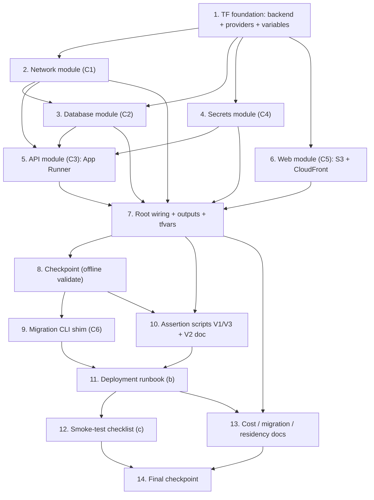

# Implementation Plan: Spec 3.5 — Deployment

## Overview

This plan produces the **committed, reproducible deliverables** for the first production deployment of the already-built FunHouse Operating System to AWS `af-south-1`, strictly within PRD §3.1 (Portable Core). The build artifacts are entirely in-repo: **Terraform IaC** under `infra/`, a **deployment runbook** and **smoke-test checklist** under `docs/`, the **verification assertion scripts**, and a **thin migration CLI shim** that reuses the existing Phase 0 DB layer.

The guiding principle is **reproducible-artifacts, not live provisioning**: no task requires live AWS credentials to *complete*. Every task authors Terraform, shell, markdown, or a small Python shim in this repository. The actual `terraform apply`, ECR push, SSM secret seeding, and end-to-end smoke run against a real account are **founder-run runbook steps** — this plan produces the procedure and the machine-checkable assertions, not the live execution.

Two founder decisions are **locked** and threaded through the tasks:

- **Migration execution:** an **ephemeral in-VPC one-off** runs `run_migrations` against the private RDS, then is torn down — no standing service (Design C6, Open Question 1 recommended).
- **KMS:** **AWS-managed keys** for Location 1 (`aws/rds`, `aws/ssm`) — no dedicated CMKs (Design Open Question 2 recommended).

Each task builds incrementally: remote state and providers first, then the five component modules (C1–C5) in dependency order, then root wiring and outputs, then the migration shim, then the verification scripts, then the runbook and smoke-test checklist, then the supporting cost/portability/residency docs. Optional (`*`) verification sub-tasks are all runnable **without a live AWS account** (`terraform fmt -check`, `terraform validate`, `shellcheck`, dry-runs against a fixture, and markdown review checklists).

Because this is an **infrastructure/deployment** spec whose resources are declarative configuration, verification follows the design's V1–V4 config/plan-level assertions and Smoke-Test/review methods — **not** property-based tests (see Design → Correctness Properties / Verification).

## Tasks

- [x] 1. Terraform foundation: remote state, provider pinning, shared variables
  - [x] 1.1 Author `infra/backend.tf` (S3 remote state)
    - Configure an S3 backend in **af-south-1** with a **versioned, encrypted** state bucket and native S3 lockfile locking (Terraform ≥1.10, no DynamoDB); document the local-state fallback for a first MVP run in a comment
    - _Requirements: 1.1, 8.1_ (Design: D6; Deliverable (a) `backend.tf`)
  - [x] 1.2 Author `infra/providers.tf` and `infra/variables.tf`
    - Pin the `aws` provider `region = "af-south-1"` and a supported provider version; declare shared variables (`location_slug`, `region`, `db_instance_class`, `db_allocated_storage`, `vpc_cidr`, `apprunner_min_instances`, `apprunner_max_instances`, `ssm_prefix`)
    - _Requirements: 1.2, 8.1, 8.3_ (Design: Deliverable (a) `providers.tf`, `variables.tf`; Data Models → Per-location variables)
  - [x] 1.3 Author `infra/README.md` (init/plan/apply prerequisites)
    - Document prerequisites (AWS creds/region, Terraform ≥1.10) and the `init` → `plan` → `apply -var-file=...` flow; note that Location 2 is a second `-var-file` apply
    - _Requirements: 8.1, 8.4_ (Design: Deliverable (a) `README.md`)
  - [x]* 1.4 Offline format/validate check of the foundation
    - Run `terraform fmt -check` and `terraform init -backend=false && terraform validate` (no apply, no credentials) against the root once modules are stubbed
    - _Requirements: 8.1_ (Design: V2 setup; runnable without a live AWS account)

- [x] 2. Network module (C1): private VPC, subnets, security groups, VPC connector
  - [x] 2.1 Author `infra/modules/network/`
    - Create `aws_vpc` (`vpc_cidr`), **two private subnets** in two af-south-1 AZs (DB subnet-group requirement), local-only route tables, **no IGW / no NAT / no public subnet**; security groups `sg-rds` (ingress TCP 5432 only from the connector SG) and `sg-apprunner-connector`; the `aws_apprunner_vpc_connector` attached to both subnets
    - _Requirements: 4.5, 7.2, 12.1, 12.2_ (Design: C1; D1)
  - [x]* 2.2 Config-assert the no-egress, private posture
    - `terraform validate` the module; assert (by review/`grep` of the module) that no `aws_internet_gateway`, `aws_nat_gateway`, or public subnet is declared
    - _Requirements: 12.1, 12.2_ (Design: V3 no-forbidden-services)

- [x] 3. Database module (C2): RDS PostgreSQL, private, encrypted, backed up
  - [x] 3.1 Author `infra/modules/database/`
    - Create `aws_db_subnet_group` (the two private subnets), `aws_db_parameter_group` with `rds.force_ssl = 1`, and `aws_db_instance`: `db.t4g.micro`, **Single-AZ**, gp3 storage (`db_allocated_storage`, autoscaling cap), `storage_encrypted = true` using the **AWS-managed `aws/rds` key** (no CMK — locked decision), `backup_retention_period = 7`, `publicly_accessible = false`, `sg-rds`, PostgreSQL 16.x, af-south-1; source DB name/user/password from SSM-provided values (module inputs), never inline literals
    - _Requirements: 1.1, 2.1, 2.2, 2.3, 2.4, 2.5, 4.6, 7.2_ (Design: C2; D3; KMS = AWS-managed, locked)
  - [x]* 3.2 Config-assert RDS settings
    - Assert (review or a plan-level check) `instance_class = db.t4g.micro`, `backup_retention_period = 7`, `storage_encrypted = true`, `publicly_accessible = false`, and `rds.force_ssl = 1`
    - _Requirements: 2.2, 2.3, 2.4_ (Design: V4 encryption-everywhere)

- [x] 4. Secrets module (C4): SSM Parameter Store entries
  - [x] 4.1 Author `infra/modules/secrets/`
    - Create SSM **SecureString** parameters (`{ssm_prefix}/db/password`, `/db/user`, `/jwt/secret`) encrypted with the **AWS-managed `aws/ssm` key** (standard tier, af-south-1) and **String** parameters (`/db/host`, `/db/name`); the module references parameter **ARNs**, and the secret *values* are supplied out-of-band (runbook / `-var` at apply), never committed; ensure `*.tfvars` holding secrets stay `.gitignore`d
    - _Requirements: 5.1, 5.2, 5.4, 5.5_ (Design: C4; D2)
  - [x]* 4.2 Config-assert secret handling
    - Assert parameters are `SecureString` type; `grep` the `infra/` tree to confirm **no inline secret literals** are present
    - _Requirements: 5.2, 5.4_ (Design: V1/V4; Verification prework Req 5)

- [x] 5. API module (C3): ECR, IAM roles, App Runner service over HTTPS
  - [x] 5.1 Author `infra/modules/api/`
    - Reference the private ECR repo (`funhouse-api`), create the App Runner **access role** (ECR pull) and **instance role** (`ssm:GetParameters` + `kms:Decrypt` for the SecureString params), and the `aws_apprunner_service`: HTTPS-only default `*.awsapprunner.com` domain, health check path `/health`, **VPC connector** egress (C1) to reach private RDS, `min instances = 1`, af-south-1; inject config as plain env vars plus **SSM SecureString references** (`JWT_SECRET`, `DB_PASSWORD`, `DB_USER`, `DB_HOST`, `DB_NAME`, `DB_PORT`, `DB_SSLMODE=require`, `TLS_REQUIRED=true`, `AWS_REGION`)
    - _Requirements: 4.1, 4.2, 4.3, 4.4, 4.5, 4.6, 5.3, 7.1, 7.2_ (Design: C3; config/secret flow; D1)
  - [x] 5.2 Wire the CORS-origin env var
    - Add a `FUNHOUSE_CORS_ORIGINS` App Runner env var (module input) so the API can allow the CloudFront PWA origin; document that it is set/updated after the CloudFront distribution exists (cheap config update, no rebuild)
    - _Requirements: 7.3_ (Design: config flow → CORS note; circular-reference resolution)
  - [x]* 5.3 Config-assert HTTPS-only and TLS-to-DB
    - Assert the service is HTTPS-only, uses the VPC connector, and passes `DB_SSLMODE=require`; assert the instance role grants only `ssm:GetParameters` + `kms:Decrypt`
    - _Requirements: 4.2, 4.6_ (Design: V4 encryption-everywhere)

- [x] 6. Web module (C5): private S3 + CloudFront (OAC, redirect-to-HTTPS)
  - [x] 6.1 Author `infra/modules/web/`
    - Create a **private** S3 bucket (af-south-1, Block Public Access on, SSE-S3) for `web/dist/`; `aws_cloudfront_origin_access_control`; an `aws_cloudfront_distribution` with **Viewer Protocol Policy = redirect-to-HTTPS**, OAC to the private origin, **SPA fallback** (403/404 → `/index.html`, HTTP 200), long-lived cache for hashed assets and **no-cache/short-TTL for `index.html` and `sw.js`**; the OAC-scoped `aws_s3_bucket_policy`
    - _Requirements: 6.1, 6.2, 6.3, 6.4, 6.5_ (Design: C5; D4; D5)
  - [x]* 6.2 Config-assert the static-hosting posture
    - Assert the bucket blocks public access, CloudFront uses OAC + redirect-to-HTTPS, and the S3 origin bucket region is af-south-1
    - _Requirements: 6.2, 6.3, 6.5_ (Design: V1 residency; V4 encryption-everywhere)

- [x] 7. Root wiring, outputs, and per-location variable sets
  - [x] 7.1 Author `infra/main.tf` module wiring
    - Wire `network → database → secrets → api → web`, passing subnet/SG/connector references, SSM ARNs, and the RDS endpoint through module inputs/outputs so the graph provisions every §3.1 component (RDS, App Runner, S3+CloudFront, SSM)
    - _Requirements: 8.3_ (Design: `main.tf`; Data Models → Terraform resource model)
  - [x] 7.2 Author `infra/outputs.tf`
    - Expose `apprunner_url`, `cloudfront_domain`, `rds_endpoint`, and the SSM parameter ARNs for use by the runbook steps (PWA build target, CORS wiring, migration DSN)
    - _Requirements: 8.3, 9.2_ (Design: `outputs.tf`)
  - [x] 7.3 Author `infra/locations/loc1.tfvars` and `infra/locations/loc2.tfvars`
    - Provide the Location 1 variable set and a Location 2 set (distinct `location_slug`, `vpc_cidr`, `ssm_prefix`); confirm Location 2 is `terraform apply -var-file=locations/loc2.tfvars` with no undocumented steps
    - _Requirements: 8.4_ (Design: Data Models → Per-location variables)
  - [x]* 7.4 Offline full-root validate
    - `terraform fmt -check` and `terraform init -backend=false && terraform validate` across the wired root and all modules (no apply, no credentials)
    - _Requirements: 8.1, 8.2_ (Design: V2 plan-idempotency intent; runnable without a live AWS account)

- [x] 8. Checkpoint — offline IaC validation
  - Ensure `terraform fmt -check` and `terraform validate` pass for the whole `infra/` tree without a live AWS account; ask the user if questions arise.

- [x] 9. Migration CLI shim (C6): reuse Phase 0 `run_migrations`
  - [x] 9.1 Author `funhouse_pipeline/db/apply_migrations.py`
    - Add a thin `python -m funhouse_pipeline.db.apply_migrations` entry point that loads config (`DatabaseConfig.dsn()` with `DB_SSLMODE=require`), opens a connection via the reused `connect()`, calls the reused `run_migrations(conn)`, and prints `MigrationResult.summary()`; add **nothing** to the app beyond this CLI shim — reuse the existing runner and connection helpers unchanged
    - _Requirements: 3.1, 3.2_ (Design: C6 → migration wrapper)
  - [x]* 9.2 Unit test the shim delegates to `run_migrations`
    - Assert the shim invokes `run_migrations` against a connection and prints the created/already-present report; reuse the existing `tests/conftest.py` `db_connection` fixture and skip gracefully without PostgreSQL; confirm a second run is a safe no-op (idempotent)
    - _Requirements: 3.2_ (Design: C6; Phase 0 already property-tests idempotency)

- [x] 10. Verification assertion scripts (V1, V3) and the V2 procedure
  - [x] 10.1 Author `infra/scripts/assert_residency.sh` (V1)
    - Parse `terraform show -json` and **fail** if any Data_At_Rest resource (RDS instance, RDS backups, S3 buckets, SSM parameters, any data-bearing log group) resolves to a region other than af-south-1
    - _Requirements: 1.1, 1.2, 5.5, 6.3, 13.1_ (Design: V1 residency assertion)
  - [x] 10.2 Author `infra/scripts/assert_no_forbidden.sh` (V3)
    - Parse `terraform show -json` and **fail** if the plan contains any load balancer (`aws_lb`/`aws_alb`/ELB), EKS (`aws_eks_*`), ECS (`aws_ecs_*`), any managed service outside the allowed set, or any CloudWatch alarm/dashboard
    - _Requirements: 12.1, 12.2, 12.3_ (Design: V3 no-forbidden-services)
  - [x] 10.3 Document the V2 plan-idempotency procedure
    - In `infra/README.md`, document that `terraform apply` followed by a second `terraform plan` MUST report **"No changes"** (re-run = no-op), and how to run it
    - _Requirements: 8.2_ (Design: V2 plan-idempotency)
  - [x]* 10.4 Shellcheck and dry-run the assertion scripts against a fixture
    - Run `shellcheck` on both scripts and execute them against a committed sample `terraform show -json` fixture (a passing fixture and a deliberately-failing one) to prove they flag violations — no live AWS account required
    - _Requirements: 1.1, 12.1_ (Design: V1, V3; runnable offline)

- [x] 11. Deployment runbook — `docs/deployment-runbook.md` (Deliverable (b))
  - [x] 11.1 Author the ordered, non-founder-followable runbook
    - Author, with exact commands and expected output, the sections: **prerequisites** → **seed SSM secrets** (values never committed) → **`terraform apply -var-file=locations/loc1.tfvars`** (capture outputs) → **publish API image to ECR** → **apply schema via the ephemeral in-VPC one-off** running `python -m funhouse_pipeline.db.apply_migrations` (creds from SSM, `sslmode=require`, torn down after — locked decision) → **build + publish PWA to S3 + CloudFront invalidation** → **wire CORS** (set App Runner `FUNHOUSE_CORS_ORIGINS` to the CloudFront origin) → **smoke test** → **teardown**; clearly mark live-cloud steps as founder-run procedure to author (not executed here)
    - _Requirements: 3.3, 9.1, 9.2, 9.3, 9.4, 9.5_ (Design: Deliverable (b); C6 ephemeral in-VPC one-off, locked)
  - [x]* 11.2 Markdown review checklist for the runbook
    - Review that steps are ordered, a non-founder can follow them end to end, secret creation/consumption is covered, and teardown is present and complete — no live AWS account required
    - _Requirements: 9.5_ (Design: Verification prework Req 9 → REVIEW)

- [x] 12. Smoke-test checklist — `docs/smoke-test-checklist.md` (Deliverable (c))
  - [x] 12.1 Author the end-to-end checklist with unambiguous expected results
    - Author steps, each with an exact action and a pass/fail expected result: **load PWA over HTTPS** (http→https redirect, installable) → **login** against the live API → **offline capture** (record queued in IndexedDB) → **sync** (`POST /sync` returns 200, action `applied`) → **read-back** through the API → **CORS** (cross-origin call from the CloudFront origin succeeds)
    - _Requirements: 7.3, 10.1, 10.2, 10.3, 10.4, 10.5, 10.6_ (Design: Deliverable (c))
  - [x]* 12.2 Markdown review checklist for the smoke test
    - Review that every step defines an unambiguous observable pass/fail result and that login → offline → sync → read-back → CORS are all covered — no live AWS account required
    - _Requirements: 10.6_ (Design: Verification prework Req 10 → REVIEW)

- [x] 13. Supporting committed docs: cost, portability, residency rule
  - [x] 13.1 Author the cost estimate and Migration-Equivalence Table doc
    - Commit (in `infra/README.md` or `docs/`) the per-component **Cost_Estimate** at Location 1 scale summing to **< US$80/mo**, and the **Migration-Equivalence Table** mapping RDS, App Runner, S3+CloudFront, and SSM (plus VPC connector/KMS/ECR) to documented non-AWS equivalents
    - _Requirements: 11.1, 11.2, 11.4, 12.4, 12.5_ (Design: Cost Estimate; Migration-Equivalence Table)
  - [x] 13.2 Author the cross-region model-inference residency rule
    - Commit the Req 13 rule: all Data_At_Rest stays in af-south-1; any future Cross_Region_Inference requires a named, POPIA-justified documented decision; record that Phase 2 (Bedrock Lesson Engine) is gated and out of build scope
    - _Requirements: 13.1, 13.2, 13.3, 13.4_ (Design: Bedrock Cross-Region Model-Inference Residency Rule)
  - [x]* 13.3 Review docs against the no-extra-services boundary
    - Confirm the committed docs assert CloudWatch defaults only and that nothing beyond §3.1 is provisioned; confirm the cost sum is under the ceiling (record an open question if it is not)
    - _Requirements: 11.3, 12.3, 12.6_ (Design: Requirements Coverage Summary)

- [x] 14. Final checkpoint — offline verification review
  - Ensure the whole `infra/` tree passes `terraform fmt -check` and `terraform validate`, the assertion scripts pass `shellcheck` and their fixture dry-runs, and the runbook/smoke-test/cost/migration/residency docs are complete; ask the user if questions arise. (No live AWS deploy happens here — provisioning is the founder's runbook execution.)

## Notes

- **No live AWS deploy happens in-repo.** The deliverable is the reproducible **IaC + docs + scripts + migration shim**; actual provisioning (`terraform apply`, ECR push, seeding real SSM secret values, and running the smoke test against live infra) is the **founder's runbook execution** and requires live AWS credentials — those live-cloud actions are authored as runbook *procedure*, never run to "complete" a coding task here.
- **Only §3.1 is provisioned.** No load balancer, Kubernetes/EKS, ECS, or extra managed service; **no monitoring beyond CloudWatch defaults** (Req 12). The App Runner VPC connector is a native App Runner feature, not a new managed service.
- **Locked decisions (recommended options shown):** (1) schema migration uses the **ephemeral in-VPC one-off** running `run_migrations` (recommended; no standing service, $0 ongoing) rather than temporarily exposing RDS publicly; (2) **AWS-managed KMS keys** for Location 1 (recommended for cost) rather than dedicated CMKs — a CMK is a documented later upgrade if audit requires.
- Tasks marked with `*` are optional verification sub-tasks and are all runnable **without a live AWS account** (`terraform fmt -check`, `terraform validate`, `shellcheck`, fixture dry-runs, and markdown review checklists).
- **PBT is intentionally not used.** These resources are declarative configuration whose behavior does not vary with generated inputs; verification is the design's V1 residency assertion, V2 plan-idempotency, V3 no-forbidden-services, V4 encryption-everywhere, plus the Smoke-Test Checklist and review checklists (consistent with the funhouse-api design's SMOKE/config treatment of deployment items).
- The migration shim adds **only** a thin CLI to `funhouse_pipeline/`; it reuses the existing `run_migrations`, `connect`, and `DatabaseConfig.dsn()` unchanged.

## Task Dependency Graph

