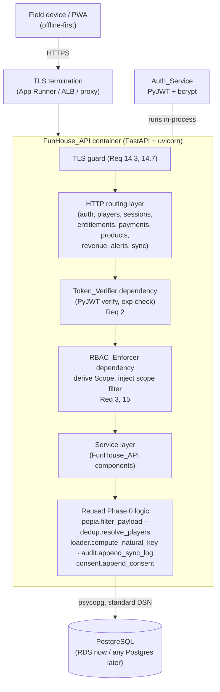
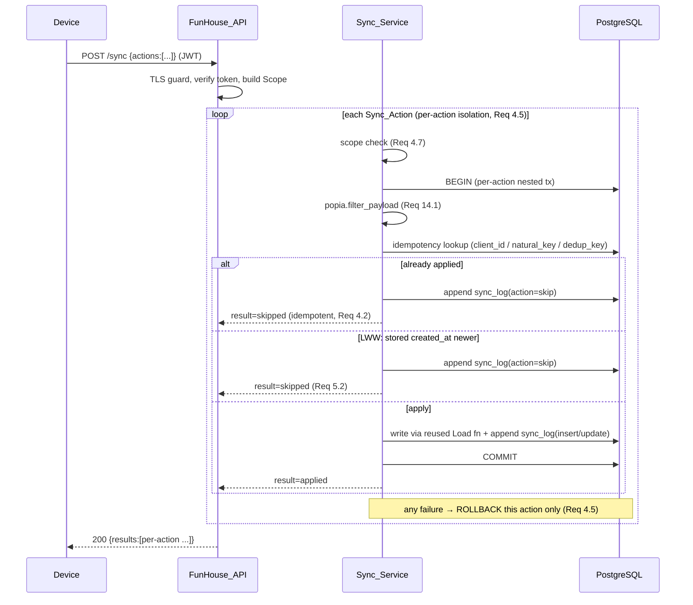

# Design Document: FunHouse Container API

## Overview

The **FunHouse Container API** (Spec 2) is a single portable HTTP service, packaged as one Docker image, that sits directly on top of the Phase 0 Data Foundation (the 14-table PostgreSQL schema, idempotent seed, and deterministic Load logic already shipped in `funhouse_pipeline/`). It is the **offline-first sync target** and the **read/write resource API** for a future PWA (Spec 3, out of scope here).

The guiding design principle is **reuse, not reimplementation**. The Phase 0 Load layer already encodes the deterministic, POPIA-safe, audited write semantics the API needs:

| Concern | Phase 0 function the API reuses | Requirement |
| --- | --- | --- |
| POPIA field stripping | `load.popia.filter_payload` | 14.1 |
| Player dedup / identity resolution | `load.dedup.resolve_players`, `compute_dedup_key`, `slug` | 4.6, 6.5 |
| Natural-key idempotency | `load.loader.compute_natural_key` + `ON CONFLICT DO NOTHING` | 4.2, 4.6 |
| Audit ledger (atomic with write) | `load.audit.append_sync_log` | 4.4, 14.2, 14.6 |
| Append-only consent ledger | `load.consent.append_consent` / `revoke_consent` | 6.4, 14.4 |
| DB connection / DSN portability | `db.connection.connect`, `config.DatabaseConfig.dsn()` | 13.4 |
| Schema / seed | `db.migrations.run_migrations`, `db.seed.seed` | 13.2 |

The API adds only what Phase 0 lacks: HTTP routing, self-managed authentication (JWT + bcrypt), role/scope authorization, a batch-sync protocol with last-write-wins conflict resolution, a deterministic Entitlement Engine, a three-stream Revenue Reporter, and a deterministic Alerts Engine.

**Technology choices**

- **Language/framework:** Python 3.11+ with **FastAPI** (consistent with the existing Python codebase; async-capable; first-class Pydantic validation → satisfies validation-error requirements 1.7, 6.6, 6.9, 10.5 with 422 responses out of the box).
- **Auth:** **PyJWT** for HS256 token signing/verification (self-managed, Req 1, 2, 13.3); **passlib[bcrypt]** (or `bcrypt`) for password hashing/verification (Req 1.2, 1.6).
- **DB driver:** **psycopg (v3)**, the driver Phase 0 already uses (`db.connection`), reused unchanged so the same DSN and transaction semantics apply.
- **Persistence:** **PostgreSQL only** — no Cognito, DynamoDB, Pinpoint, or Lambda-as-architecture (Req 13.2).
- **Server:** `uvicorn`/`gunicorn` inside the container; TLS is terminated at the edge (App Runner / ALB / reverse proxy) with an app-level guard for the TLS-unavailable case (Req 14.3, 14.7).

### Architecture

The service is a layered monolith in one container. Requests flow top-to-bottom; every write path funnels through the **service layer**, which delegates deterministic logic to the reused Phase 0 modules.



**Request flow (protected endpoint):** TLS guard → route → `Token_Verifier` (decode + verify signature + check `exp`) → `RBAC_Enforcer` (build `Scope` from claims, inject a scope filter) → service method → reused Phase 0 write/read within one DB transaction → response.

**Batch sync path (Req 4, 5):**



### Portability posture (Req 13)

The container depends only on a PostgreSQL DSN, produced by the existing `config.DatabaseConfig.dsn()` (a standard libpq connection string). Moving from AWS RDS to any VPS Postgres is a change of environment variables (`DB_HOST`, `DB_PORT`, `DB_NAME`, `DB_USER`, `DB_PASSWORD`, `DB_SSLMODE`) — no code change (Req 13.4). Auth runs in-process (Req 13.3); no managed identity provider is contacted. See the **Migration Note** section for the full AWS→VPS swap.

## Components and Interfaces

All components live in a new `funhouse_api/` package alongside `funhouse_pipeline/`; they import Phase 0 modules directly.

### 1. Auth_Service (Req 1, 2)

Responsible for password verification and JWT lifecycle.

- `hash_password(plaintext: str) -> str` — bcrypt hash (Req 1.6). Stored to `users.password_hash`; only the hash is persisted.
- `verify_password(plaintext: str, password_hash: str) -> bool` — constant-time bcrypt compare (Req 1.2, 1.4).
- `issue_token(user: UserRow, *, now: datetime) -> str` — builds JWT claims and signs with HS256:
  ```json
  { "sub": "<users.id>", "role": "founder|manager|facilitator",
    "location_id": "<uuid|null>", "school_id": "<uuid|null>",
    "iat": <epoch>, "exp": <iat + JWT_TTL_SECONDS> }
  ```
  (Req 1.1, 1.5, 14.5). Token lifetime `JWT_TTL_SECONDS` is configurable (default e.g. 8h). The `school_id` claim is sourced from the user's `users.school_id` column (added by migration `004_users_school_id.sql`): for a facilitator it is their assigned school; for founders/managers it is `NULL` (Req 1.8, 3.3). The login path selects `users.school_id` alongside `role`/`location_id` and passes it into `issue_token`.
- `decode_token(token: str, *, now: datetime) -> Claims` — verifies signature and `exp`; raises `AuthError` on missing/invalid/expired (Req 2.1–2.4, 2.7).

**Login endpoint** `POST /auth/login` (public, Req 2.5): accepts `{identifier, password}`; 422 if either is missing (Req 1.7); 401 if the identifier matches no `users` row (Req 1.3) or the password fails bcrypt (Req 1.4); otherwise 200 with the JWT (Req 1.1).

### 2. Token_Verifier (Req 2)

A FastAPI dependency `require_auth` applied to every protected router. It extracts the bearer token, calls `Auth_Service.decode_token`, and yields a `Principal(user_id, role, location_id, school_id)`. Missing/invalid/expired → 401 (Req 2.2–2.4, 2.6, 2.7). Public endpoints (`/auth/login`, `/health`) omit the dependency (Req 2.5).

### 3. RBAC_Enforcer (Req 3, 15)

A FastAPI dependency `require_scope` layered after `require_auth`. From the `Principal` it derives a `Scope`:

- **founder** → unrestricted (`location_id=None, school_id=None`) → no filter added (Req 3.1).
- **manager** → `location_id = principal.location_id` (Req 3.2).
- **facilitator** → `location_id = principal.location_id` **AND** `school_id = principal.school_id` (Req 3.3).

The `Scope` exposes:
- `read_filter() -> (sql_fragment, params)` — appended to every collection/record query (Req 3.4, 3.6, 3.7, 15.1, 15.2).
- `assert_can_write(row_location_id, row_school_id)` — raises `AuthzError` (403) for cross-scope writes before any persistence (Req 3.5).
- `stamp(new_row)` — sets `location_id` (and `school_id` where applicable) to the caller's scope on create (Req 15.3).

Single-record reads that resolve to an out-of-scope row return 403 (Req 3.7); collection reads simply exclude out-of-scope rows (Req 3.4). If the scope check cannot be completed, the request is rejected rather than allowed (Req 7.6, fail-closed).

### 4. Sync_Service (Req 4, 5)

Applies a `Sync_Batch` action-by-action with per-action isolation and idempotency. Delegates each entity to its reused Load path (see Data Models → Sync action mapping). Core algorithm per action:

1. **Scope check** — `Scope.assert_can_write`; on failure record `rejected` (Req 4.7) and continue.
2. **POPIA filter** — `popia.filter_payload(payload)` (Req 14.1).
3. **Idempotency key** — resolve the entity's key: `natural_key` (sessions/attendance/payments via `compute_natural_key`), `dedup_key` (players via `compute_dedup_key`), or `client_id` (entitlements/consents). Look up an existing row/`sync_log` entry.
4. **Conflict resolution (LWW)** — if a row already exists and the action mutates it, compare device-origin `created_at` (carried in `client_timestamp`): keep the later one; equal timestamps break the tie by `client_id` ordering (Req 5.1, 5.2, 5.4). Older/duplicate → `skipped`.
5. **Apply + audit atomically** — write via the reused Load function and `append_sync_log` in **one** nested transaction (Req 4.4, 5.3). Any exception rolls back just this action and records `rejected` (Req 4.5).

The endpoint `POST /sync` returns `SyncResult{results: [{client_id, entity, status, record_id?, reason?}]}` where `status ∈ {applied, skipped, rejected}` (Req 4.1).

### 5. Entitlement_Engine (Req 8, 9)

Deterministic; issues no model call.

- `create_entitlement(player_id, product_id, ...) -> EntitlementRow` — derives `remaining_units` and `valid_from`/`valid_to` from `products.rules` (Req 8.1).
- `draw(entitlement_id, amount, *, logged_by, now) -> DrawResult` — the accountable decrement (Req 8.2–8.5, 8.8, 8.9):
  1. Load entitlement `FOR UPDATE` (row lock, serializes concurrent draws).
  2. If recurring, apply `reset_if_new_period` first (Req 9.3).
  3. Reject if `status != 'active'` (Req 8.5) or `remaining_units < amount` (Req 8.4) — units unchanged.
  4. `UPDATE entitlements SET remaining_units = remaining_units - amount`.
  5. Append the **Digital_Signature**: a `sync_log` entry (`action=update`, `entity='entitlements'`, `record_id=entitlement_id`, `user_id=logged_by`, `server_timestamp=now()`) — the ledger pairing of who + when (Req 8.3, 8.8). This reuses `append_sync_log` and needs no new column.
  6. Steps 4–5 share one transaction: if the signature cannot be recorded, the decrement rolls back (Req 8.9).
- `balance(player_id, scope) -> [Balance]` — current `remaining_units` + validity window per active entitlement in scope (Req 8.6).
- `reset_if_new_period(entitlement, product_rules, now)` — see Recurring reset below (Req 9).

**Recurring reset (Req 9), deterministic period boundary.** For a product whose `rules` specify a recurring allowance (e.g. Holiday Special `{"hours_per_week":3,"reset":"sunday","rollover":false}`):
- The **period start** is computed deterministically from `rules.reset` and `now` (no AI, Req 9.4). For `"sunday"`: `period_start = most recent Sunday 00:00` in the configured location timezone.
- The entitlement's **current period** is tracked by reusing the existing `valid_from` column: `valid_from` holds the start date of the period the current `remaining_units` belong to.
- On evaluation, if `period_start > valid_from`, reset: `remaining_units = allowance` (e.g. 3 hrs → 180 units-as-minutes) and `valid_from = period_start`. Unused prior-period units are discarded — **no rollover** (Req 9.1, 9.2). Reusing `valid_from` avoids any schema change.

### 6. Revenue_Reporter (Req 11)

`summary(scope) -> {pay_per_use, subscription, school_contracts}` in integer cents (Req 11.1, 11.4). Joins `payments → products` and sums `amount_cents` grouped by `products.type`, restricted by the caller's scope (Req 11.2, 11.5). The `school_contracts` stream sums payments whose product is a school-contract product; while none exist it is `0` (R0) (Req 11.3).

### 7. Alerts_Engine (Req 12)

`alerts(scope, *, now) -> [Alert]`, all rules pure conditional SQL/Python, no model call (Req 12.1):
- **no-recent-session** — players in scope with no `sessions` row in the last 7 days (Req 12.2).
- **entitlement-expiring** — entitlements whose `valid_to` is within `ALERT_EXPIRY_HORIZON_DAYS` (Req 12.3).
- **subscription-due** — subscriptions past due per product rules (Req 12.4).
- **unsynced-device** — devices whose most recent `sync_log.server_timestamp` is older than 5 days (Req 12.5).
Results restricted to caller scope for manager/facilitator (Req 12.6).

### 8. Resource routers (Req 6, 7, 10, 15)

Thin FastAPI routers that validate input via Pydantic, apply `require_auth` + `require_scope`, and call service methods. See the endpoint catalog below.

### Endpoint catalog

| Method & path | Purpose | Roles / scope | Req |
| --- | --- | --- | --- |
| `POST /auth/login` | Authenticate, issue JWT | public | 1.1, 2.5 |
| `GET /health` | Liveness | public | 2.5 |
| `POST /sync` | Batch sync of offline actions | any authed; per-action scope | 4, 5 |
| `GET /players` | Roster within scope | all; scoped | 6.1, 15.1 |
| `POST /players` | Register player + consents | all; stamped to scope | 6.2–6.6, 6.9 |
| `GET /players/{id}/history` | Sessions, payments, entitlement draws | all; scoped | 6.7, 6.8, 8.7 |
| `GET /players/{id}/entitlements` | Balance query | all; scoped | 8.6 |
| `POST /sessions` | Log a session (+ optional payment/draw) | all; scoped, `logged_by` set | 7.1–7.6 |
| `POST /entitlements` | Create entitlement from a sell | manager/founder; scoped | 8.1 |
| `POST /entitlements/{id}/draw` | Decrement + digital signature | all; scoped | 8.2–8.5, 8.8, 8.9 |
| `POST /payments` | Record a payment | all; scoped, `logged_by` set | 10.1, 10.2, 10.4, 10.5 |
| `GET /products` | Read seeded catalog | all; scoped | 10.3 |
| `GET /revenue/summary` | Three-stream totals | all; scoped | 11 |
| `GET /alerts` | Deterministic operational alerts | all; scoped | 12 |

## Data Models

The API **does not change the Phase 0 schema**. All 14 tables (`001_schema.sql`) and the append-only consent enforcement (`002_consents_append_only.sql`) are reused as-is, including the universal `client_id / device_id / client_timestamp` sync-metadata columns already present on every table and the `natural_key`/`dedup_key` idempotency columns. Money stays integer cents; product rules stay JSONB.

### Required additive migration (strictly necessary): `003_role_facilitator.sql`

The requirements define three roles — `founder`, `manager`, `facilitator` (Req 3, Glossary) — but the Phase 0 `users.role` CHECK permits `('founder','manager','coach','operator')`, which lacks `facilitator`. This is the **only** schema touch the API needs, and it is purely additive/idempotent:

```sql
-- Feature: funhouse-api, additive role widening (Req 3.3).
ALTER TABLE users DROP CONSTRAINT IF EXISTS users_role_check;
ALTER TABLE users ADD CONSTRAINT users_role_check
    CHECK (role IN ('founder','manager','facilitator','coach','operator'));
```

No columns are added: the digital signature (Req 8.3), sync idempotency (Req 4.2), and device tracking (Req 12.5) all reuse existing columns (`sync_log.user_id`/`server_timestamp`, `natural_key`/`dedup_key`/`client_id`, `sync_log.device_id`). The recurring-reset period is tracked by reusing `entitlements.valid_from` (see Entitlement_Engine).

### Required additive migration (strictly necessary): `004_users_school_id.sql`

Facilitator scope is defined by `location_id` **AND** `school_id` (Req 3.3), and the RBAC_Enforcer already filters/asserts on the `school_id` JWT claim. But the Phase 0 `users` table carries only `role` and `location_id` — it has **no `school_id` column** — so `Auth_Service.issue_token` has no source for a facilitator's school, and facilitator school-scoping is not wired end to end (Req 1.8, 3.3). This migration closes that gap. Like `003`, it is purely additive/idempotent and adds no table:

```sql
-- Feature: funhouse-api, additive facilitator school scope (Req 1.8, 3.3).
ALTER TABLE users ADD COLUMN IF NOT EXISTS school_id UUID REFERENCES schools(id);
```

The column is **nullable** so founders and managers stay `NULL` (they have no assigned school); a facilitator's row carries their assigned school. `ADD COLUMN IF NOT EXISTS` makes re-running safe and causes no data loss. The migration runner auto-discovers it via the `sql/` lexical glob (`migration_files()`), applying after `003`. The expected-table count is unchanged (still 14 tables); only one nullable column is added. `users` is **not** added to `SCHOOL_ASSOCIATED_TABLES` (that set governs school-scoped *resource* queries in `001_schema.sql`; `users` is a staff table, and its `school_id` is the source of the caller's scope, not a resource scoped by it).

### Pydantic DTOs (request/response)

**Auth**
```
LoginRequest   { identifier: str, password: str }          # both required → 422 if missing (1.7)
LoginResponse  { access_token: str, token_type: "bearer", expires_at: datetime }
Claims         { sub: UUID, role: Role, location_id: UUID|None, school_id: UUID|None, iat:int, exp:int }
```

**Sync batch**
```
SyncAction  { client_id: str, entity: EntityType, created_at: datetime, payload: dict }
            # EntityType ∈ {session, attendance, player, payment, entitlement, consent, student_metrics}
SyncBatch   { actions: list[SyncAction] }                  # ordered queue from one device
ActionResult{ client_id: str, entity: EntityType, status: "applied"|"skipped"|"rejected",
              record_id: UUID|None, reason: str|None }
SyncResult  { results: list[ActionResult] }
```

**Players**
```
PlayerCreate   { first_name: str,                          # required → 422 if missing (6.6)
                 last_name?: str, birth_date?: date, grade?: str, school_id?: UUID,
                 consents: list[ConsentInput] }             # ≥1 required → 422 if empty (6.9)
ConsentInput   { consent_type: str, granted: bool = true, method?: str, granted_at?: datetime }
PlayerOut      { id, first_name, last_name, birth_date, grade, school_id, location_id,
                 consent_status, active }
PlayerHistory  { player_id, sessions: [...], payments: [...], entitlement_draws: [...] }  # 6.7, 8.7
```

**Sessions / Payments / Entitlements / Products**
```
SessionCreate  { player_id: UUID, session_type: SessionType, started_at?, ended_at?,
                 duration_minutes: int, school_id?: UUID,
                 payment?: PaymentInput, draw?: DrawInput }         # 7.1–7.3
PaymentInput   { amount_cents: int, product_id?: UUID, method?: str, paid_at?: datetime }  # 10.1,10.2
PaymentCreate  { player_id: UUID, amount_cents: int, ... }          # amount required → 422 (10.5)
DrawInput      { entitlement_id: UUID, amount: int }                # 8.2
EntitlementCreate { player_id: UUID, product_id: UUID }             # units/window from rules (8.1)
BalanceOut     { entitlement_id, product_id, remaining_units, valid_from, valid_to, status }  # 8.6
ProductOut     { id, name, type, price_cents, rules }               # 10.3
RevenueSummary { pay_per_use_cents:int, subscription_cents:int, school_contracts_cents:int } # 11
AlertOut       { type: str, subject_id: UUID, detail: str }         # 12
```

### Sync action → Phase 0 Load mapping (Req 4.6)

Every write reuses the deterministic Phase 0 path; the Sync_Service is orchestration only.

| `entity` | Idempotency key | Reused Phase 0 logic | Notes |
| --- | --- | --- | --- |
| `player` | `dedup_key` (`compute_dedup_key`) | `dedup.resolve_players` | dedup + gap-fill; new rows start `pending` (6.5, 4.2) |
| `consent` | `client_id` | `consent.append_consent` | append-only; revocation = new row (6.4, 14.4) |
| `session` | `natural_key` (`compute_natural_key`) | `loader._load_one` insert path + `append_sync_log` | `logged_by` set, optional draw via Engine (7.1–7.5) |
| `attendance` | `natural_key` | loader insert path | `ON CONFLICT (natural_key) DO NOTHING` (4.2) |
| `payment` | `natural_key` | loader insert path | `amount_to_cents`, product FK resolve (10.1, 10.2) |
| `entitlement` | `client_id` | `Entitlement_Engine.create/draw` | draw records digital signature (8.x) |
| `student_metrics` | `natural_key` (`compute_sync_natural_key` over `player_id`, `metric_type`, `measured_at`) | reused loader insert path + `append_sync_log` | location-scoped only (no `school_id`), player_id-keyed (D2-compatible), `value` stored as TEXT, `metric_type` CHECK respected (4.8) |

All paths run `popia.filter_payload` first (14.1) and `append_sync_log` in the same transaction as the write (4.4, 14.2, 14.6).

Adding `student_metrics` to the sync path **closes Dependency D1**: the PWA's typing/homework/quiz/observation metrics can now be queued offline and synced to the API idempotently, keyed on `player_id` (consistent with session/attendance/payment and compatible with the PWA's local-id resolution, Dependency D2).


## Correctness Properties

*A property is a characteristic or behavior that should hold true across all valid executions of a system — essentially, a formal statement about what the system should do. Properties serve as the bridge between human-readable specifications and machine-verifiable correctness guarantees.*

These properties were derived from the acceptance-criteria prework and consolidated to remove redundancy (many read/scope/audit criteria collapse into single universal properties). Each is intended to be implemented as one property-based test (Hypothesis) against an ephemeral PostgreSQL, reusing the Phase 0 `db_connection` fixture pattern.

### Property 1: Login token round-trips identity, role, and scope

*For any* `users` row (any role, location, and school) with a known plaintext password, authenticating with the correct password yields a JWT whose decoded claims contain exactly that user's id, role, and location scope.

**Validates: Requirements 1.1, 2.1**

### Property 2: Password verification round-trip

*For any* plaintext password, `verify_password(plaintext, hash_password(plaintext))` is true, and for any different plaintext the verification is false; the stored value is never equal to the plaintext.

**Validates: Requirements 1.2, 1.4, 1.6**

### Property 3: Issued tokens carry a correct expiry and expired tokens are rejected

*For any* issue time and configured lifetime, the token's `exp` equals `iat + lifetime`; and *for any* token whose `exp` is earlier than the current server time, verification rejects it.

**Validates: Requirements 1.5, 2.4, 14.5**

### Property 4: Only valid unexpired tokens authenticate a protected request

*For any* protected endpoint and *for any* token that is missing, has an invalid signature, or is expired, the request is rejected; a well-formed unexpired token signed with the server secret is accepted.

**Validates: Requirements 2.2, 2.3, 2.6, 2.7**

### Property 5: No response ever contains an out-of-scope record (read scope containment)

*For any* dataset spanning multiple locations and schools and *for any* authenticated principal, every record in any collection or single-record response is within the principal's scope: founders see all; a manager's results all share the manager's `location_id`; a facilitator's results all share both the facilitator's `location_id` and `school_id`. A direct read of an out-of-scope record id is rejected.

**Validates: Requirements 3.1, 3.2, 3.3, 3.4, 3.6, 3.7, 6.1, 8.6, 10.3, 12.6, 15.1, 15.2**

### Property 6: Out-of-scope writes are rejected and never persisted

*For any* write (resource create or sync action) targeting a `location_id`/`school_id` outside the caller's scope, the request is rejected and the total row count of the target table is unchanged.

**Validates: Requirements 3.5, 4.7, 7.4**

### Property 7: Created rows are stamped to the caller's scope

*For any* resource-create request, the persisted row's `location_id` equals the caller's scope (and `school_id`, where the resource is school-associated, equals the caller's school).

**Validates: Requirements 6.2, 7.1, 15.3**

### Property 8: Batch sync is idempotent (applying a batch twice equals applying it once)

*For any* `Sync_Batch`, applying it and then applying the identical batch again produces the same final database state as applying it once, and every action in the second application is reported `skipped`; no duplicate rows are created for a repeated `client_id`/natural key/dedup key.

**Validates: Requirements 4.2, 4.3, 4.6**

### Property 9: Per-action result completeness and failure isolation

*For any* `Sync_Batch`, the response contains exactly one result per submitted action with a status in `{applied, skipped, rejected}`; and *for any* batch containing an action that fails to apply, the remaining valid actions are still applied and only the failing action is reported non-applied.

**Validates: Requirements 4.1, 4.5**

### Property 10: Last-write-wins is monotonic and order-independent

*For any* set of `Sync_Actions` targeting the same record, the final stored values are those of the action with the latest device-origin `created_at`; a later stored `created_at` is never overwritten by an older incoming action (which is reported `skipped`); and when `created_at` values are equal the outcome is a deterministic function of `client_id` ordering, so submitting the actions in any order yields the same final state.

**Validates: Requirements 5.1, 5.2, 5.4**

### Property 11: Every persisted write has a matching sync_log entry

*For any* successful business write (via resource endpoint or sync), a `sync_log` row exists referencing that entity and record id, and `logged_by` is set on target tables that carry that column.

**Validates: Requirements 4.4, 7.5, 10.4, 14.2**

### Property 12: Audit atomicity — a write and its audit entry commit together

*For any* write, if the `sync_log` append cannot be recorded, the entire write is rolled back so no business row is persisted without its audit entry.

**Validates: Requirements 14.6**

### Property 13: Consents ledger is append-only (count never decreases)

*For any* sequence of consent grants and revocations, the number of `consents` rows is monotonically non-decreasing (a revocation appends a new row and never updates or deletes an existing one).

**Validates: Requirements 6.3, 6.4, 14.4**

### Property 14: Player registration is deduplicated

*For any* two registration requests that resolve to the same Phase 0 dedup key, exactly one `players` row exists afterward (the second resolves to the existing row).

**Validates: Requirements 6.5**

### Property 15: Player history is complete within scope and leaks nothing outside it

*For any* player, the history response includes that player's in-scope sessions, payments, and entitlement draws (each draw carrying its acting user and timestamp) and contains no record outside the caller's scope.

**Validates: Requirements 6.7, 8.7**

### Property 16: Entitlement units are conserved

*For any* entitlement and draw amount: a draw succeeds only when the entitlement is active and `remaining_units >= amount`, in which case `remaining_units` decreases by exactly `amount`; otherwise the draw is rejected and `remaining_units` is unchanged; `remaining_units` is never negative.

**Validates: Requirements 8.2, 8.4, 8.5**

### Property 17: A decrement and its digital signature are atomic and paired

*For any* draw, a `sync_log` update entry recording the acting user and a server timestamp is written **if and only if** `remaining_units` was actually decremented; if the signature cannot be recorded the decrement is rolled back.

**Validates: Requirements 8.3, 8.8, 8.9**

### Property 18: Entitlement creation derives units and window from product rules

*For any* product, creating an entitlement yields `remaining_units` and a validity window equal to the deterministic function of that product's `rules`.

**Validates: Requirements 8.1**

### Property 19: Recurring reset restores the allowance with no rollover, computed deterministically

*For any* recurring entitlement evaluated at a time in a later period than its current period, the remaining units reset to exactly the product's per-period allowance (unused prior-period units discarded, never carried over), the reset is applied before any draw is computed, and the period boundary is a pure, repeatable function of the product rules and the current time.

**Validates: Requirements 9.1, 9.2, 9.3, 9.4**

### Property 20: Revenue summary equals the scoped sum per product type

*For any* set of payments, the `pay_per_use` and `subscription` stream totals each equal the integer-cents sum of the in-scope payments attributable to products of that type, and for a manager/facilitator the totals exclude all out-of-scope payments.

**Validates: Requirements 11.1, 11.2, 11.4, 11.5**

### Property 21: Alerts are deterministic and honor their rule boundaries

*For any* dataset, computing alerts twice yields identical results (no AI, pure conditional logic), and an alert of each type is present exactly when its boundary condition holds: no session within 7 days, entitlement `valid_to` within the expiry horizon, subscription due, or device last-sync older than 5 days.

**Validates: Requirements 12.1, 12.2, 12.3, 12.4, 12.5**

### Property 22: Prohibited fields are never persisted (POPIA)

*For any* write payload containing one or more Prohibited_Fields (national identity numbers or physical addresses in any recognized spelling), no Prohibited_Field is present on the stored row (reusing `popia.filter_payload`).

**Validates: Requirements 14.1**

## Error Handling

The API maps each failure class to a consistent HTTP response, and every write path is transactional so failures never leave partial state.

| Condition | Response | Requirement |
| --- | --- | --- |
| Missing identifier/password, missing required field, malformed body | `422 Unprocessable Entity` (Pydantic) | 1.7, 6.6, 6.9, 10.5 |
| Unknown identifier or wrong password | `401 Unauthorized` (generic message; no user enumeration), no token | 1.3, 1.4 |
| Missing / invalid-signature / expired token on protected route | `401 Unauthorized` | 2.2, 2.3, 2.4, 2.6, 2.7 |
| Cross-scope read of a specific record | `403 Forbidden` | 3.7 |
| Cross-scope write (resource or sync action) | `403 Forbidden` (resource) / `rejected` per-action (sync), not persisted | 3.5, 4.7, 7.4 |
| Scope cannot be derived (fail-closed) | request rejected, not served | 7.6 |
| Draw against insufficient/inactive entitlement | `409 Conflict` (resource) / `rejected` (sync), units unchanged | 8.4, 8.5 |
| LWW: incoming action older than stored | per-action `skipped`, stored values preserved | 5.2 |
| Idempotent replay (duplicate key) | per-action `skipped`, no duplicate row | 4.2 |
| Single sync action raises | `rollback` that action only; `rejected` in results; batch continues | 4.5 |
| `sync_log` append fails for a write | whole write transaction rolls back | 14.6 |
| Signature append fails after decrement | decrement rolled back | 8.9 |
| TLS unavailable | request rejected, never served over plaintext | 14.3, 14.7 |

**Transaction discipline.** Following the Phase 0 loader/consent pattern, each resource write and each sync action runs inside a single (nested) transaction that includes both the business write and its `append_sync_log` call. Because the audit insert shares the write's transaction, Property 11 and Property 12 hold by construction — exactly the invariant Phase 0 already relies on.

**TLS handling.** TLS is terminated at the edge (App Runner / ALB / reverse proxy) which is the deployment expectation (Req 14.3). As an in-app backstop, a middleware inspects the forwarded-proto (e.g. `X-Forwarded-Proto`) and, when the deployment marks TLS as required, rejects any request not received over HTTPS (Req 14.7) rather than serving it.

## Testing Strategy

A dual approach — property-based tests for universal correctness and example/integration tests for concrete behavior and wiring — consistent with the Phase 0 suite.

**Property-based tests (Hypothesis).** The 22 correctness properties above are each implemented by a single Hypothesis test.
- Minimum **100 iterations** per property (Hypothesis `max_examples>=100`).
- Each test is tagged with a comment referencing its design property, format: **Feature: funhouse-api, Property {number}: {property_text}**.
- Tests run against an **ephemeral PostgreSQL** using the existing `tests/conftest.py` `db_connection` fixture (disposable schema per test, transactional rollback). No mocking of deterministic logic: the reused Phase 0 Load/dedup/audit/consent code, JWT signing/verification (PyJWT), and bcrypt hashing all run for real.
- Generators produce realistic domain data: users across roles/locations/schools, multi-location datasets for scope properties, sync batches with controlled `client_id`/`created_at` for idempotency and LWW, product `rules` variants for the Entitlement Engine, and payloads seeded with prohibited keys for the POPIA property.

**Example / unit tests.** Concrete cases not suited to PBT:
- Login failures (unknown identifier 1.3, missing field 1.7), public-endpoint access (2.5), missing first name (6.6), zero consents (6.9), missing amount (10.5), out-of-scope history empty (6.8), fail-closed authz (7.6), TLS-unavailable rejection (14.7), `school_contracts = R0` with no payment (11.3), and the consents `UPDATE`/`DELETE` trigger raising (14.4 backstop).

**Integration tests (FastAPI `TestClient`).** End-to-end endpoint behavior over the full stack (routing → auth → RBAC → service → Postgres): a login→token→protected-call happy path per router, a full `POST /sync` batch round-trip, and revenue/alerts read paths. 1–3 representative examples each — these verify wiring, not input-varying logic.

**Not property-tested (rationale).** Packaging/deployment (13.1), dependency constraints (13.2, 13.5), in-container auth (13.3), and TLS configuration (14.3) are SMOKE/config checks (single execution or static assertion), not input-varying logic. The DSN format (13.4) is an example test and is already covered by Phase 0 `test_config.py`.

## Migration Note: AWS → VPS with no rewrite (Req 13)

Portability is inherited from Phase 0 and preserved by construction:

- **One container, one dependency.** The image bundles FastAPI + the app and depends only on a reachable PostgreSQL (Req 13.1, 13.2). Auth (PyJWT + bcrypt) runs in-process, so there is no Cognito or external IdP to migrate (Req 13.3).
- **Connection by env only.** The database is selected entirely through the existing `config.DatabaseConfig` env vars (`DB_HOST`, `DB_PORT`, `DB_NAME`, `DB_USER`, `DB_PASSWORD`, `DB_SSLMODE`), rendered by `dsn()` into a standard libpq string consumed by `db.connection.connect` (Req 13.4). Moving from RDS to a VPS Postgres is: point `DB_HOST` at the new server, set `DB_SSLMODE` appropriately (`require` in production), redeploy the same image. No code changes.
- **No AWS-only services in the request path.** Any Lambda use is limited to auxiliary/background jobs (e.g. image processing), never the core API logic, which stays in the container (Req 13.5).
- **Schema/seed are portable SQL.** `run_migrations` (including the additive `003_role_facilitator.sql`) and `seed` use portable, parameterized SQL and `gen_random_uuid()` (Postgres 13+ core, no extension), so they apply identically on RDS or any self-hosted Postgres.

## Requirements Coverage Summary

- **Auth & tokens (1, 2):** Auth_Service + Token_Verifier; Properties 1–4.
- **RBAC & scoping (3, 15):** RBAC_Enforcer dependency; Properties 5–7.
- **Sync & LWW (4, 5):** Sync_Service reusing Phase 0 idempotency; Properties 8–11.
- **Players & consents (6):** roster/registration reusing dedup + append-only consent; Properties 7, 13, 14, 15.
- **Sessions (7):** scoped create with `logged_by` + audit; Properties 6, 7, 11.
- **Entitlements (8, 9):** Entitlement_Engine; Properties 16–19.
- **Payments & products (10):** payment create + catalog read; Properties 11, 20.
- **Revenue (11):** Revenue_Reporter; Property 20.
- **Alerts (12):** Alerts_Engine; Property 21.
- **Portability (13):** Migration Note; SMOKE tests.
- **POPIA (14):** reuse of `popia.filter_payload`, transactional audit, TLS guard, append-only consent; Properties 3, 11, 12, 13, 22.
