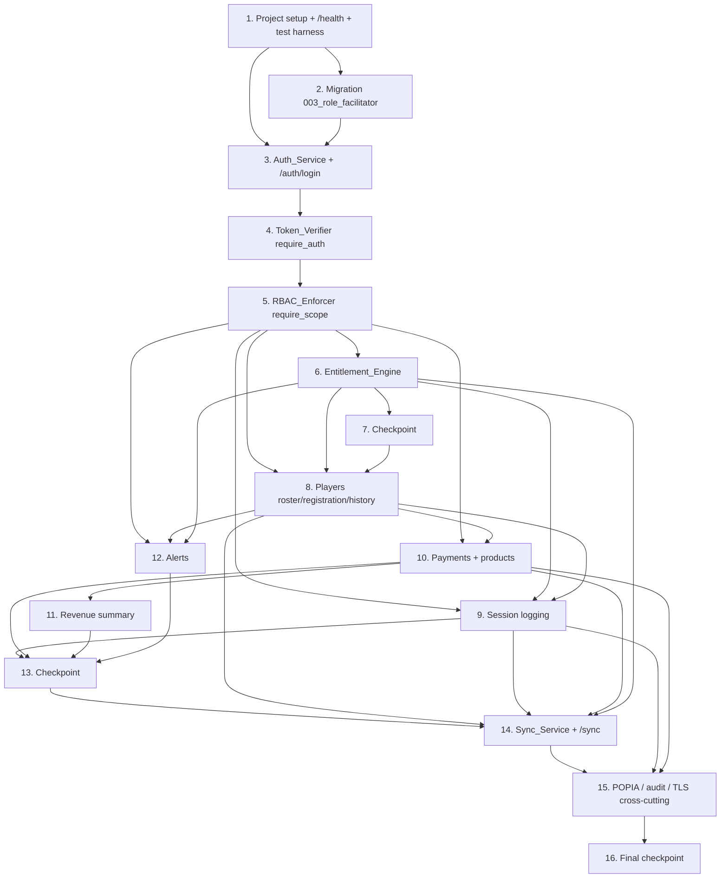

# Implementation Plan: FunHouse Container API

## Overview

This plan implements the FunHouse Container API (Spec 2) as a Python 3.11+ / **FastAPI** single-container HTTP service in a new `funhouse_api/` package alongside the existing `funhouse_pipeline/` Phase 0 codebase. The guiding principle is **reuse, not reimplementation**: every write path funnels through the reused Phase 0 Load logic (`load.popia`, `load.dedup`, `load.loader`, `load.audit`, `load.consent`), the reused DB layer (`db.connection`, `db.migrations`, `db.seed`), and the reused `config` module.

Each task builds incrementally on the previous one and ends by wiring the new code into the app factory so there is no orphaned code. Tests use the FastAPI `TestClient` (via `httpx`) and the existing `tests/conftest.py` `db_connection` fixture, which skips gracefully when no PostgreSQL server is reachable. The 22 correctness properties from the design are implemented as optional (`*`) Hypothesis property-based tests (min 100 iterations) placed next to the code they validate.

Scope is strictly the API layer. No PWA frontend, no lesson generation, no SMS.

## Tasks

- [x] 1. Project setup: dependencies, package skeleton, health endpoint, test harness
  - [x] 1.1 Add API dependencies to `pyproject.toml`
    - Add to `[project].dependencies`: `fastapi>=0.110`, `uvicorn[standard]>=0.29`, `pyjwt>=2.8`, `passlib[bcrypt]>=1.7` (psycopg is already present and reused unchanged)
    - Add `httpx>=0.27` to `[project.optional-dependencies].dev` for the FastAPI `TestClient`
    - Add `funhouse_api` to `[tool.hatch.build.targets.wheel].packages`
    - _Requirements: 13.1, 13.2, 13.3_ (Design: Overview → Technology choices)
  - [x] 1.2 Create the `funhouse_api/` package skeleton and config wiring
    - Create `funhouse_api/__init__.py`, `funhouse_api/config.py` (reads `JWT_SECRET`, `JWT_TTL_SECONDS` default 8h, `ALERT_EXPIRY_HORIZON_DAYS`, `TLS_REQUIRED`, `LOCATION_TIMEZONE`; loads DB config by reusing `funhouse_pipeline.config.load_config` / `DatabaseConfig.dsn()`)
    - Create `funhouse_api/db.py` with a `get_connection` dependency reusing `funhouse_pipeline.db.connection.connect` (standard libpq DSN, portable)
    - Create `funhouse_api/app.py` with a `create_app()` FastAPI app factory that will register routers as they are built
    - _Requirements: 13.2, 13.3, 13.4_ (Design: Components → app factory; Portability posture)
  - [x] 1.3 Implement the `/health` public endpoint
    - Add `GET /health` returning liveness JSON, registered in `create_app()`, requiring no JWT
    - _Requirements: 2.5_ (Design: Endpoint catalog)
  - [x] 1.4 Wire the FastAPI test harness
    - Create `tests/test_api_health.py` using `fastapi.testclient.TestClient(create_app())`
    - Add a shared helper/fixture (e.g. `tests/api_helpers.py` or a `conftest` addition) that builds a `TestClient` and reuses the existing `db_connection` fixture, overriding the `get_connection` dependency so API tests run against the disposable schema and skip gracefully without PostgreSQL
    - _Requirements: 2.5_ (Design: Testing Strategy → Integration tests)
  - [x]* 1.5 Write a smoke/config test for portability constraints
    - Assert the DSN is a standard libpq string via reused `DatabaseConfig.dsn()`; assert no Cognito/DynamoDB/Pinpoint imports in `funhouse_api`; single-execution config check
    - _Requirements: 13.1, 13.2, 13.3, 13.4, 13.5_ (Design: Testing Strategy → Not property-tested)

- [x] 2. Additive migration: widen `users.role` to include `facilitator`
  - [x] 2.1 Create `funhouse_pipeline/sql/003_role_facilitator.sql`
    - `DROP CONSTRAINT IF EXISTS users_role_check` then `ADD CONSTRAINT users_role_check CHECK (role IN ('founder','manager','facilitator','coach','operator'))`
    - No columns added; migration runner picks it up automatically via `migration_files()` lexical glob — verify it is registered
    - _Requirements: 3.3_ (Design: Data Models → Required additive migration)
  - [x]* 2.2 Write a unit test that the migration is idempotent and widens the role CHECK
    - Run `run_migrations` twice against `db_connection`; assert a `facilitator` user inserts successfully and the run is safe to re-apply
    - _Requirements: 3.3, 13.2_ (Design: Migration Note)

- [x] 3. Auth_Service: password hashing, JWT lifecycle, and login endpoint
  - [x] 3.1 Implement `funhouse_api/auth/service.py`
    - `hash_password` / `verify_password` (bcrypt via passlib); `issue_token` (PyJWT HS256, claims `sub`/`role`/`location_id`/`school_id`/`iat`/`exp` with `exp = iat + JWT_TTL_SECONDS`); `decode_token` (verify signature + `exp`, raise `AuthError` on missing/invalid/expired); define `Claims` and `AuthError`
    - _Requirements: 1.1, 1.2, 1.5, 1.6, 2.1, 2.3, 2.4, 14.5_ (Design: Components → Auth_Service)
  - [x]* 3.2 Write property test for password verification round-trip
    - **Property 2: Password verification round-trip** — for any plaintext, `verify_password(p, hash_password(p))` is true, a different plaintext is false, and the stored hash never equals the plaintext
    - Tag: `Feature: funhouse-api, Property 2`; Hypothesis, min 100 iterations
    - _Requirements: 1.2, 1.4, 1.6_
  - [x]* 3.3 Write property test for token expiry issuance and rejection
    - **Property 3: Issued tokens carry a correct expiry and expired tokens are rejected** — `exp == iat + lifetime`; any token with `exp` earlier than server time is rejected
    - Tag: `Feature: funhouse-api, Property 3`; Hypothesis, min 100 iterations
    - _Requirements: 1.5, 2.4, 14.5_
  - [x] 3.4 Implement `POST /auth/login` (public) and register it in the app factory
    - `funhouse_api/auth/router.py`: accept `{identifier, password}`; 422 if either missing; 401 if identifier unknown or bcrypt verify fails (generic message, no enumeration); 200 with `LoginResponse` otherwise; reuses `Auth_Service` and reused `db.connection`
    - _Requirements: 1.1, 1.3, 1.4, 1.7, 2.5_ (Design: Components → Login endpoint; Error Handling)
  - [x]* 3.5 Write property test for login token round-trip
    - **Property 1: Login token round-trips identity, role, and scope** — for any users row with a known password, correct login yields a JWT whose decoded claims contain exactly that user's id, role, and location scope
    - Tag: `Feature: funhouse-api, Property 1`; Hypothesis, min 100 iterations, uses `db_connection`
    - _Requirements: 1.1, 2.1_
  - [x]* 3.6 Write example/unit tests for login failures
    - Unknown identifier → 401; missing field → 422; verify no token issued on failure
    - _Requirements: 1.3, 1.7_ (Design: Testing Strategy → Example/unit tests)

- [x] 4. Token_Verifier: authentication dependency and public/protected split
  - [x] 4.1 Implement `funhouse_api/auth/dependencies.py` `require_auth`
    - FastAPI dependency extracting the bearer token, calling `decode_token`, yielding `Principal(user_id, role, location_id, school_id)`; missing/invalid/expired → 401; public endpoints (`/auth/login`, `/health`) omit it
    - _Requirements: 2.1, 2.2, 2.3, 2.4, 2.5, 2.6, 2.7_ (Design: Components → Token_Verifier)
  - [x]* 4.2 Write property test for protected-request authentication
    - **Property 4: Only valid unexpired tokens authenticate a protected request** — for any protected endpoint and any missing/invalid-signature/expired token the request is rejected; a well-formed unexpired token signed with the server secret is accepted
    - Tag: `Feature: funhouse-api, Property 4`; Hypothesis, min 100 iterations
    - _Requirements: 2.2, 2.3, 2.6, 2.7_
  - [x]* 4.3 Write example test for public-endpoint access without a token
    - `/health` and `/auth/login` reachable without a JWT
    - _Requirements: 2.5_

- [x] 5. RBAC_Enforcer: scope derivation and enforcement dependency
  - [x] 5.1 Implement `funhouse_api/rbac.py` `Scope` and `require_scope`
    - Derive `Scope` from `Principal`: founder unrestricted; manager by `location_id`; facilitator by `location_id` AND `school_id`
    - `Scope.read_filter() -> (sql_fragment, params)`; `Scope.assert_can_write(row_location_id, row_school_id)` → 403 on cross-scope; `Scope.stamp(new_row)` sets `location_id` (+ `school_id`); fail-closed if scope cannot be derived
    - `require_scope` FastAPI dependency layered after `require_auth`
    - _Requirements: 3.1, 3.2, 3.3, 3.4, 3.5, 3.6, 3.7, 7.6, 15.1, 15.2, 15.3_ (Design: Components → RBAC_Enforcer)
  - [x]* 5.2 Write property test for read scope containment
    - **Property 5: No response ever contains an out-of-scope record** — for any multi-location/multi-school dataset and any principal, every record in any collection or single-record response is within scope (founder all; manager same `location_id`; facilitator same `location_id` and `school_id`); direct read of an out-of-scope id → 403
    - Tag: `Feature: funhouse-api, Property 5`; Hypothesis, min 100 iterations, uses `db_connection`
    - _Requirements: 3.1, 3.2, 3.3, 3.4, 3.6, 3.7, 6.1, 8.6, 10.3, 12.6, 15.1, 15.2_
  - [x]* 5.3 Write property test for out-of-scope write rejection
    - **Property 6: Out-of-scope writes are rejected and never persisted** — for any write targeting a `location_id`/`school_id` outside the caller's scope, the request is rejected and the target table row count is unchanged
    - Tag: `Feature: funhouse-api, Property 6`; Hypothesis, min 100 iterations, uses `db_connection`
    - _Requirements: 3.5, 4.7, 7.4_
  - [x]* 5.4 Write property test for scope stamping on create
    - **Property 7: Created rows are stamped to the caller's scope** — for any create request, the persisted row's `location_id` (and `school_id` where school-associated) equals the caller's scope
    - Tag: `Feature: funhouse-api, Property 7`; Hypothesis, min 100 iterations, uses `db_connection`
    - _Requirements: 6.2, 7.1, 15.3_
  - [x]* 5.5 Write example test for fail-closed authorization
    - When scope cannot be derived, the request is rejected rather than served
    - _Requirements: 7.6_

- [x] 6. Entitlement_Engine: create, draw with digital signature, balance, recurring reset
  - [x] 6.1 Implement `funhouse_api/entitlements/engine.py` — `create_entitlement`
    - Derive `remaining_units` and `valid_from`/`valid_to` from `products.rules`; runs `popia.filter_payload` and `append_sync_log` in the write transaction
    - _Requirements: 8.1_ (Design: Components → Entitlement_Engine)
  - [x]* 6.2 Write property test for entitlement creation from product rules
    - **Property 18: Entitlement creation derives units and window from product rules** — for any product, creation yields `remaining_units` and validity window equal to the deterministic function of that product's `rules`
    - Tag: `Feature: funhouse-api, Property 18`; Hypothesis, min 100 iterations, uses `db_connection`
    - _Requirements: 8.1_
  - [x] 6.3 Implement `draw(entitlement_id, amount, *, logged_by, now)`
    - Load entitlement `FOR UPDATE`; apply recurring reset first if applicable; reject if status not active (409) or `remaining_units < amount` (409), leaving units unchanged; else decrement; append Digital_Signature (`append_sync_log` update entry with acting user + server timestamp) in the SAME transaction; roll back decrement if signature cannot be recorded
    - _Requirements: 8.2, 8.3, 8.4, 8.5, 8.8, 8.9_ (Design: Components → Entitlement_Engine → draw)
  - [x]* 6.4 Write property test for unit conservation
    - **Property 16: Entitlement units are conserved** — a draw succeeds only when active and `remaining_units >= amount` (then decreases by exactly `amount`); otherwise rejected and unchanged; never negative
    - Tag: `Feature: funhouse-api, Property 16`; Hypothesis, min 100 iterations, uses `db_connection`
    - _Requirements: 8.2, 8.4, 8.5_
  - [x]* 6.5 Write property test for decrement/signature atomic pairing
    - **Property 17: A decrement and its digital signature are atomic and paired** — a `sync_log` update entry recording acting user + server timestamp is written iff `remaining_units` was actually decremented; if the signature cannot be recorded the decrement rolls back
    - Tag: `Feature: funhouse-api, Property 17`; Hypothesis, min 100 iterations, uses `db_connection`
    - _Requirements: 8.3, 8.8, 8.9_
  - [x] 6.6 Implement `reset_if_new_period` and `balance`
    - Deterministic period boundary from `rules.reset` (e.g. `"sunday"` → most recent Sunday 00:00 in `LOCATION_TIMEZONE`); track current period by reusing `entitlements.valid_from`; on `period_start > valid_from` reset units to per-period allowance and set `valid_from = period_start` (no rollover); `balance(player_id, scope)` returns remaining units + window per active entitlement in scope
    - _Requirements: 8.6, 9.1, 9.2, 9.3, 9.4_ (Design: Components → Recurring reset)
  - [x]* 6.7 Write property test for recurring reset
    - **Property 19: Recurring reset restores the allowance with no rollover, computed deterministically** — evaluated in a later period, units reset to exactly the per-period allowance (prior units discarded), reset applied before any draw, boundary is a pure repeatable function of rules + time
    - Tag: `Feature: funhouse-api, Property 19`; Hypothesis, min 100 iterations
    - _Requirements: 9.1, 9.2, 9.3, 9.4_
  - [x] 6.8 Wire entitlement endpoints and register the router
    - `funhouse_api/entitlements/router.py`: `POST /entitlements` (manager/founder, scoped), `POST /entitlements/{id}/draw` (scoped), `GET /players/{id}/entitlements` (balance, scoped); register in `create_app()`
    - _Requirements: 8.1, 8.2, 8.6_ (Design: Endpoint catalog)

- [x] 7. Checkpoint — run the suite
  - Ensure all tests pass, ask the user if questions arise.

- [x] 8. Player roster, registration with consents, and history
  - [x] 8.1 Implement `funhouse_api/players/service.py` and router — roster and registration
    - `GET /players` returns players within scope (applies `read_filter`); `POST /players` validates first name (422 if missing) and requires ≥1 consent (422 if empty), stamps `location_id` to scope, resolves dedup via reused `dedup.resolve_players`/`compute_dedup_key`, appends one `consents` row per consent type via reused `consent.append_consent` (append-only), runs `popia.filter_payload`, appends `sync_log`; register router in `create_app()`
    - _Requirements: 6.1, 6.2, 6.3, 6.4, 6.5, 6.6, 6.9, 15.1, 15.3_ (Design: Components → Resource routers; Sync mapping)
  - [x]* 8.2 Write property test for player dedup
    - **Property 14: Player registration is deduplicated** — two requests resolving to the same Phase 0 dedup key leave exactly one `players` row
    - Tag: `Feature: funhouse-api, Property 14`; Hypothesis, min 100 iterations, uses `db_connection`
    - _Requirements: 6.5_
  - [x]* 8.3 Write property test for append-only consents ledger
    - **Property 13: Consents ledger is append-only** — for any sequence of grants/revocations the `consents` row count is monotonically non-decreasing
    - Tag: `Feature: funhouse-api, Property 13`; Hypothesis, min 100 iterations, uses `db_connection`
    - _Requirements: 6.3, 6.4, 14.4_
  - [x]* 8.4 Write example tests for registration validation
    - Missing first name → 422; zero consents → 422
    - _Requirements: 6.6, 6.9_
  - [x] 8.5 Implement `GET /players/{id}/history`
    - Return the player's sessions, payments, and entitlement draws (each draw with acting user + timestamp) within scope; empty result when none of the player's history is in scope
    - _Requirements: 6.7, 6.8, 8.7_ (Design: Endpoint catalog)
  - [x]* 8.6 Write property test for scoped, complete player history
    - **Property 15: Player history is complete within scope and leaks nothing outside it** — includes the player's in-scope sessions, payments, and entitlement draws (with acting user + timestamp) and no out-of-scope record
    - Tag: `Feature: funhouse-api, Property 15`; Hypothesis, min 100 iterations, uses `db_connection`
    - _Requirements: 6.7, 8.7_
  - [x]* 8.7 Write example test for out-of-scope history returning empty
    - _Requirements: 6.8_

- [x] 9. Session logging (with optional payment/draw)
  - [x] 9.1 Implement `funhouse_api/sessions/service.py` and router
    - `POST /sessions` creates a `sessions` row scoped to `location_id` with `logged_by` set to the acting user; reject player outside scope with 403 (fail-closed if authz cannot complete); optional `payment` associates a `payments` record; optional `draw` decrements via `Entitlement_Engine`; runs `popia.filter_payload` and appends `sync_log` in the write transaction; register router in `create_app()`
    - _Requirements: 7.1, 7.2, 7.3, 7.4, 7.5, 7.6, 15.3_ (Design: Endpoint catalog)
  - [x]* 9.2 Write example/integration test for session logging happy path and cross-scope rejection
    - Log a session with `logged_by` set + `sync_log` appended; reference to an out-of-scope player → 403
    - _Requirements: 7.1, 7.4, 7.5_

- [x] 10. Payments and products
  - [x] 10.1 Implement `funhouse_api/payments/service.py` and router
    - `POST /payments` creates a `payments` row with `amount_cents` (integer cents) and `logged_by`; 422 if amount omitted; optional `product_id` associates a `products` row; runs `popia.filter_payload` and appends `sync_log`; `GET /products` returns seeded products within scope; register router in `create_app()`
    - _Requirements: 10.1, 10.2, 10.3, 10.4, 10.5_ (Design: Endpoint catalog)
  - [x]* 10.2 Write example test for missing payment amount
    - Missing amount → 422
    - _Requirements: 10.5_

- [x] 11. Revenue summary (three streams)
  - [x] 11.1 Implement `funhouse_api/revenue/reporter.py` and router
    - `GET /revenue/summary` joins `payments → products`, sums `amount_cents` grouped by `products.type` into `pay_per_use`/`subscription`/`school_contracts` (integer cents), restricted by scope for manager/facilitator; `school_contracts` reports 0 (R0) while no such payment exists; register router
    - _Requirements: 11.1, 11.2, 11.3, 11.4, 11.5_ (Design: Components → Revenue_Reporter)
  - [x]* 11.2 Write property test for scoped per-type revenue sums
    - **Property 20: Revenue summary equals the scoped sum per product type** — `pay_per_use` and `subscription` totals each equal the integer-cents sum of in-scope payments for that product type; manager/facilitator totals exclude out-of-scope payments
    - Tag: `Feature: funhouse-api, Property 20`; Hypothesis, min 100 iterations, uses `db_connection`
    - _Requirements: 11.1, 11.2, 11.4, 11.5_
  - [x]* 11.3 Write example test for school-contracts R0 with no payment
    - _Requirements: 11.3_

- [x] 12. Deterministic alerts
  - [x] 12.1 Implement `funhouse_api/alerts/engine.py` and router
    - `alerts(scope, *, now)` with pure conditional rules (no model call): no-recent-session (no `sessions` in last 7 days), entitlement-expiring (`valid_to` within `ALERT_EXPIRY_HORIZON_DAYS`), subscription-due (per product rules), unsynced-device (most recent `sync_log.server_timestamp` older than 5 days); restrict to caller scope; `GET /alerts` router registered
    - _Requirements: 12.1, 12.2, 12.3, 12.4, 12.5, 12.6_ (Design: Components → Alerts_Engine)
  - [x]* 12.2 Write property test for deterministic, boundary-correct alerts
    - **Property 21: Alerts are deterministic and honor their rule boundaries** — computing alerts twice yields identical results; each alert type is present exactly when its boundary condition holds
    - Tag: `Feature: funhouse-api, Property 21`; Hypothesis, min 100 iterations, uses `db_connection`
    - _Requirements: 12.1, 12.2, 12.3, 12.4, 12.5_

- [x] 13. Checkpoint — run the suite
  - Ensure all tests pass, ask the user if questions arise.

- [x] 14. Sync_Service: batch sync with idempotency and last-write-wins
  - [x] 14.1 Implement `funhouse_api/sync/mapping.py` — entity → Phase 0 Load path
    - Map each `EntityType` to its idempotency key and reused Load logic: `player`→`dedup_key`/`dedup.resolve_players`; `consent`→`client_id`/`consent.append_consent`; `session`→`natural_key`/`loader` insert + `append_sync_log`; `attendance`→`natural_key`/loader insert; `payment`→`natural_key`/loader insert (amount to cents, product FK); `entitlement`→`client_id`/`Entitlement_Engine.create/draw`
    - _Requirements: 4.6_ (Design: Data Models → Sync action mapping)
  - [x] 14.2 Implement `funhouse_api/sync/service.py` and `POST /sync` router
    - Per action, in isolation: (1) `Scope.assert_can_write` → `rejected` on cross-scope; (2) `popia.filter_payload`; (3) idempotency lookup by natural/dedup/client key; (4) LWW by device-origin `created_at` with `client_id` tie-break (older/duplicate → `skipped`); (5) apply via reused Load fn + `append_sync_log` in one nested transaction; any exception rolls back that action only and records `rejected`, batch continues. Return `SyncResult{results:[{client_id, entity, status, record_id?, reason?}]}` with exactly one result per action; register router
    - _Requirements: 4.1, 4.2, 4.3, 4.4, 4.5, 4.6, 4.7, 5.1, 5.2, 5.3, 5.4_ (Design: Components → Sync_Service; batch sync sequence)
  - [x]* 14.3 Write property test for batch idempotency
    - **Property 8: Batch sync is idempotent** — applying a batch then the identical batch again yields the same final state as applying once; second application reports every action `skipped`; no duplicate rows for repeated key
    - Tag: `Feature: funhouse-api, Property 8`; Hypothesis, min 100 iterations, uses `db_connection`
    - _Requirements: 4.2, 4.3, 4.6_
  - [x]* 14.4 Write property test for per-action completeness and failure isolation
    - **Property 9: Per-action result completeness and failure isolation** — exactly one result per action with status in `{applied, skipped, rejected}`; a failing action does not prevent remaining valid actions from applying
    - Tag: `Feature: funhouse-api, Property 9`; Hypothesis, min 100 iterations, uses `db_connection`
    - _Requirements: 4.1, 4.5_
  - [x]* 14.5 Write property test for last-write-wins
    - **Property 10: Last-write-wins is monotonic and order-independent** — final stored values are the latest device-origin `created_at`; older incoming action never overwrites a newer stored one (reported `skipped`); equal `created_at` resolves deterministically by `client_id`, so any submission order yields the same final state
    - Tag: `Feature: funhouse-api, Property 10`; Hypothesis, min 100 iterations, uses `db_connection`
    - _Requirements: 5.1, 5.2, 5.4_
  - [x]* 14.6 Write integration test for a full `POST /sync` batch round-trip
    - Login → token → submit a mixed batch (player/consent/session/payment/entitlement) over `TestClient`; verify per-action results and persisted rows
    - _Requirements: 4.1, 4.4_ (Design: Testing Strategy → Integration tests)

- [x] 15. POPIA / audit / TLS cross-cutting guarantees
  - [x] 15.1 Ensure `popia.filter_payload` and transactional audit on every write path
    - Audit that every resource-create and sync write runs `popia.filter_payload` first and `append_sync_log` in the same transaction as the business write; add any missing calls so writes fail whole if the audit append fails
    - _Requirements: 14.1, 14.2, 14.6_ (Design: Error Handling → Transaction discipline)
  - [x]* 15.2 Write property test for prohibited-field stripping
    - **Property 22: Prohibited fields are never persisted** — for any payload containing national identity numbers or physical addresses (any recognized spelling), no Prohibited_Field is present on the stored row
    - Tag: `Feature: funhouse-api, Property 22`; Hypothesis, min 100 iterations, uses `db_connection`
    - _Requirements: 14.1_
  - [x]* 15.3 Write property test for every-write-has-audit
    - **Property 11: Every persisted write has a matching sync_log entry** — for any successful write (resource or sync), a `sync_log` row references that entity and record id, and `logged_by` is set where the table carries it
    - Tag: `Feature: funhouse-api, Property 11`; Hypothesis, min 100 iterations, uses `db_connection`
    - _Requirements: 4.4, 7.5, 10.4, 14.2_
  - [x]* 15.4 Write property test for audit atomicity
    - **Property 12: A write and its audit entry commit together** — if the `sync_log` append cannot be recorded, the entire write rolls back so no business row is persisted without its audit entry
    - Tag: `Feature: funhouse-api, Property 12`; Hypothesis, min 100 iterations, uses `db_connection`
    - _Requirements: 14.6_
  - [x] 15.5 Implement the TLS-required middleware
    - `funhouse_api/middleware.py`: when `TLS_REQUIRED` is set, inspect `X-Forwarded-Proto` and reject any non-HTTPS request rather than serving it; register the middleware in `create_app()`
    - _Requirements: 14.3, 14.7_ (Design: Error Handling → TLS handling)
  - [x]* 15.6 Write example test for TLS-unavailable rejection and consent-trigger backstop
    - Request without HTTPS forwarded-proto rejected when TLS required; consents `UPDATE`/`DELETE` raises (14.4 DB trigger backstop)
    - _Requirements: 14.7, 14.4_

- [x] 16. Final checkpoint — run the full suite
  - Ensure all tests pass, ask the user if questions arise.

- [x] 18. Facilitator school scope at login
  - Close the end-to-end gap: facilitator scope needs `school_id` (Req 3.3) and the RBAC_Enforcer already consumes the `school_id` claim, but the `users` table has no `school_id` for `Auth_Service.issue_token` to source. Wire it with an additive migration + login selection. RBAC is unchanged.
  - [x] 18.1 Additive migration `funhouse_pipeline/sql/004_users_school_id.sql`
    - `ALTER TABLE users ADD COLUMN IF NOT EXISTS school_id UUID REFERENCES schools(id)` — nullable (founders/managers stay NULL), idempotent, no data loss; auto-discovered by the `sql/` lexical glob after `003`; 14-table count unchanged
    - _Requirements: 1.8, 3.3_ (Design: Data Models → Required additive migration 004_users_school_id.sql)
  - [x] 18.2 Source `school_id` into the JWT at login
    - In the login path (`funhouse_api/auth/router.py`), select `users.school_id` alongside `role`/`location_id` and pass it into `issue_token` so the `school_id` claim is populated from the user row (facilitator → their school; others → NULL). RBAC (`funhouse_api/rbac.py`) is unchanged — it already consumes the claim
    - _Requirements: 1.1, 1.8, 3.3_ (Design: Components → Auth_Service; Login endpoint)
  - [x]* 18.3 Tests for the facilitator school scope at login
    - Migration idempotency + `users.school_id` column-present assertion (re-run safe); an auth test that a facilitator user with an assigned `school_id` gets a JWT whose decoded `school_id` claim equals that school (mirrors Property 1); an RBAC test that a facilitator principal built from that token is scoped to the school
    - _Requirements: 1.8, 3.3, 15.2_

## Notes

- Tasks marked with `*` are optional test sub-tasks (property-based, example, integration, smoke). Property tests use Hypothesis at min 100 iterations and are tagged `Feature: funhouse-api, Property N: <text>`.
- All 22 design correctness properties are covered: P1–P4 (Auth, tasks 3–4), P5–P7 (RBAC, task 5), P8–P10 (Sync/LWW, task 14), P11–P12 (audit, task 15), P13–P15 (players/consents/history, task 8), P16–P19 (entitlements, task 6), P20 (revenue, task 11), P21 (alerts, task 12), P22 (POPIA, task 15).
- Every task is concrete engineering work (code or tests) confined to the API layer. No PWA frontend, no lesson-gen/SMS.
- DB-backed tests reuse the existing `tests/conftest.py` `db_connection` fixture and skip gracefully without PostgreSQL.
- Portability (Req 13) and TLS/config aspects are verified by smoke/config and example tests, not property tests (per the design's Testing Strategy).

## Task Dependency Graph

