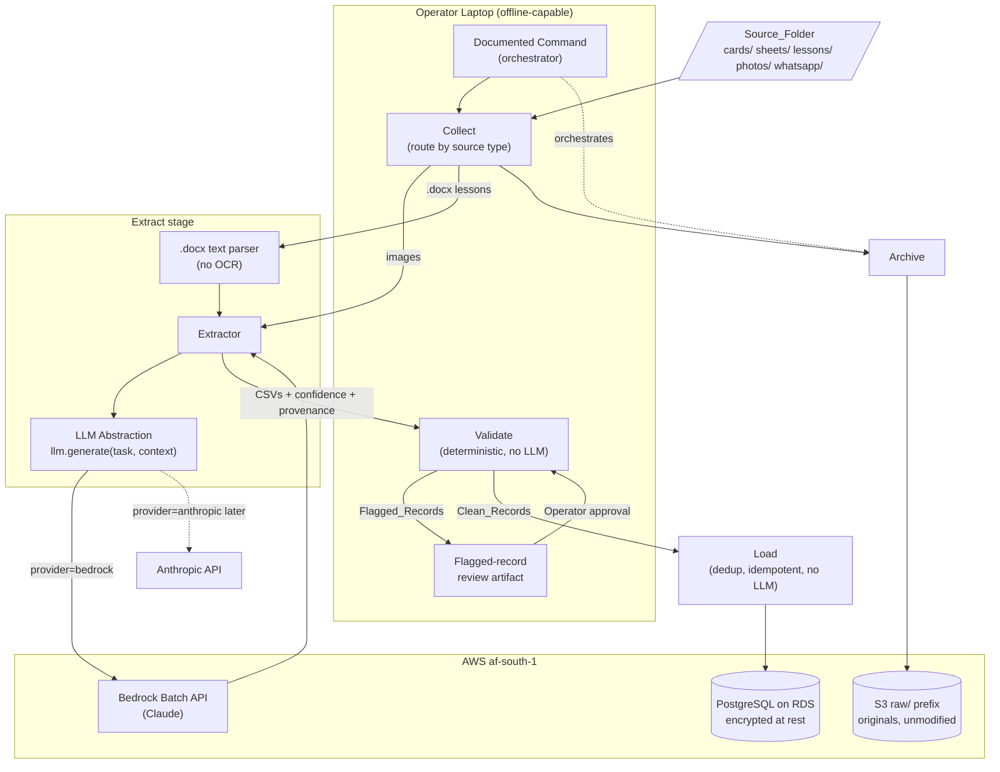
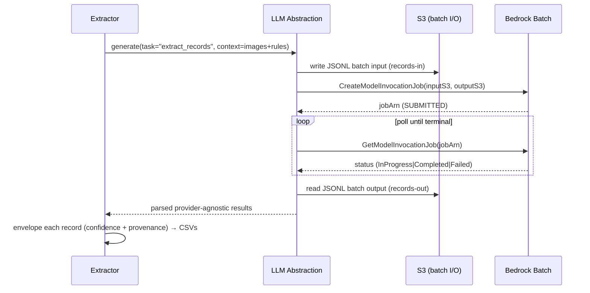

# Design Document

## Overview

Phase 0 (Data Foundation) delivers a **document-intelligence pipeline** that converts FunHouse Digital's paper-era records into a clean, structured founding dataset inside PostgreSQL. The pipeline runs from a single operator laptop and is invoked through **one documented, re-runnable command** that executes five stages end to end: **Collect → Extract → Validate → Load → Archive**.

The design is governed by three cross-cutting principles drawn from the PRD and requirements:

1. **Portable-by-construction (AWS now / anywhere later).** Every AWS dependency is isolated behind an interface or a single configuration value so that migration to a commodity equivalent before AWS credits expire (June 2027) is a config/container change, never a rewrite. (Supports Req 6.)
2. **Deterministic where correctness matters.** All model intelligence is confined to the Extract stage. Validation, deduplication, and loading are pure deterministic code with **no LLM calls** — this is what makes the pipeline re-runnable, auditable, and testable. (Supports Req 7, 8, 9.)
3. **POPIA-by-design.** Data about minors is protected as a first-class concern: no ID numbers or addresses, encryption at rest and in transit, `af-south-1` residency, an append-only consent ledger, and a `sync_log` that answers "who touched this child's record and when." (Supports Req 14.)

Scope is **Phase 0 only**. The Revenue PWA, Lesson Engine, and SMS features (Phases 1–3) are out of scope. There is no UI in Phase 0; the Operator interacts through the command line and reviews flagged records via a generated review artifact.

### Deployment shape

The entire pipeline ships as **one Docker container**. On the operator laptop it runs locally (Collect and Validate need no internet — Req 15.3), reaching out only for Bedrock (Extract), S3 (Archive), and RDS (Load) — Req 15.2. The same container image is what will later run on a VPS.

## Architecture



### Data flow summary

| Stage | Input | Output | Determinism | Network |
|-------|-------|--------|-------------|---------|
| Collect | `Source_Folder` subfolders | routed file manifest + skip log | deterministic | none |
| Extract | routed files | per-table CSVs w/ confidence + provenance | LLM (images), deterministic (.docx) | Bedrock only |
| Validate | CSVs | Clean_Records + Flagged_Records + reasons | deterministic | none |
| Load | Clean_Records | rows in PostgreSQL | deterministic | RDS |
| Archive | original files | objects under `raw/` in S3 | deterministic | S3 |

The orchestrator threads a **run manifest** through every stage so the run is resumable and idempotent (see Idempotency & Re-Runnability).

## Components and Interfaces

### 1. Orchestrator (Documented Command)

The single entry point that runs all five stages end to end. (Req 13.1, 13.2)

```
funhouse-pipeline run \
  --source-folder <path> \
  --config <path/to/config.yaml> \
  [--stage collect|extract|validate|load|archive]   # optional: run one stage
  [--resume <run_id>]                                # optional: continue a prior run
```

Responsibilities:
- Load configuration (DB connection, S3 bucket, LLM provider + threshold, region).
- Create/attach a `run_id` and a **run manifest** persisted to a local `.pipeline-state/` directory.
- Execute stages in order, halting the pipeline only on unrecoverable errors; per-file errors are recorded and skipped.
- Emit a run summary (counts: collected, extracted, flagged, loaded, skipped, archived).
- Be idempotent across re-runs over the same `Source_Folder` (Req 13.3) and process new folders fully (Req 13.4).

The command and its options are documented in the spec's `README`/`docs` section produced during implementation (Req 13.2).

### 2. Collect

Reads the `Source_Folder` and routes files by the subfolder they live in. (Req 3)

Interface:
```python
def collect(source_folder: Path, manifest: RunManifest) -> CollectResult:
    """Walk cards/, sheets/, lessons/, photos/, whatsapp/.
    Route each file to a handler by source type.
    Record missing subfolders and skipped files."""
```

Routing table:

| Subfolder | Source type | Downstream handler |
|-----------|-------------|--------------------|
| `cards/` | membership/pay cards (images) | Extract → Bedrock Batch |
| `sheets/` | attendance/payment sheets (images) | Extract → Bedrock Batch |
| `photos/` | photos of records (images) | Extract → Bedrock Batch |
| `whatsapp/` | exported chat text/images | Extract → Bedrock Batch (images) / text parse |
| `lessons/` | `.docx` lesson documents | Extract → `.docx` text parser (no OCR) |

Behavior:
- Missing subfolder → recorded as **absent**, processing continues (Req 3.2).
- Unsupported file type → **skipped**, skip recorded with file path + reason (Req 3.3).
- Supported types are defined per subfolder (e.g. `.jpg/.jpeg/.png/.heic/.pdf` for image folders; `.docx` for lessons).

### 3. Extract

Turns routed source material into `Extracted_Record`s. Two paths:

**3a. Image path (Bedrock Batch).** (Req 4, 5-negative)
- Submits extraction requests through the **LLM Abstraction** using the **Bedrock Batch API** (~half the cost of real-time invoke; batch latency is acceptable for a historical backlog). (Req 4.1)
- Supplies business rules — pricing tiers, product rules, school names, known player names — as the **system prompt** so the model extracts against known ground truth. (Req 4.2)
- Attaches a `Confidence_Score` (0–1) to each record (Req 4.3) and a reference to the originating source file (provenance) (Req 4.4).
- Writes results as **one CSV per target table**: `players`, `sessions`, `payments`, `lessons`, `student_metrics` (Req 4.5).

Bedrock Batch job flow:


**3b. Lesson `.docx` path (direct text parse).** (Req 5, 10)
- Parses `.docx` files as text, **no image OCR** (Req 5.1).
- Produces one `lessons` record per lesson (Req 5.2, 10.1), tagging topic and phenomenon (Req 10.3), and storing a reference to the original file (set during Archive/Load — Req 10.2).
- Emits a `student_metrics` record for each embedded learning measurement, with `metric_type` restricted to the allowed set (Req 5.3).

The Extractor is the **only** component that calls the LLM (Req 6.1). It never talks to a provider SDK directly — all calls go through the abstraction (§ LLM Abstraction Interface).

### 4. Validate

Deterministic gatekeeper. **No LLM calls at all** (Req 7.1). Consumes the Extract CSVs and classifies each row as `Clean_Record` or `Flagged_Record`, recording a reason for every flag.

Interface:
```python
def validate(record: ExtractedRecord, rules: BusinessRules) -> ValidationResult:
    """Pure function. Returns CLEAN or FLAGGED(reasons[])."""
```

Flagging rules (all deterministic — Req 7.2–7.6):

| Rule | Condition | Flag reason |
|------|-----------|-------------|
| Low confidence | `confidence_score < threshold` (configurable) | `LOW_CONFIDENCE` |
| Impossible date | date not a real calendar date, or out of plausible range (e.g. future date, birth_date implying age <3 or >100) | `IMPOSSIBLE_DATE` |
| Unknown person | name matches no known player name (after normalization) | `UNKNOWN_NAME` |
| Bad amount | payment amount matches no `Pricing_Tier` and no product price | `AMOUNT_NO_TIER` |

Behavior:
- A record may accumulate multiple reasons; all are recorded (Req 7.6).
- Passing all rules → `Clean_Record` (Req 7.7).
- On completion, **only** `Flagged_Record`s are surfaced to the Operator via a review artifact (e.g. `flagged-<run_id>.csv`) (Req 7.8). Operator approval promotes a flagged row to clean for that run.

### 5. Load

Deterministic importer. **No LLM calls** (Req 9.2). Imports `Clean_Record`s into `players`, `sessions`, `payments`, `lessons`, `student_metrics` (Req 9.1, 9.3, 9.4).

Interface:
```python
def load(clean_records: Iterable[CleanRecord], db: Connection, manifest: RunManifest) -> LoadResult:
    """Deduplicate players, resolve FKs, insert idempotently, write sync_log + logged_by."""
```

Key behaviors:
- **Player deduplication** (Req 8) — learners and lounge customers go into the single `players` table (Req 8.1); records referring to the same person are merged (Req 8.2); combined session/payment/metric history attaches to the surviving row (Req 8.3). New rows get `consent_status = 'pending'` (Req 8.4). See § Player Deduplication.
- **Idempotency** — a `Clean_Record` that would duplicate an already-loaded row is skipped and the skip recorded (Req 9.5, 13.3). See § Idempotency & Re-Runnability.
- **Consent ledger** — consent writes append new rows; revocations append a new row rather than editing; no row is ever deleted or overwritten (Req 11.1–11.3).
- **Provenance/audit** — every write records the acting identity in `logged_by` and appends a `sync_log` entry (Req 14.5).
- **POPIA filter** — ID numbers and physical addresses are never loaded (Req 14.1); the loader drops such fields defensively even if an extractor produced them.

### 6. Archive

Stores every original source file, unmodified, in S3 under the `raw/` prefix in `af-south-1` (Req 12.1–12.3), making the pipeline re-runnable from originals.

Interface:
```python
def archive(files: Iterable[SourceFile], bucket: str, manifest: RunManifest) -> ArchiveResult:
    """Upload originals under raw/<relative-path>. Idempotent by key + content hash."""
```

Behavior:
- Object key: `raw/<source-subfolder>/<original-filename>` (stable and deterministic).
- Content is uploaded byte-for-byte unmodified (Req 12.3); a content hash (SHA-256) is stored as object metadata to detect changes and enable idempotent re-archival.
- Region pinned to `af-south-1` (Req 12.2, 14.4); transfer uses TLS (Req 14.3).
- The stored object reference is written back onto the relevant row (e.g. `lessons.original_file_ref`) during Load (Req 10.2).

## LLM Abstraction Interface

All model calls flow through one internal module (PRD §3.3, Req 6.1, 6.2). Prompts, lesson templates, and output parsers are **provider-agnostic**. Switching providers is **one environment variable**.

```python
class LLMProvider(Protocol):
    def generate(self, task: str, context: dict) -> LLMResult: ...

def llm_generate(task: str, context: dict) -> LLMResult:
    """Single public entry point. Selects provider from env, delegates,
    and returns a provider-agnostic result the Extractor can parse identically."""
    provider = get_provider(os.environ["LLM_PROVIDER"])  # "bedrock" | "anthropic"
    return provider.generate(task, context)
```

Provider selection:

| `LLM_PROVIDER` | Implementation | Mode | Notes |
|----------------|----------------|------|-------|
| `bedrock` (now) | `BedrockBatchProvider` | Bedrock Batch API | Uses credits; ~half real-time cost; async job + S3 I/O; speed irrelevant for backlog (Req 4.1) |
| `anthropic` (later) | `AnthropicProvider` | Anthropic Messages API direct | Post-credits target; same `task`/`context` contract |

Design rules:
- `task` is a stable identifier (e.g. `extract_records`) mapping to a versioned, provider-agnostic prompt template.
- `context` carries images/text + the business-rules system prompt.
- `LLMResult` is normalized: providers must return the same shape so the Extractor's output parser is identical regardless of provider (Req 6.2).
- The Extractor imports only `llm_generate` — never a provider SDK — so adding/swapping providers requires **no Extractor code change** (Req 6.2).
- Banned services (Pinpoint, DynamoDB, Cognito, Lambda-as-architecture) are never referenced anywhere in the codebase; PostgreSQL is the only database (Req 6.3, 6.4).

## Data Models

### PostgreSQL schema (14 tables)

Conventions applied to **every** table (Req 1.2, 1.3, and sync metadata):
- `id UUID PRIMARY KEY DEFAULT gen_random_uuid()`
- `created_at TIMESTAMPTZ NOT NULL DEFAULT now()`
- `updated_at TIMESTAMPTZ NOT NULL DEFAULT now()`
- `location_id UUID NOT NULL REFERENCES locations(id)` (self-referential/nullable-at-bootstrap for `locations`)
- Sync metadata: `client_id TEXT`, `device_id TEXT`, `client_timestamp TIMESTAMPTZ` (server truth is `created_at`/`updated_at`)
- `school_id` present where the table represents school-associated data (Req 1.4)

Schema deployment is idempotent: `CREATE TABLE IF NOT EXISTS`; if a table already exists it is left intact and reported as present (Req 1.6).

```sql
-- 1. locations
CREATE TABLE IF NOT EXISTS locations (
    id UUID PRIMARY KEY DEFAULT gen_random_uuid(),
    name TEXT NOT NULL,
    location_id UUID,                     -- self-reference; nullable at bootstrap
    client_id TEXT, device_id TEXT, client_timestamp TIMESTAMPTZ,
    created_at TIMESTAMPTZ NOT NULL DEFAULT now(),
    updated_at TIMESTAMPTZ NOT NULL DEFAULT now(),
    UNIQUE (name)
);

-- 2. schools
CREATE TABLE IF NOT EXISTS schools (
    id UUID PRIMARY KEY DEFAULT gen_random_uuid(),
    name TEXT NOT NULL,
    contract_status TEXT NOT NULL CHECK (contract_status IN ('partner','proposed')),
    location_id UUID NOT NULL REFERENCES locations(id),
    client_id TEXT, device_id TEXT, client_timestamp TIMESTAMPTZ,
    created_at TIMESTAMPTZ NOT NULL DEFAULT now(),
    updated_at TIMESTAMPTZ NOT NULL DEFAULT now(),
    UNIQUE (name)
);

-- 3. users (self-managed auth: bcrypt hash travels with the API)
CREATE TABLE IF NOT EXISTS users (
    id UUID PRIMARY KEY DEFAULT gen_random_uuid(),
    name TEXT NOT NULL,
    role TEXT NOT NULL CHECK (role IN ('founder','manager','coach','operator')),
    email TEXT UNIQUE,
    password_hash TEXT,                   -- bcrypt; nullable for backfilled users
    location_id UUID NOT NULL REFERENCES locations(id),
    client_id TEXT, device_id TEXT, client_timestamp TIMESTAMPTZ,
    created_at TIMESTAMPTZ NOT NULL DEFAULT now(),
    updated_at TIMESTAMPTZ NOT NULL DEFAULT now()
);

-- 4. guardians
CREATE TABLE IF NOT EXISTS guardians (
    id UUID PRIMARY KEY DEFAULT gen_random_uuid(),
    first_name TEXT NOT NULL,
    last_name TEXT,
    phone TEXT,                           -- no ID numbers, no physical addresses (POPIA, Req 14.1)
    relationship TEXT,
    location_id UUID NOT NULL REFERENCES locations(id),
    client_id TEXT, device_id TEXT, client_timestamp TIMESTAMPTZ,
    created_at TIMESTAMPTZ NOT NULL DEFAULT now(),
    updated_at TIMESTAMPTZ NOT NULL DEFAULT now()
);

-- 5. players (learners + lounge customers — ONE table, Req 8.1)
CREATE TABLE IF NOT EXISTS players (
    id UUID PRIMARY KEY DEFAULT gen_random_uuid(),
    first_name TEXT NOT NULL,
    last_name TEXT,
    birth_date DATE,
    grade TEXT,
    school_id UUID REFERENCES schools(id),         -- nullable (lounge customers)
    guardian_id UUID REFERENCES guardians(id),
    consent_status TEXT NOT NULL DEFAULT 'pending'
        CHECK (consent_status IN ('pending','granted','revoked')),   -- backfill starts pending (Req 8.4, 14)
    consent_date TIMESTAMPTZ,
    photo_consent BOOLEAN NOT NULL DEFAULT false,
    active BOOLEAN NOT NULL DEFAULT true,
    dedup_key TEXT,                                 -- normalized identity for merge/idempotency
    location_id UUID NOT NULL REFERENCES locations(id),
    client_id TEXT, device_id TEXT, client_timestamp TIMESTAMPTZ,
    created_at TIMESTAMPTZ NOT NULL DEFAULT now(),
    updated_at TIMESTAMPTZ NOT NULL DEFAULT now(),
    UNIQUE (dedup_key)                              -- enforces one row per person
);

-- 6. consents (APPEND-ONLY ledger, Req 11)
CREATE TABLE IF NOT EXISTS consents (
    id UUID PRIMARY KEY DEFAULT gen_random_uuid(),
    player_id UUID NOT NULL REFERENCES players(id),
    guardian_id UUID REFERENCES guardians(id),
    consent_type TEXT NOT NULL,                     -- e.g. data_processing, photo
    granted BOOLEAN NOT NULL,
    granted_at TIMESTAMPTZ NOT NULL,
    method TEXT,                                    -- paper, verbal, whatsapp, form
    captured_by_user_id UUID REFERENCES users(id),
    location_id UUID NOT NULL REFERENCES locations(id),
    client_id TEXT, device_id TEXT, client_timestamp TIMESTAMPTZ,
    created_at TIMESTAMPTZ NOT NULL DEFAULT now(),
    updated_at TIMESTAMPTZ NOT NULL DEFAULT now()
    -- No UPDATE/DELETE permitted; enforced by trigger + role grants (see Error Handling)
);

-- 7. products
CREATE TABLE IF NOT EXISTS products (
    id UUID PRIMARY KEY DEFAULT gen_random_uuid(),
    name TEXT NOT NULL,
    type TEXT NOT NULL CHECK (type IN ('pay_per_use','subscription','once_off_pass')),
    price_cents INTEGER NOT NULL,                   -- store money as integer cents
    rules JSONB NOT NULL DEFAULT '{}'::jsonb,       -- e.g. members, hours/week, term, reset
    location_id UUID NOT NULL REFERENCES locations(id),
    client_id TEXT, device_id TEXT, client_timestamp TIMESTAMPTZ,
    created_at TIMESTAMPTZ NOT NULL DEFAULT now(),
    updated_at TIMESTAMPTZ NOT NULL DEFAULT now(),
    UNIQUE (name)
);

-- 8. entitlements (what a player is entitled to under a product)
CREATE TABLE IF NOT EXISTS entitlements (
    id UUID PRIMARY KEY DEFAULT gen_random_uuid(),
    player_id UUID NOT NULL REFERENCES players(id),
    product_id UUID NOT NULL REFERENCES products(id),
    status TEXT NOT NULL DEFAULT 'active'
        CHECK (status IN ('active','expired','cancelled')),
    remaining_units INTEGER,                        -- sessions/time remaining (nullable = unlimited)
    valid_from DATE,
    valid_to DATE,
    location_id UUID NOT NULL REFERENCES locations(id),
    client_id TEXT, device_id TEXT, client_timestamp TIMESTAMPTZ,
    created_at TIMESTAMPTZ NOT NULL DEFAULT now(),
    updated_at TIMESTAMPTZ NOT NULL DEFAULT now()
);

-- 9. sessions
CREATE TABLE IF NOT EXISTS sessions (
    id UUID PRIMARY KEY DEFAULT gen_random_uuid(),
    player_id UUID NOT NULL REFERENCES players(id),
    session_type TEXT NOT NULL
        CHECK (session_type IN ('lesson','kit','esports','lounge')),
    started_at TIMESTAMPTZ,
    ended_at TIMESTAMPTZ,
    duration_minutes INTEGER,
    school_id UUID REFERENCES schools(id),          -- school-associated (Req 1.4)
    logged_by UUID REFERENCES users(id),            -- who touched the record (Req 14.5)
    location_id UUID NOT NULL REFERENCES locations(id),
    client_id TEXT, device_id TEXT, client_timestamp TIMESTAMPTZ,
    created_at TIMESTAMPTZ NOT NULL DEFAULT now(),
    updated_at TIMESTAMPTZ NOT NULL DEFAULT now(),
    natural_key TEXT UNIQUE                          -- idempotency (Req 9.5)
);

-- 10. attendance
CREATE TABLE IF NOT EXISTS attendance (
    id UUID PRIMARY KEY DEFAULT gen_random_uuid(),
    session_id UUID REFERENCES sessions(id),
    player_id UUID NOT NULL REFERENCES players(id),
    attendance_date DATE NOT NULL,
    present BOOLEAN NOT NULL DEFAULT true,
    school_id UUID REFERENCES schools(id),
    logged_by UUID REFERENCES users(id),
    location_id UUID NOT NULL REFERENCES locations(id),
    client_id TEXT, device_id TEXT, client_timestamp TIMESTAMPTZ,
    created_at TIMESTAMPTZ NOT NULL DEFAULT now(),
    updated_at TIMESTAMPTZ NOT NULL DEFAULT now(),
    natural_key TEXT UNIQUE
);

-- 11. payments
CREATE TABLE IF NOT EXISTS payments (
    id UUID PRIMARY KEY DEFAULT gen_random_uuid(),
    player_id UUID NOT NULL REFERENCES players(id),
    product_id UUID REFERENCES products(id),
    amount_cents INTEGER NOT NULL,
    method TEXT,                                     -- cash, transfer, etc.
    paid_at TIMESTAMPTZ,
    logged_by UUID REFERENCES users(id),
    location_id UUID NOT NULL REFERENCES locations(id),
    client_id TEXT, device_id TEXT, client_timestamp TIMESTAMPTZ,
    created_at TIMESTAMPTZ NOT NULL DEFAULT now(),
    updated_at TIMESTAMPTZ NOT NULL DEFAULT now(),
    natural_key TEXT UNIQUE
);

-- 12. lessons
CREATE TABLE IF NOT EXISTS lessons (
    id UUID PRIMARY KEY DEFAULT gen_random_uuid(),
    title TEXT NOT NULL,
    topic TEXT,                                      -- tag (Req 10.3)
    phenomenon TEXT,                                 -- tag (Req 10.3)
    content TEXT,
    original_file_ref TEXT,                          -- S3 key of original (Req 10.2)
    school_id UUID REFERENCES schools(id),
    location_id UUID NOT NULL REFERENCES locations(id),
    client_id TEXT, device_id TEXT, client_timestamp TIMESTAMPTZ,
    created_at TIMESTAMPTZ NOT NULL DEFAULT now(),
    updated_at TIMESTAMPTZ NOT NULL DEFAULT now(),
    natural_key TEXT UNIQUE
);

-- 13. student_metrics
CREATE TABLE IF NOT EXISTS student_metrics (
    id UUID PRIMARY KEY DEFAULT gen_random_uuid(),
    player_id UUID NOT NULL REFERENCES players(id),
    lesson_id UUID REFERENCES lessons(id),
    metric_type TEXT NOT NULL
        CHECK (metric_type IN ('typing_wpm','typing_accuracy','homework_done','quiz_score','observation')),  -- Req 1.7
    value TEXT NOT NULL,                             -- text to hold numeric + observation notes
    measured_at TIMESTAMPTZ,
    logged_by UUID REFERENCES users(id),
    location_id UUID NOT NULL REFERENCES locations(id),
    client_id TEXT, device_id TEXT, client_timestamp TIMESTAMPTZ,
    created_at TIMESTAMPTZ NOT NULL DEFAULT now(),
    updated_at TIMESTAMPTZ NOT NULL DEFAULT now(),
    natural_key TEXT UNIQUE
);

-- 14. sync_log (who touched what, when — Req 14.5)
CREATE TABLE IF NOT EXISTS sync_log (
    id UUID PRIMARY KEY DEFAULT gen_random_uuid(),
    device_id TEXT,
    user_id UUID REFERENCES users(id),
    entity TEXT NOT NULL,                            -- table name
    record_id UUID NOT NULL,
    action TEXT NOT NULL CHECK (action IN ('insert','update','delete','skip')),
    client_timestamp TIMESTAMPTZ,
    server_timestamp TIMESTAMPTZ NOT NULL DEFAULT now(),
    location_id UUID NOT NULL REFERENCES locations(id),
    created_at TIMESTAMPTZ NOT NULL DEFAULT now(),
    updated_at TIMESTAMPTZ NOT NULL DEFAULT now()
);
```

Encryption at rest is enabled at the RDS instance level; encryption in transit via TLS on all DB and S3 connections (Req 14.2, 14.3). Residency pinned to `af-south-1` (Req 1.5, 14.4).

### Seed data (Req 2)

Seeding is idempotent: each row is inserted only if a row with the same natural identity is absent; otherwise it is skipped and left unchanged (Req 2.8).

| Table | Rows | Natural identity |
|-------|------|------------------|
| `locations` | Row 1 = **Smithfield** (Req 2.1) | `name` |
| `schools` (`partner`) | Mofulatshepe, Relebohile-Sibulele, Smithfield Primary (Req 2.2) | `name` |
| `schools` (`proposed`) | Thabo-Vuyo, Naledi, Rouxville Primary, JB Tyu (Req 2.3) | `name` |
| `products` | PayPerUse-20min (R10), PayPerUse-1hr (R30), PayPerUse-2hr (R50), Subscription (R350), Holiday Special (R250) (Req 2.4) | `name` |
| `users` | Aya (`founder`), Loyiso (`manager`) (Req 2.7) | `email`/`name` |

Product rules stored in `products.rules` JSONB:
- **Subscription** (Req 2.5): `{"members": 4, "hours_per_week": 2, "min_term_months": 3}`, `price_cents = 35000`.
- **Holiday Special** (Req 2.6): `price_cents = 25000`, `{"hours_per_week": 3, "reset": "sunday", "rollover": false, "fixed_window": true}`.
- Pay-per-use (Req 2.4): `PayPerUse-20min` 1000, `PayPerUse-1hr` 3000, `PayPerUse-2hr` 5000 cents; `type = pay_per_use`.

`Pricing_Tier` set used by the Validator is derived from these seeded products: {R10/20min, R30/1hr, R50/2hr, R350/subscription, R250/Holiday Special}.

### CSV intermediate schemas (Extract output)

One CSV per target table. Every row carries the **extracted-record envelope** columns in addition to its domain columns:

Envelope columns (present in every CSV):

| Column | Meaning |
|--------|---------|
| `record_id` | stable id for the extracted row (used for idempotency + review) |
| `confidence_score` | 0–1 extraction certainty (Req 4.3) |
| `source_file` | provenance: path/key of the originating source file (Req 4.4) |
| `extracted_at` | timestamp |
| `provider` | LLM provider that produced it (`bedrock`/`anthropic`) or `docx-parser` |

Domain columns per CSV:

- **players.csv**: `first_name, last_name, birth_date, grade, school_name, guardian_name, photo_consent`
- **sessions.csv**: `player_name, session_type, started_at, ended_at, duration_minutes, school_name`
- **payments.csv**: `player_name, product_name, amount, method, paid_at`
- **lessons.csv**: `title, topic, phenomenon, content, source_file`
- **student_metrics.csv**: `player_name, lesson_title, metric_type, value, measured_at`

(Names are resolved to `*_id` foreign keys deterministically during Load.)

### Extracted-record envelope (in-memory)

```python
@dataclass
class ExtractedRecord:
    record_id: str
    target_table: str                # players|sessions|payments|lessons|student_metrics
    payload: dict                     # domain columns
    confidence_score: float           # 0..1 (Req 4.3)
    source_file: str                  # provenance (Req 4.4)
    provider: str
    extracted_at: datetime
```

### Player deduplication

Goal: one `players` row per real person; a learner who also uses the lounge is a single identity with combined history (Req 8.1–8.3, 8.5).

Strategy:
1. **Normalize** each candidate into a `dedup_key`: lowercase, trim, collapse whitespace on `first_name`+`last_name`, combined with `birth_date` when present — e.g. `slug(first)|slug(last)|birth_date`.
2. **Match** incoming records against existing `players.dedup_key` (unique constraint) and against each other within the batch.
3. **Merge**: when a match is found, no new row is created; the existing row survives. Attribute-level fill-in favors the higher-confidence, non-null value. Ambiguous merges (same name, conflicting birth_date) are **flagged for Operator review** rather than auto-merged.
4. **Re-associate**: sessions, payments, and student_metrics for merged records are attached to the surviving `players.id` (Req 8.3).
5. New rows created with `consent_status = 'pending'` (Req 8.4).

The `dedup_key` unique constraint is the database-level guarantee that two rows cannot represent the same person.


## Correctness Properties

*A property is a characteristic or behavior that should hold true across all valid executions of a system — essentially, a formal statement about what the system should do. Properties serve as the bridge between human-readable specifications and machine-verifiable correctness guarantees.*

The properties below are derived from the prework analysis. Redundant per-criterion checks have been consolidated so each property carries unique validation value. Infrastructure/config criteria (RDS deploy, region, encryption, banned-service exclusion) are covered by smoke/integration tests in the Testing Strategy, not as properties.

### Property 1: Universal schema column presence

*For any* table in the deployed schema, that table has `id`, `created_at`, `updated_at`, and `location_id` columns.

**Validates: Requirements 1.2, 1.3**

### Property 2: Schema deploy is idempotent and non-destructive

*For any* pre-existing database state, running schema deployment again leaves every existing table and all its rows intact and reports already-present tables as present.

**Validates: Requirements 1.6**

### Property 3: metric_type domain is enforced

*For any* string value, inserting a `student_metrics` row succeeds if and only if the value is one of `typing_wpm`, `typing_accuracy`, `homework_done`, `quiz_score`, `observation`.

**Validates: Requirements 1.7**

### Property 4: Seeding is idempotent

*For any* subset of seed rows already present in the database, re-running the seed step creates no duplicate rows and leaves the existing rows unchanged.

**Validates: Requirements 2.8**

### Property 5: Missing subfolders do not halt collection

*For any* subset of the five expected subfolders being absent, collection records each absent subfolder and still processes every present subfolder to completion.

**Validates: Requirements 3.2**

### Property 6: Unsupported files are skipped with a recorded reason

*For any* file whose type is unsupported for its subfolder, collection skips the file and records a skip entry containing the file path and a reason.

**Validates: Requirements 3.3**

### Property 7: Extraction context always includes the business rules

*For any* image extraction request, the context/system prompt built for the LLM contains the pricing tiers, product rules, school names, and known player names.

**Validates: Requirements 4.2**

### Property 8: Every extracted record carries a complete envelope

*For any* record produced by the Extractor, the record has a `confidence_score` in the closed interval [0, 1] and a non-empty `source_file` provenance reference.

**Validates: Requirements 4.3, 4.4**

### Property 9: Lesson `.docx` files are parsed as text without OCR or LLM image calls

*For any* `.docx` lesson file, extraction produces records via the text parser and issues no image-OCR or LLM image-extraction call.

**Validates: Requirements 5.1**

### Property 10: One lessons record per lesson

*For any* lesson document containing N lessons, extraction and load produce exactly N `lessons` records.

**Validates: Requirements 5.2, 10.1**

### Property 11: Embedded metrics use only allowed metric types

*For any* lesson document with embedded learning measurements, each produced `student_metrics` record has a `metric_type` drawn from the allowed set.

**Validates: Requirements 5.3**

### Property 12: Provider selection is transparent to the Extractor

*For any* configured provider value, `llm_generate` routes the call to that provider and returns a normalized `LLMResult` of the same shape, requiring no change to Extractor code.

**Validates: Requirements 6.2**

### Property 13: Validation is deterministic and LLM-free

*For any* extracted record, repeated calls to the Validator produce identical results, and validation issues no large-language-model call.

**Validates: Requirements 7.1**

### Property 14: Low-confidence records are flagged

*For any* record whose `confidence_score` is below the configured threshold, the Validator marks it a Flagged_Record with reason `LOW_CONFIDENCE`.

**Validates: Requirements 7.2**

### Property 15: Impossible dates are flagged

*For any* record containing an impossible date, the Validator marks it a Flagged_Record with reason `IMPOSSIBLE_DATE`.

**Validates: Requirements 7.3**

### Property 16: Unknown names are flagged

*For any* record whose person name matches no known player name after normalization, the Validator marks it a Flagged_Record with reason `UNKNOWN_NAME`.

**Validates: Requirements 7.4**

### Property 17: Payments with no matching tier or product are flagged

*For any* payment record whose amount equals no `Pricing_Tier` and no product price, the Validator marks it a Flagged_Record with reason `AMOUNT_NO_TIER`.

**Validates: Requirements 7.5**

### Property 18: Clean/flagged is a total partition with recorded reasons

*For any* extracted record, the Validator classifies it as exactly one of Clean_Record or Flagged_Record: it is Clean if and only if it violates no rule, and every Flagged_Record carries a non-empty list of reasons.

**Validates: Requirements 7.6, 7.7**

### Property 19: Only flagged records are surfaced for review

*For any* set of validated records, the Operator review artifact contains exactly the flagged subset and no clean record.

**Validates: Requirements 7.8**

### Property 20: Player deduplication yields one row per person with preserved history

*For any* set of extracted player records (learners and lounge customers mixed), after load the `players` table contains no two rows for the same person (unique `dedup_key`), all such records land in the single `players` table, and every session, payment, and metric from merged records is associated with exactly one surviving `players` row with no history lost.

**Validates: Requirements 8.1, 8.2, 8.3**

### Property 21: New players start with pending consent

*For any* newly created `players` row, its `consent_status` equals `pending`.

**Validates: Requirements 8.4**

### Property 22: Clean records load into their target tables (LLM-free)

*For any* set of Clean_Records, the Loader creates a corresponding row in the correct target table for each record and issues no large-language-model call.

**Validates: Requirements 9.1, 9.2, 9.3, 9.4**

### Property 23: End-to-end run is idempotent

*For any* Source_Folder, running the Documented_Command twice results in the same database state as running it once (duplicate records are skipped and the skip recorded), for all target tables.

**Validates: Requirements 9.5, 13.3**

### Property 24: Consent ledger is append-only and monotonic

*For any* sequence of consent operations (including revocations), the `consents` row count is monotonically non-decreasing, every previously written row remains byte-for-byte unchanged, and a revocation is represented as a newly appended row.

**Validates: Requirements 11.1, 11.2, 11.3**

### Property 25: Archived originals are byte-for-byte preserved

*For any* processed source file, the object archived under the `raw/` prefix has content identical to the original (equal SHA-256 digest).

**Validates: Requirements 12.3**

### Property 26: Every loaded row traces to an archived original

*For any* row loaded into the database from source material, its provenance resolves to an original source file that exists as an archived object under `raw/` (for lessons, `original_file_ref` points to that object).

**Validates: Requirements 4.4, 10.2, 12.1**

### Property 27: Lessons are tagged with topic and phenomenon

*For any* lesson whose source contains a topic and phenomenon, the loaded `lessons` row has both fields populated.

**Validates: Requirements 10.3**

### Property 28: No prohibited personal data is loaded

*For any* loaded row, no field contains a national identity number or physical address.

**Validates: Requirements 14.1**

### Property 29: Every write is audited

*For any* record written to the database, the acting identity is recorded in `logged_by` (where the table has it) and a corresponding `sync_log` entry referencing the entity, record id, and action is appended.

**Validates: Requirements 14.5**

### Property 30: Collect and Validate perform no network I/O

*For any* input, the Collect and Validate stages complete without issuing any network call.

**Validates: Requirements 15.3**

## Error Handling

The pipeline distinguishes **recoverable per-item errors** (record and continue) from **unrecoverable run errors** (halt with a clear message). Nothing silently disappears — every skip/failure is written to the run manifest and surfaced in the run summary.

| Condition | Stage | Handling |
|-----------|-------|----------|
| Missing subfolder | Collect | Record as absent; continue with remaining subfolders (Req 3.2). |
| Unsupported file type | Collect | Skip file; record path + reason (Req 3.3). |
| Bedrock Batch job fails / times out | Extract | Retry with exponential backoff up to N attempts; on persistent failure, mark the batch's source files as `extract_failed` in the manifest and continue other batches. Failed files are re-attempted on the next run (idempotent). |
| Malformed / unparseable LLM output | Extract | Emit a low-confidence (0.0) record so the Validator flags it, preserving provenance rather than dropping the source. |
| `.docx` parse error | Extract | Record parse failure with file path; skip that file; continue. |
| Low confidence / impossible date / unknown name / bad amount | Validate | Flag with reason; route to Operator review (never auto-loaded) (Req 7.2–7.6). |
| Ambiguous dedup (same name, conflicting birth_date) | Load | Do not auto-merge; flag for Operator review. |
| Duplicate of already-loaded row | Load | Skip insert; append a `skip` `sync_log`/manifest entry (Req 9.5). |
| Foreign-key resolution failure (e.g. unknown school/product name) | Load | Flag the record for review rather than inserting with a null/guessed FK. |
| Attempt to UPDATE/DELETE a `consents` row | Load / DB | Rejected by an append-only trigger and restricted role grants (Req 11.3); raises an error. |
| S3 upload failure | Archive | Retry with backoff; on persistent failure, halt the run for that file's batch and report (originals must not be lost before load is trusted). |
| Object already archived with matching hash | Archive | Skip re-upload; treat as success (idempotent, Req 12.3). |
| DB connection / auth failure | Load | Unrecoverable: halt with actionable message; no partial-commit (each record loads in its own transaction). |
| Network unavailable during Collect/Validate | Collect/Validate | Not an error — these stages are offline by design (Req 15.3). |

Transactions: each record's load (including its `sync_log` append and any player merge) executes in a single transaction, so a failure leaves no half-written row. The append-only guarantee on `consents` is enforced both by a database trigger and by granting the pipeline role only `INSERT`/`SELECT` on that table.

## Idempotency & Re-Runnability

Idempotency is the backbone of "one re-runnable command" (Req 13.3) and is achieved deterministically:

1. **Natural keys.** `sessions`, `attendance`, `payments`, `lessons`, `student_metrics` each carry a `natural_key` (a deterministic hash of the identifying domain fields + source provenance) with a `UNIQUE` constraint. Load uses `INSERT ... ON CONFLICT (natural_key) DO NOTHING`, so re-loading a record is a no-op skip (Req 9.5).
2. **Player `dedup_key`.** The unique `dedup_key` guarantees a person cannot be inserted twice across runs (Req 8.2).
3. **Archive keys.** Object keys are deterministic (`raw/<subfolder>/<filename>`), and a content-hash check makes re-archival a no-op (Req 12.3).
4. **Run manifest.** The orchestrator persists per-file/per-record status; on `--resume` it skips already-completed work and re-attempts only failed items.
5. **Schema + seed idempotency.** `CREATE TABLE IF NOT EXISTS` and natural-identity seed checks make deploy/seed safe to re-run (Req 1.6, 2.8).

Result: running the command twice over the same `Source_Folder` converges to the same database state as running it once (Property 23); running it over a new folder processes that folder fully (Req 13.4).

## Testing Strategy

A dual approach: **property-based tests** verify the universal properties above across many generated inputs; **example, integration, and smoke tests** cover concrete scenarios, external-service wiring, and one-time configuration.

### Property-based testing

PBT applies to this feature because the deterministic core — validation, deduplication, idempotency, the append-only ledger, envelope/provenance invariants, and offline behavior — consists of pure or clearly-bounded functions with universal properties over large input spaces.

- Use an established PBT library for the implementation language (e.g. **Hypothesis** for Python, or **fast-check** for TypeScript). Do **not** hand-roll property testing.
- Each of Properties 1–30 is implemented by a **single** property-based test.
- Each property test runs a **minimum of 100 iterations**.
- Each test is tagged with a comment referencing its design property, in the format:
  `Feature: phase0-data-foundation, Property {number}: {property_text}`
- External services (Bedrock, S3, RDS) are **mocked** in property tests so 100+ iterations stay fast and cheap. A local/ephemeral PostgreSQL (or transactional rollback per iteration) backs DB-touching properties (2, 3, 20–24, 26, 28, 29); an in-memory fake object store backs archive properties (25, 26).
- Generators of note:
  - Player records with controllable name/birth_date collisions (for dedup Property 20).
  - Payment amounts spanning tier-matching and non-matching values (Property 17).
  - Dates spanning valid, boundary, and impossible values (Property 15).
  - Confidence scores spanning the threshold (Properties 8, 14).
  - Operation sequences over the consent ledger including revocations (Property 24).
  - Arbitrary byte blobs as "source files" for archive integrity (Property 25).

### Example / unit tests

Concrete behaviors and specific dataset facts:
- Seed rows exist with correct values (Req 2.1–2.7): locations=Smithfield; partner/proposed schools; five products with correct prices and rules; Aya/Loyiso users.
- `school_id` present on school-associated tables (Req 1.4).
- Exactly five CSVs produced by Extract (Req 4.5).
- Extractor imports only `llm_generate`, never a provider SDK (Req 6.1).
- The real founding dataset yields all 73 learners plus lounge regulars after dedup (Req 8.5).

### Integration tests (1–3 examples each; not property tests)

- Bedrock Batch submission path: input JSONL written, job submitted, output JSONL parsed (Req 4.1) — against a mocked/stubbed Bedrock.
- End-to-end command over a small fixture `Source_Folder` runs all five stages (Req 13.1) and a fresh new folder processes fully (Req 13.4).
- Provider swap: setting `LLM_PROVIDER=anthropic` routes through the Anthropic provider (Req 6.2) with a stubbed client.

### Smoke / configuration checks (single execution)

- All 14 tables exist after deploy (Req 1.1).
- RDS region `af-south-1`, storage encryption at rest, TLS in transit (Req 1.5, 14.2, 14.3, 14.4); S3 bucket region `af-south-1` (Req 12.2).
- No dependency on Pinpoint, DynamoDB, Cognito, or Lambda-as-architecture; only a PostgreSQL driver present (Req 6.3, 6.4).
- Documentation of the command exists (Req 13.2).
- Container runs locally on the operator laptop (Req 15.1).

## Migration Note (AWS now → commodity later)

Portable-by-construction means each AWS dependency swaps to its commodity equivalent with a config/container change, never a rewrite (Req 6). Phase 0 touches four AWS services:

| Component | AWS now | Commodity later | How the swap happens (no rewrite) |
|-----------|---------|-----------------|-----------------------------------|
| Database | PostgreSQL on **RDS** | Postgres on VPS / Supabase / Neon | Change the connection string in config; PostgreSQL is the only DB and no RDS-proprietary features are used. |
| Object storage | **S3** (`raw/` prefix) | Cloudflare R2 / Backblaze B2 (S3-compatible) | Point the S3-compatible client at a new endpoint + credentials; keys/paths unchanged. |
| LLM | **Bedrock Batch** (Claude, on credits) | **Anthropic API** direct | Set `LLM_PROVIDER=anthropic`; the LLM Abstraction routes to the other provider with the same `task`/`context` contract and output parser. |
| App packaging | **App Runner / ECS** container | Any VPS (R150–R350/mo) | Run the same Docker image under a different scheduler; auth (JWT + bcrypt) travels inside the container. |

Because Validate, Load, Archive, and dedup are deterministic and provider-agnostic, and all model access is behind `llm.generate`, none of the migration paths require touching business logic — only configuration and the container's runtime host.
