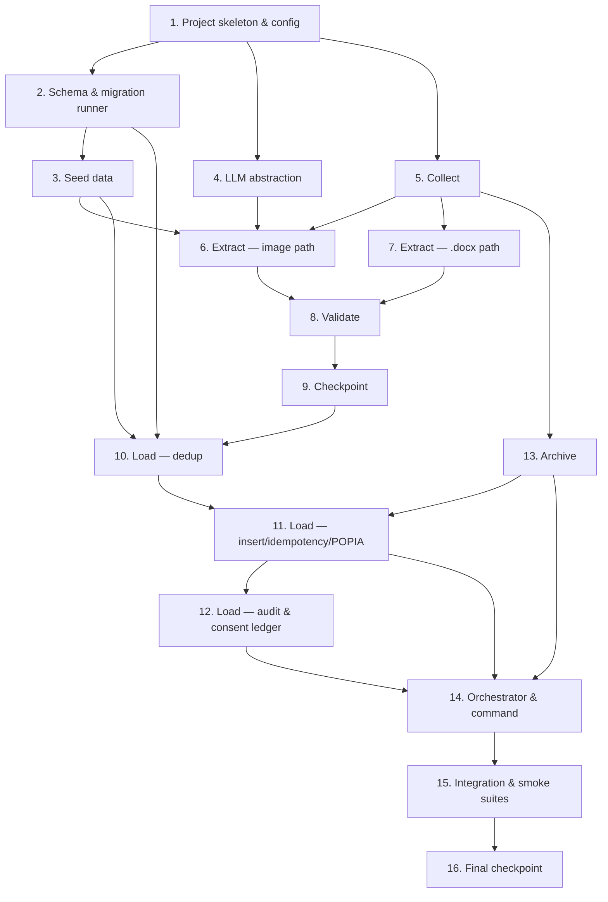

# Implementation Plan: Phase 0 — Data Foundation

## Overview

This plan implements the Phase 0 document-intelligence pipeline (**Collect → Extract → Validate → Load → Archive**) that converts FunHouse Digital's paper-era records into a clean PostgreSQL founding dataset, invoked through one documented, re-runnable command.

Language stack: **Python** (the design's pseudocode and Testing Strategy specify Python with **Hypothesis** for property-based testing). AWS access (Bedrock Batch, S3) is isolated behind interfaces; DB access uses a standard PostgreSQL driver only. External services are mocked in tests; DB-touching tests run against an ephemeral/local PostgreSQL.

Tasks are ordered so each builds on the previous: project skeleton → schema/seed → LLM abstraction → Collect → Extract → Validate → Load → Archive → orchestrator wiring → integration/smoke suites. Property-based tests for each of the 30 correctness properties are placed as optional sub-tasks next to the code they validate so errors surface early; a final verification pass runs the full suite.

Conventions:
- Tasks marked with `*` are optional (tests) and can be skipped for a faster MVP; core implementation tasks are never optional.
- Each property test uses Hypothesis, runs a **minimum of 100 iterations**, and is tagged with a comment: `Feature: phase0-data-foundation, Property {number}: {property_text}`.
- Scope is **Phase 0 only** — no Revenue PWA, Lesson Engine, or SMS work.

## Tasks

- [x] 1. Establish project skeleton, configuration, and test harness
  - Create the Python package layout: `funhouse_pipeline/` with submodules `config`, `db`, `llm`, `collect`, `extract`, `validate`, `load`, `archive`, `orchestrator`, and a `funhouse_pipeline/sql/` directory for migration files.
  - Add dependency/config files (`pyproject.toml` or `requirements.txt`) pinning a PostgreSQL driver (e.g. `psycopg`), an AWS SDK (`boto3`), a `.docx` parser (`python-docx`), a YAML loader, and dev deps `pytest`, `hypothesis`, and an AWS mock (`moto`).
  - Implement `config` loading from a YAML file + environment variables (DB connection, S3 bucket, region `af-south-1`, `LLM_PROVIDER`, confidence threshold).
  - Set up the `tests/` package and `pytest` configuration, plus a shared fixture that provides an ephemeral/local PostgreSQL connection with per-test transactional rollback.
  - _Requirements: 6.4, 13.2, 15.1_

- [x] 2. Implement PostgreSQL schema and migration runner
  - [x] 2.1 Author the 14-table schema SQL
    - Write `CREATE TABLE IF NOT EXISTS` statements for `locations`, `schools`, `users`, `players`, `guardians`, `consents`, `products`, `entitlements`, `sessions`, `attendance`, `payments`, `lessons`, `student_metrics`, `sync_log` exactly as in the design's Data Models section.
    - Include on every table `id UUID PK`, `created_at`, `updated_at`, `location_id`, and the sync-metadata columns (`client_id`, `device_id`, `client_timestamp`); include `school_id` on school-associated tables (`players`, `sessions`, `attendance`, `lessons`).
    - Add CHECK constraints (`contract_status`, `role`, `consent_status`, product `type`, `session_type`, `entitlements.status`, `sync_log.action`) and the `student_metrics.metric_type` CHECK restricting to `typing_wpm`, `typing_accuracy`, `homework_done`, `quiz_score`, `observation`.
    - Add unique constraints for idempotency/dedup: `players.dedup_key`, and `natural_key` on `sessions`, `attendance`, `payments`, `lessons`, `student_metrics`; plus `UNIQUE(name)`/`UNIQUE(email)` for seedable reference tables.
    - _Requirements: 1.1, 1.2, 1.3, 1.4, 1.7, 8.2, 9.5_
  - [x] 2.2 Implement the migration runner
    - Write a deterministic runner that executes the schema SQL against the configured database, reports each table as created or already-present, and is safe to re-run.
    - _Requirements: 1.6_
  - [x] 2.3 Implement the append-only consents enforcement
    - Add a database trigger rejecting UPDATE/DELETE on `consents`, and apply restricted role grants (INSERT/SELECT only) for the pipeline role.
    - _Requirements: 11.3_
  - [x]* 2.4 Write property test for universal schema column presence
    - **Property 1: Universal schema column presence** — for any deployed table, `id`, `created_at`, `updated_at`, `location_id` columns exist.
    - **Validates: Requirements 1.2, 1.3**
  - [x]* 2.5 Write property test for idempotent, non-destructive deploy
    - **Property 2: Schema deploy is idempotent and non-destructive** — re-running deploy over any pre-existing state leaves tables and rows intact and reports present tables.
    - **Validates: Requirements 1.6**
  - [x]* 2.6 Write property test for metric_type domain enforcement
    - **Property 3: metric_type domain is enforced** — inserting a `student_metrics` row succeeds iff `metric_type` is in the allowed set.
    - **Validates: Requirements 1.7**

- [x] 3. Implement idempotent seed data
  - [x] 3.1 Implement the seed routine
    - Insert `locations` row Smithfield; partner schools (Mofulatshepe, Relebohile-Sibulele, Smithfield Primary) and proposed schools (Thabo-Vuyo, Naledi, Rouxville Primary, JB Tyu); the five products with prices in cents and JSONB rules (Subscription `{"members":4,"hours_per_week":2,"min_term_months":3}` at 35000; Holiday Special `{"hours_per_week":3,"reset":"sunday","rollover":false,"fixed_window":true}`; PayPerUse 1000/3000/5000); and users Aya (`founder`) and Loyiso (`manager`).
    - Perform each insert only when a row with the same natural identity (name/email) is absent; otherwise skip and leave unchanged.
    - _Requirements: 2.1, 2.2, 2.3, 2.4, 2.5, 2.6, 2.7, 2.8_
  - [x]* 3.2 Write property test for idempotent seeding
    - **Property 4: Seeding is idempotent** — for any subset of seed rows already present, re-running the seed creates no duplicates and leaves existing rows unchanged.
    - **Validates: Requirements 2.8**
  - [x]* 3.3 Write example tests for seed correctness
    - Assert each expected location, school (with correct `contract_status`), product (correct `price_cents` and `rules`), and user (correct `role`) exists after seeding.
    - _Requirements: 2.1, 2.2, 2.3, 2.4, 2.5, 2.6, 2.7_

- [x] 4. Implement the provider-agnostic LLM abstraction
  - [x] 4.1 Implement the abstraction interface and provider registry
    - Define the `LLMProvider` protocol, the normalized `LLMResult` dataclass, and `llm_generate(task, context)` selecting the provider from `LLM_PROVIDER` env var and delegating.
    - Implement `BedrockBatchProvider` (Bedrock Batch API: write JSONL input to S3, submit `CreateModelInvocationJob`, poll to terminal state, read/parse JSONL output) and a stubbable `AnthropicProvider` returning the same `LLMResult` shape.
    - Ensure banned services (Pinpoint, DynamoDB, Cognito, Lambda-as-architecture) are never referenced.
    - _Requirements: 4.1, 6.1, 6.2, 6.3_
  - [x]* 4.2 Write property test for transparent provider selection
    - **Property 12: Provider selection is transparent to the Extractor** — for any configured provider value, `llm_generate` routes to that provider and returns a normalized `LLMResult` of the same shape with no Extractor change.
    - **Validates: Requirements 6.2**
  - [x]* 4.3 Write integration test for the Bedrock Batch submission path
    - Against a mocked Bedrock/S3, assert input JSONL is written, the job is submitted, and output JSONL is parsed into `LLMResult`s.
    - _Requirements: 4.1_

- [x] 5. Implement Collect (source routing, offline)
  - [x] 5.1 Implement subfolder walking and routing
    - Walk `cards/`, `sheets/`, `lessons/`, `photos/`, `whatsapp/`; route each file to its handler (image → Extract/Bedrock; `.docx` in `lessons/` → text parser) using the design's routing and per-subfolder supported types.
    - Record missing subfolders as absent and continue; skip unsupported files recording path + reason; write results into the run manifest.
    - Perform no network I/O in this stage.
    - _Requirements: 3.1, 3.2, 3.3, 15.3_
  - [x]* 5.2 Write property test for missing subfolders
    - **Property 5: Missing subfolders do not halt collection** — for any subset of the five subfolders absent, each absent one is recorded and every present subfolder is still processed.
    - **Validates: Requirements 3.2**
  - [x]* 5.3 Write property test for unsupported-file skipping
    - **Property 6: Unsupported files are skipped with a recorded reason** — for any unsupported file, it is skipped and a skip entry with path + reason is recorded.
    - **Validates: Requirements 3.3**

- [x] 6. Implement Extract — image path (Bedrock Batch)
  - [x] 6.1 Implement the business-rules system prompt builder
    - Build the extraction `context`/system prompt containing pricing tiers, product rules, school names, and known player names (derived from seed data).
    - _Requirements: 4.2_
  - [x] 6.2 Implement image extraction and the record envelope
    - Call `llm_generate` for image sources; envelope each produced record with `record_id`, `confidence_score` (0–1), `source_file` provenance, `provider`, and `extracted_at`.
    - _Requirements: 4.1, 4.3, 4.4_
  - [x] 6.3 Implement CSV writers for the five target tables
    - Write one CSV each for `players`, `sessions`, `payments`, `lessons`, `student_metrics` with the envelope columns plus the domain columns from the design's CSV schemas.
    - _Requirements: 4.5_
  - [x]* 6.4 Write property test for extraction context content
    - **Property 7: Extraction context always includes the business rules** — for any image extraction request, the built context/system prompt contains pricing tiers, product rules, school names, and known player names.
    - **Validates: Requirements 4.2**
  - [x]* 6.5 Write property test for the record envelope
    - **Property 8: Every extracted record carries a complete envelope** — for any extracted record, `confidence_score` ∈ [0,1] and `source_file` is non-empty.
    - **Validates: Requirements 4.3, 4.4**
  - [x]* 6.6 Write example test for the five CSVs
    - Assert exactly five CSVs (`players`, `sessions`, `payments`, `lessons`, `student_metrics`) are produced.
    - _Requirements: 4.5_
  - [x]* 6.7 Write example test that Extract uses only the abstraction
    - Assert the extract module imports `llm_generate` and no provider SDK directly.
    - _Requirements: 6.1_

- [x] 7. Implement Extract — lesson `.docx` path (direct text parse)
  - [x] 7.1 Implement the `.docx` text parser
    - Parse `.docx` lesson files as text (no image OCR, no LLM image call); produce one `lessons` record per lesson tagging `topic` and `phenomenon`; emit a `student_metrics` record per embedded measurement with `metric_type` from the allowed set.
    - _Requirements: 5.1, 5.2, 5.3, 10.1, 10.3_
  - [x]* 7.2 Write property test for text-only lesson parsing
    - **Property 9: Lesson `.docx` files are parsed as text without OCR or LLM image calls** — for any `.docx` lesson, records come from the text parser and no image-OCR/LLM image call is issued.
    - **Validates: Requirements 5.1**
  - [x]* 7.3 Write property test for one-lessons-record-per-lesson
    - **Property 10: One lessons record per lesson** — for any document with N lessons, exactly N `lessons` records are produced.
    - **Validates: Requirements 5.2, 10.1**
  - [x]* 7.4 Write property test for allowed embedded metric types
    - **Property 11: Embedded metrics use only allowed metric types** — each produced `student_metrics` record has a `metric_type` from the allowed set.
    - **Validates: Requirements 5.3**

- [x] 8. Implement Validate (deterministic, LLM-free)
  - [x] 8.1 Implement the flag rules and clean/flagged partition
    - Implement pure-function validation with rules `LOW_CONFIDENCE` (below configured threshold), `IMPOSSIBLE_DATE`, `UNKNOWN_NAME` (name matches no known player after normalization), `AMOUNT_NO_TIER` (payment amount matches no Pricing_Tier and no product price); accumulate all applicable reasons; classify each record as exactly Clean or Flagged. No LLM calls, no network I/O.
    - _Requirements: 7.1, 7.2, 7.3, 7.4, 7.5, 7.6, 7.7, 15.3_
  - [x] 8.2 Implement the flagged-record review artifact
    - Emit `flagged-<run_id>.csv` containing only flagged records with reasons; support Operator approval promoting a flagged row to clean for the run.
    - _Requirements: 7.8_
  - [x]* 8.3 Write property test for deterministic, LLM-free validation
    - **Property 13: Validation is deterministic and LLM-free** — repeated Validator calls yield identical results and issue no LLM call.
    - **Validates: Requirements 7.1**
  - [x]* 8.4 Write property test for low-confidence flagging
    - **Property 14: Low-confidence records are flagged** — any record below threshold is flagged with reason `LOW_CONFIDENCE`.
    - **Validates: Requirements 7.2**
  - [x]* 8.5 Write property test for impossible-date flagging
    - **Property 15: Impossible dates are flagged** — any record with an impossible date is flagged with reason `IMPOSSIBLE_DATE`.
    - **Validates: Requirements 7.3**
  - [x]* 8.6 Write property test for unknown-name flagging
    - **Property 16: Unknown names are flagged** — any record whose name matches no known player after normalization is flagged with reason `UNKNOWN_NAME`.
    - **Validates: Requirements 7.4**
  - [x]* 8.7 Write property test for bad-amount flagging
    - **Property 17: Payments with no matching tier or product are flagged** — any payment amount matching no tier and no product price is flagged with reason `AMOUNT_NO_TIER`.
    - **Validates: Requirements 7.5**
  - [x]* 8.8 Write property test for the clean/flagged partition
    - **Property 18: Clean/flagged is a total partition with recorded reasons** — each record is exactly Clean (iff no rule violated) or Flagged with a non-empty reason list.
    - **Validates: Requirements 7.6, 7.7**
  - [x]* 8.9 Write property test for the review artifact contents
    - **Property 19: Only flagged records are surfaced for review** — the review artifact contains exactly the flagged subset and no clean record.
    - **Validates: Requirements 7.8**

- [x] 9. Checkpoint — Ensure all tests pass
  - Ensure all tests pass, ask the user if questions arise.

- [x] 10. Implement Load — player deduplication
  - [x] 10.1 Implement dedup_key normalization and merge
    - Normalize candidates into `dedup_key` (`slug(first)|slug(last)|birth_date`); match against existing `players.dedup_key` and within the batch; on match keep the surviving row (higher-confidence non-null fill-in) and re-associate sessions/payments/student_metrics to the surviving `players.id`; flag ambiguous merges (same name, conflicting birth_date) for review; new rows get `consent_status='pending'`.
    - Store learners and lounge customers in the single `players` table.
    - _Requirements: 8.1, 8.2, 8.3, 8.4_
  - [x]* 10.2 Write property test for deduplication
    - **Property 20: Player deduplication yields one row per person with preserved history** — after load no two rows share a person (unique `dedup_key`), all land in the single `players` table, and every merged session/payment/metric associates with exactly one surviving row with no history lost.
    - **Validates: Requirements 8.1, 8.2, 8.3**
  - [x]* 10.3 Write property test for pending consent default
    - **Property 21: New players start with pending consent** — any newly created `players` row has `consent_status='pending'`.
    - **Validates: Requirements 8.4**

- [x] 11. Implement Load — insertion, idempotency, FK resolution, POPIA filter
  - [x] 11.1 Implement deterministic clean-record loading
    - Import Clean_Records into `players`, `sessions`, `payments`, `lessons`, `student_metrics`; resolve `*_name` to `*_id` FKs deterministically; flag FK-resolution failures for review instead of inserting null/guessed FKs; no LLM calls.
    - _Requirements: 9.1, 9.2, 9.3, 9.4_
  - [x] 11.2 Implement natural-key idempotency
    - Compute deterministic `natural_key` per row and use `INSERT ... ON CONFLICT (natural_key) DO NOTHING`; record each skipped duplicate; wrap each record's load in its own transaction.
    - _Requirements: 9.5, 13.3_
  - [x] 11.3 Implement the POPIA field filter
    - Defensively drop national identity numbers and physical addresses before loading, even if present in extractor output.
    - _Requirements: 14.1_
  - [x] 11.4 Implement lesson tagging and original-file reference on load
    - Populate `lessons.topic`, `lessons.phenomenon`, and `lessons.original_file_ref` (S3 key of the archived original).
    - _Requirements: 10.2, 10.3_
  - [x]* 11.5 Write property test for clean-record loading
    - **Property 22: Clean records load into their target tables (LLM-free)** — for any set of Clean_Records, a row is created in the correct target table for each and no LLM call is issued.
    - **Validates: Requirements 9.1, 9.2, 9.3, 9.4**
  - [x]* 11.6 Write property test for POPIA filtering
    - **Property 28: No prohibited personal data is loaded** — for any loaded row, no field contains a national identity number or physical address.
    - **Validates: Requirements 14.1**
  - [x]* 11.7 Write property test for lesson tagging
    - **Property 27: Lessons are tagged with topic and phenomenon** — for any lesson whose source contains a topic and phenomenon, the loaded row has both populated.
    - **Validates: Requirements 10.3**

- [x] 12. Implement Load — audit trail and append-only consent ledger
  - [x] 12.1 Implement logged_by + sync_log auditing
    - On every write, set `logged_by` (where present) to the acting identity and append a `sync_log` entry referencing entity, record id, and action (including `skip`).
    - _Requirements: 14.5_
  - [x] 12.2 Implement append-only consent writes
    - Append a new `consents` row for each consent write; represent revocations as newly appended rows; never delete or overwrite an existing row.
    - _Requirements: 11.1, 11.2, 11.3_
  - [x]* 12.3 Write property test for the audit trail
    - **Property 29: Every write is audited** — for any record written, `logged_by` (where the table has it) is set and a matching `sync_log` entry is appended.
    - **Validates: Requirements 14.5**
  - [x]* 12.4 Write property test for the append-only ledger
    - **Property 24: Consent ledger is append-only and monotonic** — for any sequence of consent operations (incl. revocations), the row count is non-decreasing, prior rows stay byte-for-byte unchanged, and a revocation is a newly appended row.
    - **Validates: Requirements 11.1, 11.2, 11.3**

- [x] 13. Implement Archive (S3 raw/ prefix, idempotent)
  - [x] 13.1 Implement original-file archival
    - Upload each original byte-for-byte to `raw/<subfolder>/<filename>` in region `af-south-1` over TLS; store a SHA-256 content hash as object metadata; make re-archival a no-op when key + hash match.
    - _Requirements: 12.1, 12.2, 12.3, 14.3, 14.4_
  - [x]* 13.2 Write property test for byte-for-byte preservation
    - **Property 25: Archived originals are byte-for-byte preserved** — for any source file, the archived object's content equals the original (equal SHA-256 digest).
    - **Validates: Requirements 12.3**
  - [x]* 13.3 Write property test for provenance-to-archive traceability
    - **Property 26: Every loaded row traces to an archived original** — for any loaded row, its provenance resolves to an archived object under `raw/` (for lessons, via `original_file_ref`).
    - **Validates: Requirements 4.4, 10.2, 12.1**

- [x] 14. Implement the orchestrator and documented command
  - [x] 14.1 Implement the CLI and run manifest
    - Implement `funhouse-pipeline run --source-folder --config [--stage ...] [--resume <run_id>]`; create/attach a `run_id` and persist a run manifest to `.pipeline-state/`; execute Collect → Extract → Validate → Load → Archive in order; emit a run summary (collected, extracted, flagged, loaded, skipped, archived).
    - _Requirements: 13.1, 13.4_
  - [x] 14.2 Implement error handling and retries
    - Distinguish recoverable per-item errors (record + continue) from unrecoverable run errors (halt with actionable message); implement exponential-backoff retries for Bedrock Batch and S3; record every skip/failure in the manifest.
    - _Requirements: 13.1_
  - [x] 14.3 Write the command documentation
    - Add written documentation of the Documented_Command and its options to the project docs.
    - _Requirements: 13.2_
  - [x]* 14.4 Write property test for end-to-end idempotency
    - **Property 23: End-to-end run is idempotent** — for any Source_Folder, running the command twice yields the same database state as once (duplicates skipped and recorded) across all target tables.
    - **Validates: Requirements 9.5, 13.3**
  - [x]* 14.5 Write property test for offline stages
    - **Property 30: Collect and Validate perform no network I/O** — for any input, Collect and Validate complete without issuing any network call.
    - **Validates: Requirements 15.3**

- [x] 15. Implement integration and smoke test suites
  - [x]* 15.1 Write integration tests for the end-to-end command
    - Against a small fixture `Source_Folder` with mocked Bedrock/S3 and ephemeral PostgreSQL, run all five stages; verify a fresh new folder processes fully; verify `LLM_PROVIDER=anthropic` routes through the Anthropic provider (stubbed).
    - _Requirements: 13.1, 13.4, 6.2_
  - [x]* 15.2 Write smoke/configuration checks
    - Verify all 14 tables exist after deploy; RDS region `af-south-1` with encryption at rest and TLS in transit; S3 bucket region `af-south-1`; no dependency on Pinpoint/DynamoDB/Cognito/Lambda and only a PostgreSQL driver present; command documentation exists; container runs locally.
    - _Requirements: 1.1, 1.5, 6.3, 6.4, 12.2, 13.2, 14.2, 14.3, 14.4, 15.1_
  - [x]* 15.3 Write example test for the full founding dataset
    - Verify the real founding dataset yields all 73 learners plus lounge regulars as deduplicated rows after load.
    - _Requirements: 8.5_

- [x] 16. Final checkpoint — Ensure all tests pass
  - Ensure all tests pass, ask the user if questions arise.

## Task Dependency Graph

Notes:
- Task 3 (seed) supplies the business rules/known-name sets that Task 6 (image Extract) and Task 8 (Validate) depend on.
- Task 13 (Archive) is scheduled before Task 11 completes wiring `original_file_ref`/provenance, so archive keys exist when Load writes references (Property 26).
- Property tests (`*` sub-tasks) live next to the code they validate; Task 15 adds cross-cutting integration/smoke coverage; Tasks 9 and 16 are checkpoints.
- All 30 correctness properties are covered: P1–P3 (Task 2), P4 (Task 3), P5–P6 (Task 5), P7–P8 (Task 6), P9–P11 (Task 7), P12 (Task 4), P13–P19 (Task 8), P20–P21 (Task 10), P22/P27/P28 (Task 11), P24/P29 (Task 12), P25–P26 (Task 13), P23/P30 (Task 14).
