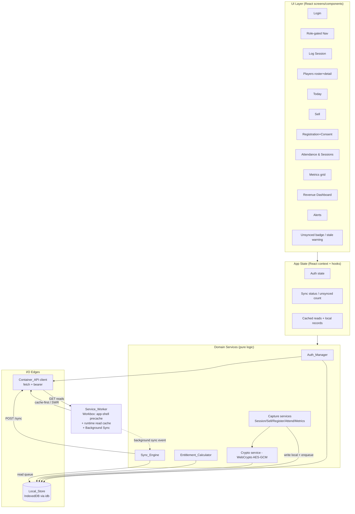
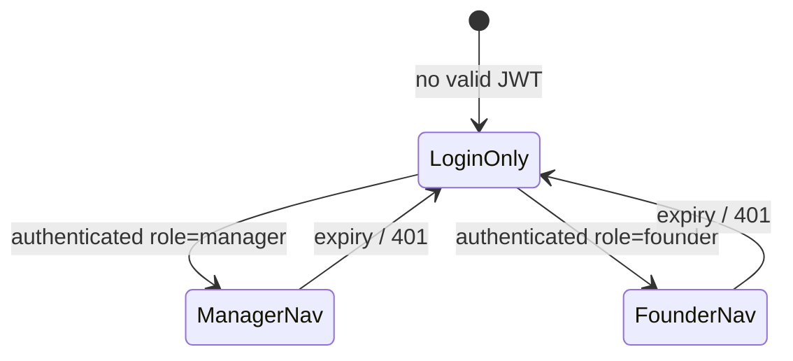

# Design Document: Revenue PWA

## Overview

The Revenue_PWA is an offline-first, installable Progressive Web App (React + Vite + TypeScript) that is the phone-first capture and reporting client for the FunHouse Operating System. It consumes the already-delivered Spec 2 **Container_API** and adds **no backend changes**. Every core capture (session, attendance, registration, consent, payment, entitlement draw/create, metrics) is written to a local **IndexedDB** store first and confirmed to the user without any network call; a **Sync_Engine** later flushes those writes to the idempotent, last-write-wins `POST /sync` endpoint. Read views (roster, entitlement balances, revenue summary, alerts) are served from the API when online and from cached copies when offline.

This design is scoped to the PWA client. It maps every design decision back to the requirements in `requirements.md` and matches the real API contract discovered in `funhouse_api/`.

### Confirmed Container_API contract (source of truth)

The design binds to these observed contracts (not assumptions):

- **`POST /auth/login`** → request `{identifier, password}`; `200` → `{access_token, token_type: "bearer", expires_at}`; `401` generic on bad credentials; `422` when a field is missing. (`auth/router.py`, `auth/service.py`)
- **`POST /sync`** → request `{actions: [{client_id, entity, created_at, payload}]}`; `200` → `{results: [{client_id, entity, status, record_id, reason}]}` where `status ∈ {applied, skipped, rejected}`. The batch always returns `200` even when individual actions are `rejected` (per-action isolation). (`sync/router.py`, `sync/service.py`)
- **Sync `entity` values** = `player | consent | session | attendance | payment | entitlement | student_metrics` (`sync/mapping.py` `VALID_ENTITIES`). **`student_metrics` is now an accepted sync entity** (Container API PR #3 — [Dependency D1](#dependency-d1-student_metrics-sync-entity) resolved); it is a natural-key entity keyed on `player_id`/`metric_type`/`measured_at`.
- **Idempotency keys** (server-side, per `sync/mapping.py`):
  - `player` → dedup key over name/birth_date
  - `session` → natural key over `(player_id, session_type, started_at, ended_at)`; `duration_minutes` is a mutable/LWW value field
  - `attendance` → natural key over `(player_id, attendance_date, session_id)`; `present` is mutable
  - `payment` → natural key over `(player_id, product_id, amount_cents, paid_at)`; `method` is mutable; server accepts `amount` (e.g. `"R30"`) or `amount_cents`
  - `consent` → the action's `client_id`
  - `entitlement` → the action's `client_id` (create); a **draw** is signalled by `payload.entitlement_id + payload.amount`
- **Last-write-wins**: server decides winners by device-origin `created_at`, tie-broken by `client_id`. The client MUST therefore preserve `created_at`/`client_id` unchanged across retries (Req 5.7).
- **`GET /players`** → `[{id, first_name, last_name, birth_date, grade, school_id, location_id, consent_status, active}]` (`players/router.py`)
- **`GET /players/{id}/entitlements`** → `[{entitlement_id, product_id, remaining_units, valid_from, valid_to, status}]`; **`remaining_units` is integer minutes** and may be `null` (unlimited). (`entitlements/router.py`, `entitlements/engine.py`)
- **`GET /players/{id}/history`** → `{player_id, sessions[], payments[], entitlement_draws[]}` (`players/router.py`)
- **`GET /revenue/summary`** → `{pay_per_use_cents, subscription_cents, school_contracts_cents}` (integer cents). (`revenue/router.py`)
- **`GET /alerts`** → `[{type, subject_id, detail}]`; alerts are computed server-side and MUST NOT be recomputed on the client. (`alerts/router.py`)
- **`GET /products`** → `[{id, name, type, price_cents, rules, location_id}]` (`payments/router.py`) — used to price the Sell flow and to derive entitlement units for optimistic display.
- **Units**: entitlements are integer minutes; a product rule in hours becomes `hours * 60` (`engine.py`). The client mirrors this integer-minute convention exactly (Req 8).
- **Auth scope**: JWT carries `role` (`founder | manager | facilitator`) and `location_id`; role gates navigation (Req 2).

## Architecture

The client is a layered SPA. The UI never touches the network or IndexedDB directly; it goes through app state, which delegates to domain services. Domain services own all business rules and are the units targeted by property-based tests. The Local_Store and the Container_API client are the only two edges that do I/O.



### Offline capture path vs sync path

```mermaid
sequenceDiagram
  participant U as User
  participant C as Capture service
  participant LS as Local_Store
  participant SE as Sync_Engine
  participant SW as Service_Worker
  participant API as Container_API

  Note over U,LS: Capture path (no network required - Req 4, 7, 10, 12, 14, 15)
  U->>C: Confirm capture
  C->>C: Build domain record + SyncAction (client_id, created_at=device now)
  C->>LS: Write encrypted record + enqueue SyncAction (status=unsynced)
  C-->>U: Confirm success (no network call)

  Note over SE,API: Sync path (Req 5, 6)
  SW->>SE: 'sync' event OR window 'online' event
  SE->>LS: Read unsynced actions
  SE->>API: POST /sync {actions:[...]} + bearer
  API-->>SE: 200 {results:[{client_id,status,reason}]}
  SE->>LS: Match by client_id; applied/skipped -> remove from unsynced;\n rejected -> retain + store reason
  SE->>LS: Update last_successful_sync
  Note right of SE: network error -> retain all, retry later (Req 5.5)
```

### Layer responsibilities

| Layer | Responsibility | Requirements |
|---|---|---|
| UI (React) | Render screens, capture input, show sync/stale/cached indicators; no I/O or business rules | 2, 6, 7, 9–16 |
| App State | Hold auth session, unsynced count, cached reads; subscribe to Local_Store + Sync_Engine events | 2, 6, 11 |
| Auth_Manager | Login, token storage/attachment, expiry/401 handling, re-auth grace | 1, 2, 17 |
| Sync_Engine | Batch queue → `POST /sync`, reconcile by `client_id`, retry, background sync, stale tracking | 5, 6 |
| Entitlement_Calculator | Optimistic minute-balance = cached server balance − pending local draws; block oversell | 8 |
| Capture services | Produce domain record(s) + SyncAction(s) per flow | 4, 7, 10, 12, 14, 15 |
| Crypto service | AES-GCM encrypt/decrypt personal-data payloads at rest | 17 |
| Local_Store | Durable IndexedDB persistence (queue, records, cached reads, meta) | 4, 9, 11, 13, 16 |
| Container_API client | `fetch` wrapper: HTTPS, bearer attach, 401 surfacing | 1, 5, 13, 16, 17 |
| Service_Worker | App-shell precache, runtime read caching, Background Sync registration | 3, 5 |

## PWA / Service Worker (Req 3, 5)

Built with **`vite-plugin-pwa`** (Workbox under the hood) in `injectManifest` or `generateSW` mode. We use **`generateSW`** for the precache manifest plus declarative `runtimeCaching`, and register a supplementary Background Sync via a small custom plugin where supported.

### Manifest (Req 3.1)

```json
{
  "name": "FunHouse Revenue",
  "short_name": "FunHouse",
  "start_url": "/",
  "scope": "/",
  "display": "standalone",
  "background_color": "#0b0b0f",
  "theme_color": "#0b0b0f",
  "icons": [
    { "src": "/icons/icon-192.png", "sizes": "192x192", "type": "image/png" },
    { "src": "/icons/icon-512.png", "sizes": "512x512", "type": "image/png" },
    { "src": "/icons/icon-maskable-512.png", "sizes": "512x512", "type": "image/png", "purpose": "maskable" }
  ]
}
```

### Precache (Req 3.2, 3.3)

Workbox precaches the build output (`index.html`, hashed JS/CSS chunks, icons, fonts) via `self.__WB_MANIFEST`. On `install` the shell is cached; on offline launch the navigation route is served from the precached `index.html` (single-page app-shell fallback via `NavigationRoute`), so the interface renders with zero connectivity.

### Update-on-next-launch (Req 3.4)

`vite-plugin-pwa` is configured with `registerType: 'autoUpdate'`. A new deployed service worker installs in the background and activates on the next launch (`skipWaiting` + `clientsClaim` deferred to next navigation), serving updated assets. The app shows a subtle "update ready" affordance but does not force reload mid-capture.

### Runtime caching for GET reads (Req 9.2, 13.5, 16.3)

Read endpoints must render offline with a "cached" indicator. Two complementary mechanisms:

1. **Workbox runtime cache** (HTTP-level) for resilience, and
2. **Local_Store cached-read mirror** (application-level) which is the authoritative source the UI reads from and which drives the "cached"/freshness indicator.

| Endpoint | Workbox strategy | Rationale |
|---|---|---|
| `GET /revenue/summary` | `StaleWhileRevalidate` | Show cached instantly, refresh in background (Req 13.5) |
| `GET /alerts` | `StaleWhileRevalidate` | Cached offline, no client recompute (Req 16.3, 16.4) |
| `GET /players` | `StaleWhileRevalidate` | Roster renders offline (Req 9.2) |
| `GET /players/{id}/entitlements` | `NetworkFirst` (fallback cache) | Balance freshness preferred; falls back to cache offline (Req 8.5) |
| `GET /products` | `CacheFirst` (long TTL) | Catalog is near-static; needed offline for Sell/units (Req 12) |

The application layer additionally writes each successful read into the `cached_reads`/`entitlement_balances` object stores with a `cached_at` timestamp; the UI derives its offline "cached" badge from whether the currently rendered data came from the store rather than a live fetch.

### Background Sync (Req 5.2)

Where the Background Sync API is available, the Sync_Engine registers a sync tag (`funhouse-sync`) so the queue flushes when connectivity returns even if the app is backgrounded. A `sync` event in the service worker posts a message to any open client to run the flush, or (when no client is open) the SW itself calls a shared flush routine bound to the same Local_Store. **Foreground fallback**: the window listens for the `online` event and a periodic timer to trigger `Sync_Engine.flush()` on browsers without Background Sync (Req 5.1).

## Local_Store schema (IndexedDB)

The Local_Store is a single IndexedDB database (`funhouse-revenue`, version-managed) accessed through the thin **`idb`** wrapper. Object stores:

### `sync_queue` — the durable Sync_Queue (Req 4.2, 4.3, 5, 6)

- **keyPath**: `client_id` (string UUID, unique per device — Req 4.3)
- **value**: `SyncAction` + local status metadata
- **indexes**:
  - `by_status` on `status` (`unsynced | applied | skipped | rejected`) — derive unsynced count/badge (Req 6.1)
  - `by_entity` on `entity`
  - `by_created_at` on `created_at` — stable batch ordering (Req 5.1)
  - `by_player` on `payload.player_id` (via stored `player_id` mirror) — Entitlement_Calculator pending-draw lookup (Req 8.2)

Stored shape:
```
{ client_id, entity, created_at, payload, status, reason?, player_id?, attempt_count }
```

### Local domain record stores (Req 4.1, 4.5, 9.3)

One store per captured entity so local reads (Today totals, player detail, offline roster additions) work without the server:

- `players` — keyPath `local_id`; index `by_client_id`, `by_name`
- `sessions` — keyPath `local_id`; index `by_day` (local capture date), `by_player`
- `payments` — keyPath `local_id`; index `by_day`, `by_player`
- `entitlements` — keyPath `local_id`; index `by_player`, `by_client_id`
- `consents` — keyPath `local_id`; index `by_player`
- `attendance` — keyPath `local_id`; index `by_session`, `by_player`
- `student_metrics` — keyPath `local_id`; index `by_day` (synced live, keyed on `player_id`; see [D1](#dependency-d1-student_metrics-sync-entity) — resolved)

Each personal-data-bearing record stores its sensitive fields as an **encrypted blob** (see [POPIA](#popia-on-device-protection-req-17)); non-sensitive index keys (e.g. `by_day`, `client_id`) are stored in clear so indexing still works.

### Cached server reads (Req 9.2, 13.5, 16.3)

- `cached_reads` — keyPath `key` (e.g. `revenue:summary:{period}:{location}`, `alerts`, `players`); value `{ key, data, cached_at }`
- `entitlement_balances` — keyPath `player_id`; value `{ player_id, balances: BalanceOut[], cached_at }` (Req 8.2, 8.5)

### Auth / meta (Req 5.7, 6.4, 17)

- `meta` — keyPath `key`; entries include:
  - `device_id` — a UUID generated once per device/install
  - `last_successful_sync` — ISO timestamp (drives >5-day stale warning, Req 6.4)
  - `session` — encrypted `{ access_token, expires_at, role, location_id }` (Req 1.2, 17)
  - `crypto_salt` — salt for key derivation

`client_id` generation uses `crypto.randomUUID()`; `device_id` is generated once and stored in `meta`, guaranteeing per-device uniqueness of every action's `client_id` (Req 4.3).

## Auth_Manager (Req 1, 2, 17)

Responsibilities and rules:

- **Login (Req 1.1, 1.4)**: validate non-empty `identifier` and `password` client-side; block submit + show field-level message when empty (1.4). On submit, `POST /auth/login`.
- **Success (Req 1.2)**: store `{access_token, expires_at, role, location_id}` in the `meta.session` entry in **device-protected storage** — IndexedDB with the personal/session payload encrypted at rest via the Crypto service (browsers expose no OS keychain; this is the honest best-effort, see POPIA limitations).
- **401 on login (Req 1.3)**: show generic "invalid credentials"; store no token.
- **Attach bearer (Req 1.5)**: while a stored JWT exists and `expires_at` is in the future, the API client attaches `Authorization: Bearer <token>` to every Container_API request and every `POST /sync`.
- **Expiry (Req 1.6, 2.3)**: if token absent or `expires_at <= now`, route to login and **retain** all queued Unsynced_Items in Local_Store. A **≤30s re-auth grace** may keep already-displayed personal data visible while re-auth completes (Req 17.3).
- **401 on any API call (Req 1.7)**: clear the stored JWT and prompt re-login.
- **HTTPS only (Req 17.4)**: the API client rejects non-HTTPS base URLs.
- **Role gating (Req 2)**: the decoded `role` claim drives navigation (see below).

## Role-gated navigation (Req 2)

A single route guard reads the auth state:

- No valid JWT → only `/login` reachable (Req 2.3).
- `manager` → Log Session, Players, Today, Sell (Req 2.1).
- `founder` → Revenue Dashboard, Attendance & Sessions, Metrics Entry, Alerts (Req 2.2).
- Screens outside the role are excluded from nav controls and their routes redirect (Req 2.4).



## Sync_Engine (Req 5, 6)

The Sync_Engine is a pure-logic orchestrator over the Local_Store and API client. Core routine `flush()`:

1. **Collect** all `sync_queue` entries with `status = unsynced`, ordered by `created_at` (then `client_id`) for deterministic batching (Req 5.1).
2. **Build batch** `{actions: [{client_id, entity, created_at, payload}]}` — each action serialized **exactly** in the API's `SyncAction` shape. `created_at` and `client_id` are copied verbatim from the stored action, never regenerated (Req 5.7).
3. **POST /sync** with bearer token.
4. **On `200`**: for each returned result, match to the local action **by `client_id`** (Req 5.3):
   - `applied` or `skipped` → set local status accordingly and **remove from the unsynced set** (Req 5.4).
   - `rejected` → keep the local record, set `status = rejected`, store `reason` (Req 5.6). Rejected actions are excluded from future batches but surfaced to the user (Req 6.5).
   - Any submitted action with **no matching result** is treated as still-unsynced and retried.
5. **Update `last_successful_sync`** to now when the POST returned `200` (Req 6.4 basis).
6. **On network error / non-200 transport failure**: retain all affected actions as `unsynced` (increment `attempt_count`) for a later attempt (Req 5.5). No action is lost.

### Idempotency & retry safety

Because server keys are deterministic (`client_id` or natural/dedup key) and applied/skipped actions are removed locally, re-flushing after a successful reconcile **cannot** re-send an already-terminal action, and even an accidental re-send is a server-side `skipped` no-op. This underpins Property 1 (queue idempotency) and Property 5 (created_at/client_id preserved).

### Background sync & fallback (Req 5.2)

- Register `navigator.serviceWorker.ready.then(r => r.sync.register('funhouse-sync'))` after each enqueue when the API is present.
- SW `sync` event → message clients to `flush()`, or run a headless flush.
- Fallback: `window.addEventListener('online', flush)` plus a lightweight interval while unsynced actions remain, for browsers without Background Sync.

### Sync status & stale device (Req 6)

- **Unsynced count/badge (Req 6.1, 6.2)**: derived from `count(sync_queue where status=unsynced)`; the UI subscribes to a store-change event and re-derives on every change.
- **Synced state (Req 6.3)**: when the unsynced count is `0`, show the synced indicator.
- **Stale warning (Req 6.4)**: if `now - last_successful_sync > 5 full days`, show a stale-device warning. Synced state and stale warning may display simultaneously.
- **Rejected surfacing (Req 6.5)**: any `rejected` action is listed with its stored `reason`.

## Entitlement_Calculator (Req 8)

Mirrors the server's integer-minute convention exactly. All arithmetic is in **integer minutes**.

- **Optimistic balance (Req 8.2)**: for a player, `optimistic_remaining(entitlement) = cached_server_remaining_units − Σ(pending local draw amounts for that entitlement)` where pending = `sync_queue` entries with `entity = entitlement`, `payload.entitlement_id = e`, `payload.amount` present, and `status = unsynced`. Cached server balance comes from `entitlement_balances` store (from `GET /players/{id}/entitlements`).
- **Unlimited entitlements**: when `remaining_units` is `null` (server unlimited), the calculator treats the balance as unlimited — draws are always permitted and never reduce a displayed number.
- **Display before confirm (Req 8.1)**: show remaining balance, unit total, and reset/validity date (`valid_from`/`valid_to`) before the confirm control is available.
- **Immediate optimistic reduction (Req 8.3)**: confirming an offline draw enqueues an `entitlement` draw action, which immediately lowers the optimistic remaining by the drawn amount (because the new pending action enters the sum).
- **Block oversell (Req 8.4)**: if `optimistic_remaining < requested_amount`, the entitlement payment method for that amount is disabled/prevented.
- **Block negative & zero on empty (Req 8.6)**: if `optimistic_remaining` is negative, prevent any draw including a zero-amount draw.
- **Refresh (Req 8.5)**: a fresh `GET /players/{id}/entitlements` replaces the cached server balance for that player in `entitlement_balances`.

### Draw vs create mapping

- A **draw** (Log Session paying by entitlement) → `entitlement` action with `payload = { entitlement_id, amount }` (amount in minutes). This matches `service._apply_entitlement`'s draw branch (`entitlement_id + amount`).
- A **create** (Sell subscription/Holiday Special) → `entitlement` action with `payload = { player_id, product_id }`. The server derives units/window from `products.rules`.

## Capture flows / components (Req 4, 7, 9, 10, 11, 12, 14, 15)

Each capture service is a pure function `buildActions(input, context) → { records[], actions[] }` consumed by a thin React screen. Every completed capture writes local record(s) and enqueues exactly one SyncAction per resulting entity (Req 4.1, 4.2), all offline-capable (Req 4.4).

### Log Session — `Session_Logger` (Req 7, 8)

- Controls: player (search or recent-players list from Local_Store — 7.2), console `PS5 | PS4` (7.3), duration presets `20 | 60 | 120` min + custom minutes (7.4), payment method cash-amount or entitlement-draw (7.5).
- Confirm enabled only when player + duration + payment method chosen (7.6).
- On confirm (7.7): write a `session` record and enqueue a `session` action `{player_id, session_type: "lounge", started_at, ended_at, duration_minutes}`; **plus** either
  - cash → a `payment` action `{player_id, amount_cents|amount, method:"cash", paid_at}`, or
  - entitlement → an `entitlement` draw action `{entitlement_id, amount: duration_minutes}` (gated by Entitlement_Calculator).
- No network required (7.8). `session_type` uses the allowed value `"lounge"` (from loader `ALLOWED_SESSION_TYPES`).

### Players roster + detail (Req 9)

- Roster lists in-scope players with name, entitlement balance, last visit date, entitlement status (9.1); offline renders from cached `GET /players` in `cached_reads`/`players` store (9.2).
- Detail merges server history (`GET /players/{id}/history`) with locally captured, not-yet-synced records from the local stores (9.3).
- Name search filters roster (9.4); empty roster renders empty state (9.5).

### Registration + consent — `Registration_Module` (Req 10)

- Fields: player name, guardian phone, four `Consent_Type` toggles (10.1).
- Require non-empty player name (10.2) and an on-screen guardian confirmation action (10.3) before submit.
- On submit (10.4): write a `player` record + one `consent` record per captured Consent_Type; enqueue a `player` action `{first_name,(last_name)}` and one `consent` action per type `{player_id, consent_type, granted, granted_at}`.
- Personal fields limited to name, guardian phone, four consents; **no** national ID / address (10.5, 17.5). Offline-capable (10.6).
- **Local player linkage**: because the server assigns the real player id, consent/session actions captured before the player syncs reference a **local player id**; the Sync_Engine orders the `player` action first (earliest `created_at`) and, after it is `applied`, resolves dependent actions' `player_id` from the returned `record_id`. This client-side id-resolution is documented as [Dependency D2](#dependency-d2-local-id-resolution).

### Today (Req 11)

- Running cash total for the current day computed from local `payments` (11.1); count of sessions logged today from local `sessions` (11.2); cash total shown against the **R550** monthly pace target (11.3); current Unsynced_Items count shown, zero when none (11.4). All computed from Local_Store so it renders offline (11.5).

### Sell — `Sell_Module` (Req 12)

- Product options: pay-per-use cash, new subscription, Holiday Special pass (12.1). Prices sourced from cached `GET /products`.
- New subscription: record **R350** price and allow selecting **up to four** members (12.2); prevent adding a fifth (12.4).
- On complete (12.3): write a `payment` record and, for subscription/Holiday Special, an `entitlement` **create** action `{player_id, product_id}`; enqueue corresponding actions. Offline-capable (12.5).

### Attendance & school sessions — `Attendance_Module` (Req 14)

- Require session type `lesson | kit | esports` (14.1) — all valid server `session_type`s.
- Class roster with tap-to-toggle attendance per member (14.2).
- Session-type quick field: kit→kit-module, esports→match-particulars, lesson→lesson-reference (14.3), carried in the `session` payload (e.g. as a note/reference field).
- On confirm (14.4): write a `session` record + one `attendance` record per present member; enqueue a `session` action and one `attendance` action `{session_id, player_id, attendance_date, present:true}` per present member. Offline-capable (14.5).

### Metrics — `Metrics_Module` (Req 15)

- Grid: student name, words-per-minute, accuracy (15.1); accept only non-negative numeric input for wpm/accuracy (15.2).
- Each row's student is a **selected registered player** (chosen with the shared player search/select control reused from Log Session), so the saved metric carries a `player_id`.
- On save (15.3): write a `student_metrics` record and enqueue a Sync_Action for it. **`/sync` now accepts the `student_metrics` entity ([D1](#dependency-d1-student_metrics-sync-entity) resolved, Container API PR #3)**, so the action enqueues with the normal `unsynced` status (`entity: "student_metrics"`, payload `{player_id, metric_type: 'typing_wpm'|'typing_accuracy', value, measured_at}`) and the Sync_Engine includes it in the next flush batch, reconciling it (applied/skipped/rejected) like the other natural-key entities. The entity is keyed server-side on `player_id`/`metric_type`/`measured_at` (the server sets `logged_by`/`location` and stores `value` as TEXT); a metric captured for an offline-registered player gets the same Dependency-D2 local-id rewrite session/payment get. Offline-capable (15.4). The student's display name stays personal data — encrypted at rest locally (Req 17.1) and never sent on the wire.

## Read views (Req 13, 16)

### Revenue Dashboard (Req 13)

- Renders three streams (pay-per-use, subscription, school-contract) from `GET /revenue/summary` (13.1), converting integer cents → Rand for display.
- Always shows the school-contract stream even at R0 (13.2).
- Period selector daily/weekly/monthly (13.3) and location selector (13.4) drive query params; each `(period, location)` result is cached under its own `cached_reads` key.
- Offline renders the last cached summary with a "cached" indicator (13.5).

> Note: `GET /revenue/summary` in Spec 2 returns totals scoped by the caller; period/location **query parameters** are assumed to be accepted by the endpoint. If the deployed endpoint ignores them, the dashboard falls back to the default scoped summary and disables the filters — recorded as [Dependency D3](#dependency-d3-revenue-filters).

### Alerts (Req 16)

- Online: `GET /alerts`, display each alert's `type` and `subject` (`subject_id` + `detail`) (16.1).
- Renders the four alert types as returned: no-session-in-7-days, entitlement-expiring, subscription-payment-due, unsynced-device-older-than-5-days (16.2).
- Offline: last cached alerts with "cached" indicator (16.3).
- **No client recompute** — alerts are displayed exactly as received (16.4).

## POPIA on-device protection (Req 17)

- **Encryption at rest (Req 17.1)**: personal-data payloads (player name, guardian phone, consents, and any capture carrying personal data) are encrypted with **WebCrypto AES-GCM (256-bit)** before being written to IndexedDB. A per-record random 96-bit IV is stored alongside the ciphertext.
- **Key management**: the AES key is derived via **PBKDF2** (WebCrypto) from a login-time secret combined with the stored `crypto_salt`, held only as a non-extractable `CryptoKey` in memory for the authenticated session. It is not persisted in extractable form.
- **Withhold display until authenticated (Req 17.2)**: with no in-memory key/valid session, encrypted personal data cannot be decrypted or displayed; the UI shows the login screen.
- **Re-auth on expiry (Req 17.3)**: at `expires_at`, personal data display requires re-authentication, with a ≤30s grace for already-rendered data.
- **HTTPS only (Req 17.4)** and **minimal fields (Req 17.5)**: no national ID numbers or residential addresses are ever collected or stored.
- **Honest limitations**: a browser has no hardware-backed keystore for a web origin; a determined attacker with the unlocked device and the running session key can read data. AES-GCM at rest protects data at rest against casual inspection of IndexedDB and against access when no session key is in memory, but is **not** equivalent to OS-level secure enclave protection. This trade-off is documented so it is not mistaken for stronger guarantees.

## Data Models

TypeScript types the client uses. Payload types match the API contract exactly.

```typescript
// ---- Sync primitives (match sync/router.py SyncActionModel / SyncResultModel) ----
type EntityType =
  | 'player' | 'consent' | 'session' | 'attendance' | 'payment' | 'entitlement'
  | 'student_metrics'; // live entity, keyed on player_id/metric_type/measured_at (D1 resolved)

type SyncStatus = 'unsynced' | 'applied' | 'skipped' | 'rejected' | 'blocked';

interface SyncAction<P = Record<string, unknown>> {
  client_id: string;      // crypto.randomUUID(), unique per device (Req 4.3)
  entity: EntityType;
  created_at: string;     // ISO; device time of capture, preserved across retries (Req 5.7)
  payload: P;
}

interface StoredSyncAction<P = Record<string, unknown>> extends SyncAction<P> {
  status: SyncStatus;
  reason?: string;        // set when status === 'rejected' (Req 5.6)
  player_id?: string;     // mirror for by_player index (Req 8.2)
  attempt_count: number;
}

interface ActionResult {  // from POST /sync response
  client_id: string;
  entity: string;
  status: 'applied' | 'skipped' | 'rejected';
  record_id: string | null;
  reason: string | null;
}
interface SyncResult { results: ActionResult[]; }

// ---- Per-entity payloads (match sync/service.py handlers) ----
interface PlayerPayload {
  first_name: string; last_name?: string;
  birth_date?: string; grade?: string;
  location_id?: string; school_id?: string;
}
interface ConsentPayload {
  player_id: string; consent_type: ConsentType;
  granted: boolean; granted_at?: string; method?: string;
}
type ConsentType = 'media' | 'data_processing' | 'participation' | 'communications';
interface SessionPayload {
  player_id: string;
  session_type: 'lounge' | 'lesson' | 'kit' | 'esports';
  started_at: string; ended_at: string; duration_minutes: number;
  school_id?: string; reference?: string; // kit-module / match-particulars / lesson-reference
}
interface AttendancePayload {
  session_id: string; player_id: string;
  attendance_date: string; present: boolean; school_id?: string;
}
interface PaymentPayload {
  player_id: string; product_id?: string;
  amount_cents: number;    // integer cents (server also accepts `amount`)
  method?: string; paid_at?: string;
}
interface EntitlementCreatePayload { player_id: string; product_id: string; }
interface EntitlementDrawPayload { entitlement_id: string; amount: number; } // minutes
interface StudentMetricsPayload {  // live entity (D1 resolved); natural key = player_id/metric_type/measured_at
  player_id?: string;              // display name is personal → encrypted at rest, never sent
  metric_type: 'typing_wpm' | 'typing_accuracy';
  value: number; measured_at: string;
}

// ---- Cached server reads (match read routers) ----
interface PlayerOut {
  id: string; first_name: string; last_name: string | null;
  birth_date: string | null; grade: string | null;
  school_id: string | null; location_id: string;
  consent_status: string; active: boolean;
}
interface BalanceOut {              // GET /players/{id}/entitlements
  entitlement_id: string; product_id: string;
  remaining_units: number | null;  // integer MINUTES; null = unlimited
  valid_from: string | null; valid_to: string | null; status: string;
}
interface PlayerHistory {
  player_id: string;
  sessions: Record<string, unknown>[];
  payments: Record<string, unknown>[];
  entitlement_draws: Record<string, unknown>[];
}
interface RevenueSummary {          // GET /revenue/summary
  pay_per_use_cents: number; subscription_cents: number; school_contracts_cents: number;
}
interface Alert { type: string; subject_id: string; detail: string; } // GET /alerts
interface ProductOut {              // GET /products
  id: string; name: string; type: string;
  price_cents: number; rules: Record<string, unknown>; location_id: string;
}

interface LoginResponse { access_token: string; token_type: 'bearer'; expires_at: string; }

// ---- Meta ----
interface Session { access_token: string; expires_at: string; role: 'manager' | 'founder' | 'facilitator'; location_id: string | null; }
interface Meta {
  device_id: string;
  last_successful_sync: string | null;
  crypto_salt: string;
}

// ---- Encrypted-at-rest envelope for personal data (Req 17.1) ----
interface EncryptedField { iv: string; ciphertext: string; } // base64
```

### IndexedDB store definitions

| Store | keyPath | Indexes | Encrypted fields |
|---|---|---|---|
| `sync_queue` | `client_id` | `by_status`, `by_entity`, `by_created_at`, `by_player` | personal fields inside `payload` |
| `players` | `local_id` | `by_client_id`, `by_name` | name, guardian_phone |
| `sessions` | `local_id` | `by_day`, `by_player` | — |
| `payments` | `local_id` | `by_day`, `by_player` | — |
| `entitlements` | `local_id` | `by_player`, `by_client_id` | — |
| `consents` | `local_id` | `by_player` | consent metadata |
| `attendance` | `local_id` | `by_session`, `by_player` | — |
| `student_metrics` | `local_id` | `by_day` | student name (synced by `player_id`, D1 resolved) |
| `cached_reads` | `key` | — | personal fields in cached rosters |
| `entitlement_balances` | `player_id` | — | — |
| `meta` | `key` | — | `session` |


## Correctness Properties

*A property is a characteristic or behavior that should hold true across all valid executions of a system — essentially, a formal statement about what the system should do. Properties serve as the bridge between human-readable specifications and machine-verifiable correctness guarantees.*

The following properties are derived from the prework analysis and target the pure-logic services (Sync_Engine, Entitlement_Calculator, capture builders, Local_Store round-trips, validation, and crypto). They are written for property-based testing with **fast-check** (≥100 runs each).

### Property 1: Sync-queue idempotency on re-flush

*For any* Sync_Queue and any `POST /sync` response marking a subset of actions `applied`/`skipped`, running `flush()` again produces a batch that contains none of those terminal actions and issues no duplicate action for them; and applying the same reconcile twice yields the same queue state as applying it once (idempotent).

**Validates: Requirements 5.3, 5.4**

### Property 2: Every completed capture creates exactly one action per resulting entity with a unique, device-origin identity

*For any* sequence of completed captures (session, registration, sell, attendance, metrics), each resulting entity produces exactly one Sync_Action, every action's `client_id` is unique across all actions created on the device, and every action's `created_at` equals the device capture time and its `payload` carries the required fields for its entity.

**Validates: Requirements 4.1, 4.2, 4.3, 7.7, 10.4, 12.3, 14.4, 15.3**

### Property 3: Local persistence round-trip across relaunch

*For any* set of local records and queued actions written to the Local_Store, closing and reopening the store yields exactly the same records and pending queue entries (no loss, no reordering of the unsynced set by `created_at`).

**Validates: Requirements 4.5**

### Property 4: Offline capture performs no network call

*For any* capture action executed while offline, the capture completes successfully and the Container_API client is never invoked.

**Validates: Requirements 4.4, 7.8, 10.6, 12.5, 14.5, 15.4**

### Property 5: created_at and client_id are preserved across retries

*For any* Sync_Action and any number of successive `flush()` attempts (including intervening network errors), the action's `created_at` and `client_id` transmitted to `POST /sync` remain byte-for-byte identical to the values assigned at capture.

**Validates: Requirements 5.7**

### Property 6: Reconcile clears terminal actions and retains rejections with a reason

*For any* batch and any `POST /sync` result set (in any order), each action matched by `client_id` with `applied` or `skipped` is removed from the unsynced set, and each `rejected` action is retained locally with its returned `reason` recorded and surfaced.

**Validates: Requirements 5.3, 5.4, 5.6, 6.5**

### Property 7: Network error retains the entire queue unchanged

*For any* Sync_Queue, when `POST /sync` fails with a network error, the set of Unsynced_Items after the attempt equals the set before the attempt (only `attempt_count` may change).

**Validates: Requirements 5.5**

### Property 8: Unsynced badge equals the count of unsynced actions

*For any* Sync_Queue, the displayed unsynced-items count equals the number of actions with status `unsynced`, and it re-derives to the correct value after any enqueue or reconcile (zero when none remain).

**Validates: Requirements 6.1, 6.2, 6.3, 11.4**

### Property 9: Stale-device warning triggers strictly after 5 full days

*For any* `last_successful_sync` timestamp and current device time, the stale-device warning is shown if and only if the elapsed time is strictly greater than 5 full days; the warning may coexist with the synced state.

**Validates: Requirements 6.4**

### Property 10: Optimistic entitlement balance equals cached minus pending draws

*For any* cached server balance (integer minutes, or unlimited) and any set of pending local entitlement-draw actions for that entitlement, the optimistic remaining equals the cached `remaining_units` minus the sum of pending draw amounts (and is treated as unlimited when the cached value is null).

**Validates: Requirements 8.2, 8.3**

### Property 11: Draws never exceed cached-minus-pending and are never driven negative

*For any* entitlement state, an entitlement draw of `amount` is permitted if and only if the entitlement is unlimited, or `0 < amount ≤ optimistic_remaining` and `optimistic_remaining ≥ 0`; a negative optimistic balance blocks every draw including a zero-amount draw, and no accepted draw drives the optimistic remaining below zero.

**Validates: Requirements 8.4, 8.6**

### Property 12: Refreshing balances replaces the cached value for that player

*For any* player and any newly retrieved `GET /players/{id}/entitlements` result, the cached server balance for that player is replaced by the retrieved value (subsequent optimistic computation uses the new value).

**Validates: Requirements 8.5**

### Property 13: Roster search returns exactly the name matches

*For any* cached roster and any search text, the displayed players are exactly those whose name matches the search text, and each displayed row contains name, entitlement balance, last-visit date, and entitlement status.

**Validates: Requirements 9.1, 9.4**

### Property 14: Player detail merges server history with local unsynced records

*For any* server history and any set of locally captured, not-yet-synced records for a player, the detail view contains every server record and every local unsynced record for that player (union, no omission).

**Validates: Requirements 9.3**

### Property 15: Registration validation requires a non-empty name and guardian confirmation

*For any* registration input, submission is permitted if and only if the player name contains a non-whitespace character and the on-screen guardian confirmation has been given.

**Validates: Requirements 10.2, 10.3**

### Property 16: Stored personal fields are restricted to the allowed set

*For any* captured record written to the Local_Store, the persisted personal fields are a subset of {player name, guardian phone, the four consent values} and never include a national ID number or residential address.

**Validates: Requirements 10.5, 17.5**

### Property 17: Today totals equal sums over the current day's local records

*For any* set of local payment and session records, the Today cash total equals the sum of the current day's cash payments and the Today session count equals the number of the current day's sessions, computed solely from Local_Store data.

**Validates: Requirements 11.1, 11.2, 11.5**

### Property 18: Subscription membership never exceeds four

*For any* sequence of add-member actions on a new subscription, the resulting member set contains at most four members, and any attempt to add a fifth is rejected.

**Validates: Requirements 12.4**

### Property 19: Metrics entry accepts only non-negative numeric input

*For any* input value for words-per-minute or accuracy, the value is accepted if and only if it parses to a non-negative number.

**Validates: Requirements 15.2**

### Property 20: Alerts render exactly as received without recomputation

*For any* alert list returned by `GET /alerts`, the rendered alerts are a one-to-one, order-preserving reflection of the received alerts (each with its `type` and subject), with no client-side rule recomputation or filtering.

**Validates: Requirements 16.2, 16.4**

### Property 21: Personal-data records round-trip through encryption and are never stored as plaintext

*For any* personal-data payload, encrypting then decrypting with the session key yields the original payload, and the bytes persisted to IndexedDB do not contain the plaintext personal fields.

**Validates: Requirements 17.1**

### Property 22: Role-gated navigation exposes exactly the permitted screens

*For any* authentication state, the set of navigable screens equals the exact set permitted for that role (manager, founder), or only the login screen when no valid JWT is present; screens outside the role are never navigable.

**Validates: Requirements 2.1, 2.2, 2.3, 2.4**

## Error Handling

| Condition | Handling | Requirements |
|---|---|---|
| Empty login fields | Client validation blocks submit; field-level message | 1.4 |
| `401` on login | Generic "invalid credentials"; no token stored | 1.3 |
| `401` on any API/sync call | Clear stored JWT; route to login; retain queue | 1.6, 1.7 |
| Token expired (`expires_at ≤ now`) | Route to login; retain queue; ≤30s grace for shown data | 1.6, 17.3 |
| Network error on `POST /sync` | Retain all affected actions; increment attempt; retry later (backoff) | 5.5 |
| Non-200 / malformed sync response | Treat as transport failure → retain queue; log | 5.5 |
| Action `rejected` by server | Retain record; store `reason`; surface in UI; exclude from future batches | 5.6, 6.5 |
| Submitted action with no matching result | Treat as still unsynced; retry | 5.3 |
| Oversell / negative / zero-on-empty draw | Entitlement_Calculator blocks selection before enqueue | 8.4, 8.6 |
| Offline read with no cache yet | Show empty/first-run state with offline indicator | 9.5, 13.5, 16.3 |
| `student_metrics` action | Enqueue `unsynced` and flush live keyed on `player_id`; reconcile like other entities (D1 resolved, API PR #3) | D1 |
| IndexedDB write failure | Surface error, do not confirm capture success (write-before-confirm invariant) | 4.1 |
| Decrypt failure (missing/expired key) | Withhold personal data; require re-auth | 17.2, 17.3 |
| Non-HTTPS API base URL | Reject at client init | 17.4 |

## Testing Strategy

**Dual approach**: property-based tests verify universal correctness of the pure-logic services; unit and integration tests cover concrete examples, edge cases, UI behavior, and wiring.

### Tooling

- **Vitest** as the test runner.
- **React Testing Library** for component behavior (Log Session, Sell, Registration, Today, Dashboard, Alerts, nav guards).
- **fake-indexeddb** to back the Local_Store in tests (real IndexedDB semantics, in-memory).
- **fast-check** for property-based tests (each configured to run **≥100 iterations**).
- **Mocked API client** — a fake `fetch`/MSW handler; **no real network** in any test.

### Property-based tests (fast-check, ≥100 runs)

Each correctness property (Properties 1–22) is implemented by a **single** property test, tagged:

`// Feature: revenue-pwa, Property {number}: {property_text}`

Primary targets:
- **Sync_Engine**: Properties 1, 2, 5, 6, 7, 8, 9 — generate arbitrary queues, arbitrary result permutations (including missing/extra results), and network-error scenarios against a mocked API and fake-indexeddb.
- **Entitlement_Calculator**: Properties 10, 11, 12 — generate arbitrary cached balances (including `null`/unlimited) and pending draw sets in integer minutes.
- **Capture builders / validation**: Properties 2, 4, 15, 16, 18, 19.
- **Local_Store**: Property 3 (persistence round-trip).
- **Read/render logic**: Properties 13, 14, 17, 20.
- **Crypto**: Property 21 (encrypt/decrypt round-trip; ciphertext ≠ plaintext).
- **Navigation**: Property 22 (role → nav-set mapping).

### Unit / example tests

- Login flows: 1.1, 1.2, 1.3, 1.7 (mocked 200/401/422).
- UI presence/enable: 7.1–7.6, 8.1, 10.1, 12.1, 12.2, 13.1–13.5, 14.2, 14.3, 15.1, 16.1.
- Edge cases: 6.3 (zero synced), 9.5 (empty roster), 13.2 (R0 school stream).

### Integration-style tests (small, mocked)

- SW/PWA behavior indicators (Req 3.1–3.4, 5.2) verified via `vite-plugin-pwa`/Workbox config assertions and a small set of service-worker registration tests (browsers' SW/Background Sync are environment-dependent; keep to 1–3 representative checks).
- **End-to-end capture→queue→mock-sync→reconcile**: a handful of integration tests drive a capture through the Local_Store, run `Sync_Engine.flush()` against a mocked `/sync`, and assert reconciled queue state — covering the full offline-first loop without a real backend.

## Dependencies and Assumptions

### Dependency D1: `student_metrics` sync entity — RESOLVED

**Status: resolved** (Container API PR #3). The `POST /sync` `VALID_ENTITIES` set (`sync/mapping.py`) now includes `student_metrics` alongside `{player, consent, session, attendance, payment, entitlement}`. The entity is a **natural-key** entity keyed on `player_id`/`metric_type`/`measured_at`; the server sets `logged_by`/`location` and stores `value` as TEXT (coercing the numeric value). Allowed `metric_type`s are `typing_wpm` and `typing_accuracy`.

**Client resolution**: metrics are now captured against a **selected registered player** and enqueued as normal `unsynced` `student_metrics` actions (payload `{player_id, metric_type, value, measured_at}`). The Sync_Engine includes them in the next flush batch and reconciles them (applied/skipped/rejected) like the other capture entities. A metric captured for an offline-registered player is ordered after the `player` action and gets the same [Dependency D2](#dependency-d2-local-id-resolution) local-id rewrite as session/payment. The student's display name remains personal data — encrypted at rest locally (Req 17.1) and never transmitted.

_Historical note_: before PR #3 the client queued metrics in a forward-compatible `blocked` sub-status (excluded from batches) so they would flush unchanged once the entity existed. That hold is no longer used for metrics; the `blocked` mechanism is retained generically for any future not-yet-accepted entity.

### Dependency D2: Local-id resolution for dependent actions

The server assigns real ids; a `consent`/`session`/`payment`/`entitlement` action captured before its `player` action is applied references a **local** player id. The Sync_Engine orders the `player` action first and rewrites dependent actions' `player_id` from the applied action's returned `record_id` before sending them. This is client-side sequencing; it assumes `POST /sync` returns `record_id` for an applied `player` (confirmed in `sync/router.py` / `service.py`).

### Dependency D3: Revenue summary period/location filters

`GET /revenue/summary` returns a scoped three-stream total. Period (daily/weekly/monthly) and location filtering (Req 13.3, 13.4) are assumed to be supported via query parameters. If the deployed endpoint does not accept them, the dashboard falls back to the default scoped summary and disables the filters. No client-side re-aggregation of revenue is performed.

## Migration / Portability Note

The Revenue_PWA is a **static** build (HTML/JS/CSS + service worker + manifest) that can be hosted on any static host — S3 + CloudFront today, or any other static host later — with no server-side rendering. It communicates **only** with the Container_API over **HTTPS** (Req 17.4) using a configurable base URL. This keeps the client consistent with the FunHouse portability principle: the frontend has no hosting-specific coupling, and moving hosts requires only redeploying the static bundle and pointing it at the same API.
