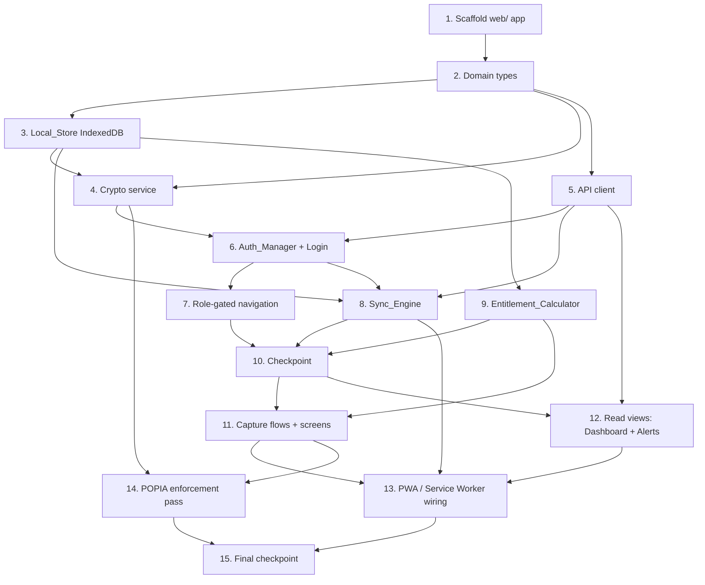

# Implementation Plan: Revenue PWA

## Overview

This plan implements the Revenue_PWA client as a **separate frontend application** under `web/` (i.e. `/projects/sandbox/FunHouse-LMS/web/`), sitting alongside the existing Python `funhouse_api/` and `funhouse_pipeline/`. **No changes are made to the Python backend.**

The build order follows the layered architecture from the design (UI → App State → Domain Services → I/O Edges), building the I/O edges and pure-logic services first (which are the property-test targets), then wiring capture flows, read views, and finally the PWA/service-worker shell. Each task is incremental, builds on the previous, and ends by wiring new code into the running app so there is no orphaned code.

**Conventions**
- All paths are relative to `web/` unless stated otherwise.
- Folder layers per design: `src/ui/`, `src/state/`, `src/domain/`, `src/store/`, `src/api/`.
- Tasks marked with `*` are optional test sub-tasks (property, unit, or integration). Core implementation sub-tasks are never optional.
- Property tests use **fast-check** at **≥100 runs** and are tagged `// Feature: revenue-pwa, Property N: <text>`.
- Unit/component tests use **Vitest + React Testing Library + fake-indexeddb + mocked fetch/MSW**. No real network in any test.
- The design uses concrete TypeScript throughout, so no implementation-language question is required.

## Tasks

- [x] 1. Scaffold the Vite + React + TypeScript app under `web/`
  - Create `web/` with `package.json`, `tsconfig.json`, `vite.config.ts`, `vitest.config.ts`, `index.html`, and the layer folders `src/ui/`, `src/state/`, `src/domain/`, `src/store/`, `src/api/`, plus `src/main.tsx` and `src/App.tsx`.
  - Add runtime deps: `react`, `react-dom`, `react-router-dom`, `idb`, `vite-plugin-pwa` (Workbox).
  - Add dev deps: `typescript`, `vite`, `@vitejs/plugin-react`, `vitest`, `jsdom`, `@testing-library/react`, `@testing-library/jest-dom`, `@testing-library/user-event`, `fake-indexeddb`, `fast-check`, `msw`.
  - Configure Vitest (`jsdom` environment, `setupTests.ts` importing `@testing-library/jest-dom` and `fake-indexeddb/auto`), and a test script (single-run, e.g. `vitest run`) + `build` script.
  - _Requirements: 3.1_
  - _Design: Architecture (layered SPA), Testing Strategy → Tooling_

  - [x]* 1.1 Add a trivial passing test and verify toolchain
    - Add `src/__smoke__/toolchain.test.ts` with a trivial assertion to prove Vitest + TS run.
    - Confirm `npm run test` (single-run) and `npm run build` both succeed.
    - _Design: Testing Strategy → Tooling_

- [x] 2. Define TypeScript domain types matching the API contract
  - Create `src/domain/types.ts` with the Data Models from the design: `EntityType` (incl. live `student_metrics`, D1 resolved), `SyncStatus`, `SyncAction`, `StoredSyncAction`, `ActionResult`, `SyncResult`.
  - Add per-entity payloads: `PlayerPayload`, `ConsentPayload`, `ConsentType`, `SessionPayload`, `AttendancePayload`, `PaymentPayload`, `EntitlementCreatePayload`, `EntitlementDrawPayload`, `StudentMetricsPayload`.
  - Add cached-read types: `PlayerOut`, `BalanceOut` (`remaining_units: number | null` integer minutes), `PlayerHistory`, `RevenueSummary`, `Alert`, `ProductOut`, `LoginResponse`, `Session`, `Meta`, `EncryptedField`.
  - _Requirements: 4.2, 5.3, 8.2_
  - _Design: Data Models; Confirmed Container_API contract_

- [x] 3. Implement the Local_Store (IndexedDB via `idb`)
  - [x] 3.1 Create the database, object stores, and indexes
    - Create `src/store/localStore.ts` opening DB `funhouse-revenue` (versioned) via `idb`.
    - Define stores exactly per design: `sync_queue` (keyPath `client_id`; indexes `by_status`, `by_entity`, `by_created_at`, `by_player`), `players`/`sessions`/`payments`/`entitlements`/`consents`/`attendance`/`student_metrics` (keyPath `local_id` + listed indexes), `cached_reads` (keyPath `key`), `entitlement_balances` (keyPath `player_id`), `meta` (keyPath `key`).
    - Implement CRUD helpers: enqueue action, read unsynced ordered by `created_at`, update action status/reason, write/read local records, write/read cached reads and balances, get/set `meta` entries.
    - Generate `device_id` once via `crypto.randomUUID()` and persist in `meta`; generate each action `client_id` via `crypto.randomUUID()`.
    - _Requirements: 4.1, 4.2, 4.3, 4.5, 5.1, 6.1_
    - _Design: Local_Store schema (IndexedDB); IndexedDB store definitions_

  - [x]* 3.2 Write property test for Local_Store persistence round-trip
    - **Property 3: Local persistence round-trip across relaunch**
    - For any set of local records and queued actions, closing/reopening the store yields identical records and pending queue (no loss, no reorder of the unsynced set by `created_at`). Use `fake-indexeddb`.
    - **Validates: Requirements 4.5**

  - [x]* 3.3 Write unit tests for store indexes and helpers
    - Test `by_status` unsynced count, `by_player` lookup, `by_created_at` ordering, cached-read overwrite semantics.
    - _Requirements: 5.1, 6.1, 8.2_

- [x] 4. Implement the Crypto service (WebCrypto AES-GCM + PBKDF2)
  - [x] 4.1 Implement encrypt/decrypt and key derivation
    - Create `src/domain/crypto.ts`: derive a non-extractable AES-GCM 256-bit `CryptoKey` via PBKDF2 from a login-time secret + stored `crypto_salt`; encrypt/decrypt to/from the `EncryptedField` `{iv, ciphertext}` (base64) envelope with a per-record random 96-bit IV.
    - Provide helpers to encrypt a personal-data payload before a Local_Store write and decrypt on read; hold the key only in memory for the authenticated session.
    - _Requirements: 17.1_
    - _Design: POPIA on-device protection; Crypto service_

  - [x]* 4.2 Write property test for encryption round-trip
    - **Property 21: Personal-data records round-trip through encryption and are never stored as plaintext**
    - For any personal-data payload, decrypt(encrypt(x)) == x and the persisted bytes do not contain the plaintext personal fields.
    - **Validates: Requirements 17.1**

- [x] 5. Implement the Container_API client
  - [x] 5.1 Implement the fetch wrapper
    - Create `src/api/client.ts`: `fetch` wrapper that rejects non-HTTPS base URLs at init, attaches `Authorization: Bearer <token>` when a valid session is present, and surfaces `401` distinctly for the Auth_Manager.
    - Add typed methods for `POST /auth/login`, `GET /players`, `GET /players/{id}/entitlements`, `GET /players/{id}/history`, `GET /revenue/summary`, `GET /alerts`, `GET /products`, `POST /sync`.
    - _Requirements: 1.5, 17.4, 1.7_
    - _Design: Container_API client; Confirmed Container_API contract_

  - [x]* 5.2 Write unit tests for the API client (mocked fetch/MSW)
    - Test HTTPS-only rejection, bearer attachment, and `401` surfacing.
    - _Requirements: 1.5, 1.7, 17.4_

- [x] 6. Implement Auth_Manager and the login screen
  - [x] 6.1 Implement Auth_Manager logic
    - Create `src/domain/authManager.ts` + `src/state/authState.tsx` (React context): client-side non-empty validation; on submit `POST /auth/login`; on `200` store `{access_token, expires_at, role, location_id}` in encrypted `meta.session`; on `401` show generic "invalid credentials" and store nothing.
    - While a stored JWT exists and `expires_at` is in the future, expose it for bearer attachment; on absent/expired token or a `401` from any call, clear the JWT, route to login, and retain queued Unsynced_Items; support a ≤30s re-auth grace for already-displayed personal data.
    - _Requirements: 1.1, 1.2, 1.3, 1.5, 1.6, 1.7, 17.2, 17.3_
    - _Design: Auth_Manager_

  - [x]* 6.2 Write unit tests for Auth_Manager flows
    - Mocked `200`/`401`/`422`: token storage, generic error, expiry routing + queue retention, `401` clears JWT, ≤30s grace.
    - _Requirements: 1.1, 1.2, 1.3, 1.6, 1.7, 17.3_

  - [x] 6.3 Build the login screen UI
    - Create `src/ui/Login.tsx` with identifier + password fields, field-level validation that blocks submission on empty input, and wiring to Auth_Manager.
    - _Requirements: 1.1, 1.4_
    - _Design: Auth_Manager (Login)_

  - [x]* 6.4 Write RTL tests for the login screen
    - Empty-field validation blocks submit; successful/failed login rendering.
    - _Requirements: 1.4_

- [x] 7. Implement role-gated navigation and route guard
  - [x] 7.1 Implement the route guard and navigation shell
    - Create `src/ui/AppShellNav.tsx` + `src/ui/RouteGuard.tsx` + router config in `App.tsx`: no valid JWT → only `/login`; `manager` → Log Session, Players, Today, Sell; `founder` → Revenue Dashboard, Attendance & Sessions, Metrics Entry, Alerts; screens outside a role are excluded from nav and their routes redirect.
    - _Requirements: 2.1, 2.2, 2.3, 2.4_
    - _Design: Role-gated navigation_

  - [x]* 7.2 Write property test for role-gated navigation
    - **Property 22: Role-gated navigation exposes exactly the permitted screens**
    - For any auth state, the navigable-screen set equals the exact permitted set for the role, or only login when no valid JWT is present.
    - **Validates: Requirements 2.1, 2.2, 2.3, 2.4**

- [x] 8. Implement the Sync_Engine
  - [x] 8.1 Implement `flush()` batch build and reconcile
    - Create `src/domain/syncEngine.ts`: collect `status = unsynced` actions ordered by `created_at` then `client_id`; build `{actions:[{client_id, entity, created_at, payload}]}` copying `created_at`/`client_id` verbatim (never regenerated); `POST /sync` with bearer; on `200`, match results by `client_id` — `applied`/`skipped` remove from unsynced, `rejected` retain record + store `reason`, unmatched treated as still-unsynced; update `last_successful_sync` on `200`; on network/non-200 failure retain all affected actions and increment `attempt_count`.
    - _Requirements: 5.1, 5.3, 5.4, 5.5, 5.6, 5.7_
    - _Design: Sync_Engine; Idempotency & retry safety_

  - [x]* 8.2 Write property test for queue idempotency on re-flush
    - **Property 1: Sync-queue idempotency on re-flush**
    - **Validates: Requirements 5.3, 5.4**

  - [x]* 8.3 Write property test for identity preservation across retries
    - **Property 5: created_at and client_id are preserved across retries**
    - **Validates: Requirements 5.7**

  - [x]* 8.4 Write property test for reconcile of terminal + rejected actions
    - **Property 6: Reconcile clears terminal actions and retains rejections with a reason**
    - **Validates: Requirements 5.3, 5.4, 5.6, 6.5**

  - [x]* 8.5 Write property test for network-error queue retention
    - **Property 7: Network error retains the entire queue unchanged**
    - **Validates: Requirements 5.5**

  - [x] 8.6 Implement local-id resolution for dependent actions (D2)
    - Order the `player` action first; after it is `applied`, rewrite dependent `consent`/`session`/`payment`/`entitlement` actions' `player_id` from the applied action's returned `record_id` before sending them.
    - _Requirements: 4.2, 5.3_
    - _Design: Dependency D2 (local-id resolution)_

  - [x] 8.7 Implement sync status, unsynced badge, and stale-device state
    - Create `src/state/syncState.tsx`: derive unsynced count from `count(sync_queue where status=unsynced)`, emit synced state at zero, compute the strictly-greater-than-5-full-days stale warning from `last_successful_sync` (may coexist with synced), and surface `rejected` actions with their `reason`.
    - _Requirements: 6.1, 6.2, 6.3, 6.4, 6.5_
    - _Design: Sync status & stale device_

  - [x]* 8.8 Write property test for the unsynced badge count
    - **Property 8: Unsynced badge equals the count of unsynced actions**
    - **Validates: Requirements 6.1, 6.2, 6.3, 11.4**

  - [x]* 8.9 Write property test for the stale-device threshold
    - **Property 9: Stale-device warning triggers strictly after 5 full days**
    - **Validates: Requirements 6.4**

  - [x] 8.10 Wire background sync and foreground fallback triggers
    - Register the `funhouse-sync` background-sync tag after each enqueue where supported; add the `window 'online'` listener and a lightweight interval while unsynced actions remain, both calling `Sync_Engine.flush()`. (Service-worker `sync` event handler is wired in task 13.)
    - _Requirements: 5.1, 5.2_
    - _Design: Background sync & fallback_

  - [x]* 8.11 Write integration-style capture→queue→mock-sync→reconcile tests
    - Drive a capture into the Local_Store, run `flush()` against a mocked `/sync`, and assert reconciled queue state (applied/skipped removed, rejected retained with reason) using fake-indexeddb + mocked fetch/MSW.
    - _Requirements: 5.1, 5.3, 5.4, 5.6_

- [x] 9. Implement the Entitlement_Calculator
  - [x] 9.1 Implement optimistic balance and draw gating
    - Create `src/domain/entitlementCalculator.ts`: `optimistic_remaining = cached_server_remaining_units − Σ(pending unsynced draw amounts for that entitlement)` in integer minutes; treat `null` cached value as unlimited (always permit, never reduce a displayed number); expose remaining/unit-total/validity for pre-confirm display; block a draw when `optimistic_remaining < amount`; block any draw (including zero-amount) when `optimistic_remaining` is negative; replace the cached balance for a player on a fresh `GET /players/{id}/entitlements`.
    - _Requirements: 8.1, 8.2, 8.3, 8.4, 8.5, 8.6_
    - _Design: Entitlement_Calculator; Draw vs create mapping_

  - [x]* 9.2 Write property test for optimistic balance
    - **Property 10: Optimistic entitlement balance equals cached minus pending draws**
    - **Validates: Requirements 8.2, 8.3**

  - [x]* 9.3 Write property test for draw gating bounds
    - **Property 11: Draws never exceed cached-minus-pending and are never driven negative**
    - **Validates: Requirements 8.4, 8.6**

  - [x]* 9.4 Write property test for balance refresh replacement
    - **Property 12: Refreshing balances replaces the cached value for that player**
    - **Validates: Requirements 8.5**

- [x] 10. Checkpoint - Ensure all tests pass and the app builds
  - Run `npm run test` (single-run) and `npm run build`. Ensure all tests pass, ask the user if questions arise.

- [x] 11. Implement capture flows and screens
  - [x] 11.1 Implement Log Session builder and screen (`Session_Logger`)
    - Create `src/domain/captures/session.ts` (`buildActions`) + `src/ui/LogSession.tsx`: player select via search or recent-players list from Local_Store, console `PS5 | PS4`, duration presets `20 | 60 | 120` + custom minutes, payment method cash-amount or entitlement-draw (gated by Entitlement_Calculator); enable confirm only when player + duration + payment chosen; on confirm write a `session` record (`session_type: "lounge"`) + enqueue a `session` action plus either a `payment` (cash) or `entitlement` draw action; write-before-confirm, no network.
    - _Requirements: 7.1, 7.2, 7.3, 7.4, 7.5, 7.6, 7.7, 7.8, 8.1_
    - _Design: Log Session — Session_Logger_

  - [x]* 11.2 Write RTL/unit tests for Log Session controls
    - Presence of controls and confirm-enable gating (player + duration + payment); pre-confirm balance display.
    - _Requirements: 7.1, 7.2, 7.3, 7.4, 7.5, 7.6, 8.1_

  - [x] 11.3 Implement Players roster and player detail
    - Create `src/ui/Players.tsx` + `src/ui/PlayerDetail.tsx` + `src/domain/roster.ts`: roster rows with name, entitlement balance, last-visit date, entitlement status; offline renders from cached `GET /players`; name search filters; empty roster renders empty state; detail merges `GET /players/{id}/history` with local unsynced records.
    - _Requirements: 9.1, 9.2, 9.3, 9.4, 9.5_
    - _Design: Players roster + detail_

  - [x]* 11.4 Write property test for roster search
    - **Property 13: Roster search returns exactly the name matches**
    - **Validates: Requirements 9.1, 9.4**

  - [x]* 11.5 Write property test for player-detail merge
    - **Property 14: Player detail merges server history with local unsynced records**
    - **Validates: Requirements 9.3**

  - [x] 11.6 Implement Registration + consent (`Registration_Module`)
    - Create `src/domain/captures/registration.ts` + `src/ui/Registration.tsx`: fields player name + guardian phone + four `Consent_Type` toggles; require non-empty name and on-screen guardian confirmation before submit; on submit write a `player` record + one `consent` record per captured type and enqueue a `player` action + one `consent` action per type; restrict personal fields to name/guardian phone/four consents (no national ID/address); encrypt personal fields at rest; offline-capable.
    - _Requirements: 10.1, 10.2, 10.3, 10.4, 10.5, 10.6, 17.5_
    - _Design: Registration + consent — Registration_Module_

  - [x]* 11.7 Write property test for registration validation
    - **Property 15: Registration validation requires a non-empty name and guardian confirmation**
    - **Validates: Requirements 10.2, 10.3**

  - [x]* 11.8 Write property test for restricted personal fields
    - **Property 16: Stored personal fields are restricted to the allowed set**
    - **Validates: Requirements 10.5, 17.5**

  - [x] 11.9 Implement the Today screen
    - Create `src/ui/Today.tsx` + `src/domain/today.ts`: running cash total for the current day from local `payments`, count of today's sessions from local `sessions`, cash total shown against the R550 monthly pace target, current Unsynced_Items count (zero when none); computed entirely from Local_Store so it renders offline.
    - _Requirements: 11.1, 11.2, 11.3, 11.4, 11.5_
    - _Design: Today_

  - [x]* 11.10 Write property test for Today totals
    - **Property 17: Today totals equal sums over the current day's local records**
    - **Validates: Requirements 11.1, 11.2, 11.5**

  - [x] 11.11 Implement the Sell flow (`Sell_Module`)
    - Create `src/domain/captures/sell.ts` + `src/ui/Sell.tsx`: product options pay-per-use cash, new subscription (R350), Holiday Special pass (prices from cached `GET /products`); allow up to four members on a subscription and prevent a fifth; on complete write a `payment` record and, for subscription/Holiday Special, an `entitlement` create action (`{player_id, product_id}`) and enqueue corresponding actions; offline-capable.
    - _Requirements: 12.1, 12.2, 12.3, 12.4, 12.5_
    - _Design: Sell — Sell_Module_

  - [x]* 11.12 Write property test for subscription membership cap
    - **Property 18: Subscription membership never exceeds four**
    - **Validates: Requirements 12.4**

  - [x] 11.13 Implement Attendance & school sessions (`Attendance_Module`)
    - Create `src/domain/captures/attendance.ts` + `src/ui/Attendance.tsx`: require session type `lesson | kit | esports`; roster with tap-to-toggle attendance; session-type quick field (kit→kit-module, esports→match-particulars, lesson→lesson-reference) carried in the `session` payload `reference`; on confirm write a `session` record + one `attendance` record per present member and enqueue a `session` action + one `attendance` action per present member; offline-capable.
    - _Requirements: 14.1, 14.2, 14.3, 14.4, 14.5_
    - _Design: Attendance & school sessions — Attendance_Module_

  - [x] 11.14 Implement the Metrics grid (`Metrics_Module`)
    - Create `src/domain/captures/metrics.ts` + `src/ui/Metrics.tsx`: grid columns student / words-per-minute / accuracy; each row selects a registered player (reusing the Log Session player search/select control) so the metric is keyed on `player_id`; accept only non-negative numeric input for wpm/accuracy; on save write a `student_metrics` record and enqueue a live `student_metrics` action (payload `{player_id, metric_type: 'typing_wpm'|'typing_accuracy', value, measured_at}`) with the normal `unsynced` status; offline-capable.
    - **Note (Dependency D1 — RESOLVED, Container API PR #3):** `student_metrics` is now an accepted `/sync` entity, a natural-key entity keyed on `player_id`/`metric_type`/`measured_at` (server sets `logged_by`/`location`, stores `value` as TEXT). Metrics enqueue `unsynced` and the Sync_Engine includes them in the next batch, reconciling them like the other capture entities; a metric for an offline-registered player gets the same Dependency-D2 local-id rewrite as session/payment. The student's display name stays encrypted at rest and is never sent on the wire. The prior `blocked` forward-compatibility hold is no longer used for metrics (the `blocked` mechanism is retained generically for any future not-yet-accepted entity).
    - _Requirements: 15.1, 15.2, 15.3, 15.4_
    - _Design: Metrics — Metrics_Module; Dependency D1_

  - [x]* 11.15 Write property test for metrics numeric input
    - **Property 19: Metrics entry accepts only non-negative numeric input**
    - **Validates: Requirements 15.2**

  - [x]* 11.16 Write property test for capture action identity across all builders
    - **Property 2: Every completed capture creates exactly one action per resulting entity with a unique, device-origin identity**
    - For any sequence of completed captures (session, registration, sell, attendance, metrics), each resulting entity yields exactly one Sync_Action with a device-unique `client_id`, `created_at` == device capture time, and the required payload fields.
    - **Validates: Requirements 4.1, 4.2, 4.3, 7.7, 10.4, 12.3, 14.4, 15.3**

  - [x]* 11.17 Write property test for offline capture performing no network call
    - **Property 4: Offline capture performs no network call**
    - For any capture executed offline, the capture completes and the Container_API client is never invoked (assert against the mocked client).
    - **Validates: Requirements 4.4, 7.8, 10.6, 12.5, 14.5, 15.4**

- [x] 12. Implement read views (Revenue Dashboard and Alerts)
  - [x] 12.1 Implement the Revenue Dashboard
    - Create `src/ui/RevenueDashboard.tsx` + `src/domain/revenue.ts`: render pay-per-use, subscription, and school-contract streams from `GET /revenue/summary` (cents→Rand), always show the school-contract stream even at R0, period selector (daily/weekly/monthly) and location selector driving query params (each `(period, location)` cached under its own `cached_reads` key), offline render of the last cached summary with a "cached" indicator; apply the D3 fallback (disable filters + default scoped summary if the endpoint ignores params); no client-side re-aggregation.
    - _Requirements: 13.1, 13.2, 13.3, 13.4, 13.5_
    - _Design: Revenue Dashboard; Dependency D3_

  - [x]* 12.2 Write unit tests for the dashboard
    - Three-stream rendering, R0 school stream shown, cached indicator offline, period/location param wiring, D3 fallback.
    - _Requirements: 13.1, 13.2, 13.3, 13.4, 13.5_

  - [x] 12.3 Implement the Alerts view
    - Create `src/ui/Alerts.tsx`: online `GET /alerts` displaying each alert's `type` and subject (`subject_id` + `detail`); render the four alert types as returned; offline render of last cached alerts with a "cached" indicator; display exactly as received with no client-side recomputation or filtering.
    - _Requirements: 16.1, 16.2, 16.3, 16.4_
    - _Design: Alerts_

  - [x]* 12.4 Write property test for alerts rendering fidelity
    - **Property 20: Alerts render exactly as received without recomputation**
    - **Validates: Requirements 16.2, 16.4**

- [x] 13. Wire the PWA / Service Worker
  - [x] 13.1 Configure the manifest and `vite-plugin-pwa`
    - Add the web app manifest (name, short_name, icons 192/512 + maskable, start_url, scope, `display: standalone`) and configure `vite-plugin-pwa` with `registerType: 'autoUpdate'`; add the icon assets under `public/icons/`.
    - _Requirements: 3.1, 3.4_
    - _Design: PWA / Service Worker → Manifest, Update-on-next-launch_

  - [x] 13.2 Configure app-shell precache and runtime read caching
    - Precache the build output via `self.__WB_MANIFEST` with an SPA `NavigationRoute` fallback to `index.html`; configure `runtimeCaching`: `StaleWhileRevalidate` for `GET /revenue/summary`, `GET /alerts`, `GET /players`; `NetworkFirst` for `GET /players/{id}/entitlements`; `CacheFirst` (long TTL) for `GET /products`.
    - _Requirements: 3.2, 3.3, 9.2, 13.5, 16.3_
    - _Design: PWA / Service Worker → Precache, Runtime caching for GET reads_

  - [x] 13.3 Register Background Sync in the service worker
    - Add the SW `sync` event handler for the `funhouse-sync` tag that messages open clients to run `Sync_Engine.flush()` (or a headless flush), completing the wiring started in task 8.10.
    - _Requirements: 5.2_
    - _Design: PWA / Service Worker → Background Sync_

  - [x]* 13.4 Write integration/config tests for PWA behavior
    - Assert manifest fields, `vite-plugin-pwa` runtimeCaching config, and 1–3 representative service-worker registration/background-sync checks.
    - _Requirements: 3.1, 3.2, 3.3, 3.4, 5.2_

- [x] 14. Enforce POPIA on-device protection across the app
  - Verify and wire that every personal-data record write path (registration/player, consent, and any capture carrying personal data) routes sensitive fields through the Crypto service before the Local_Store write while keeping non-sensitive index keys in clear; withhold display of stored personal data until authenticated (no in-memory key → login screen); enforce HTTPS-only at the API client; confirm no national ID/address fields exist in any capture form or payload.
  - _Requirements: 17.1, 17.2, 17.4, 17.5_
  - _Design: POPIA on-device protection_

  - [x]* 14.1 Write unit tests for POPIA enforcement wiring
    - Personal fields encrypted at rest across capture write paths; display withheld with no session key; HTTPS-only rejection; absence of national ID/address fields.
    - _Requirements: 17.1, 17.2, 17.4, 17.5_

- [x] 15. Final checkpoint - Ensure all tests pass and the app builds
  - Run `npm run test` (single-run) and `npm run build`. Ensure all tests pass and the production PWA bundle builds, ask the user if questions arise.

## Notes

- Tasks marked with `*` are optional test sub-tasks and can be skipped for a faster MVP; core implementation sub-tasks must not be skipped.
- Each task references specific requirement clauses and/or design sections for traceability.
- All 22 correctness properties are implemented as single fast-check property tests (≥100 runs), tagged `Feature: revenue-pwa, Property N: <text>`, and placed next to the code they validate.
- **Dependency D1 (metrics) — RESOLVED (Container API PR #3):** `student_metrics` is now an accepted `/sync` entity keyed on `player_id`/`metric_type`/`measured_at`. Metrics are captured against a selected registered player and sync live as normal `unsynced` actions (included in flush batches and reconciled like the other entities, with D2 local-id resolution for offline-registered players). The earlier `blocked` forward-compatibility hold is no longer used for metrics.
- **Dependency D2 (local-id resolution)** is handled in task 8.6; **Dependency D3 (revenue filters)** fallback is handled in task 12.1.
- Scope is strictly the PWA client under `web/`; the Python `funhouse_api/` and `funhouse_pipeline/` are not modified.

## Task Dependency Graph

