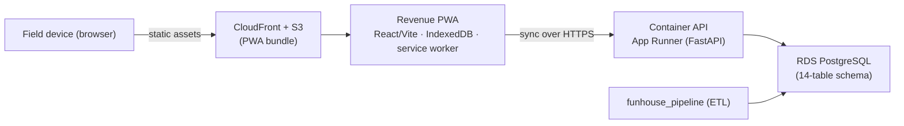

# FunHouse Operating System

The FunHouse Operating System turns FunHouse Digital's paper-era records into a
clean, structured founding dataset and puts it to work behind an offline-first
revenue app. Three components ship in this repository and fit together end to
end: an ETL **pipeline** that lands data in PostgreSQL, a portable **Container
API** that serves it with auth/RBAC/entitlements, and a **Revenue PWA** that
works offline and syncs back to the API.

Everything is built to run in AWS **af-south-1** (Cape Town) for data-residency
under POPIA, on a lean footprint targeting **under US$80/month**.

## Architecture overview

Three shipped components:

- **`funhouse_pipeline/`** — Phase 0 ETL. Runs **Collect → Extract → Validate →
  Load → Archive** over a source folder into a **14-table PostgreSQL schema**
  with **idempotent** migrations and seed (re-running skips duplicates and
  leaves no residue).
- **`funhouse_api/`** — the FunHouse **Container API** (FastAPI). Self-managed
  auth (JWT + bcrypt), RBAC, entitlements, resource endpoints, and the
  offline-sync target for the PWA. Ships as a **single Docker container**,
  **PostgreSQL-only**, no external IdP.
- **`web/`** — the **offline-first Revenue PWA** (React / Vite). Stores data in
  **IndexedDB**, runs a **service worker** for offline use, and **syncs** to the
  Container API when back online.



Data at rest (RDS, S3, SSM) stays in **af-south-1**; the deployment provisions
no load balancer, EKS/ECS, or monitoring beyond CloudWatch defaults.

## Repo layout

```
funhouse_pipeline/   # Phase 0 ETL + PostgreSQL schema/migrations/seed
funhouse_api/        # FastAPI Container API (auth, RBAC, entitlements, sync)
web/                 # offline-first Revenue PWA (React/Vite, IndexedDB, SW)
infra/               # Terraform IaC for af-south-1 (VPC, RDS, App Runner, S3/CloudFront, SSM)
docs/                # deployment runbook, smoke-test checklist, pipeline command reference
tests/               # pytest suite for the pipeline + API (+ Hypothesis property tests)
config.example.yaml  # sample configuration
pyproject.toml       # Python project + dev extras
```

## The pipeline command

The whole pipeline runs from a single documented, re-runnable command:

```bash
funhouse-pipeline run --source-folder <path> --config config.yaml
```

It executes **Collect → Extract → Validate → Load → Archive** end to end over a
`Source_Folder`, threads a resumable run manifest through `.pipeline-state/`, and
prints a summary (collected / extracted / flagged / loaded / skipped / archived).
Re-running over the same folder is idempotent (duplicates are skipped and
recorded). Single stages can be run with `--stage`, and a prior run resumed with
`--resume <run_id>`. Full documentation of the command, its flags, offline
behavior, and provider/config environment variables is in
[`docs/pipeline-command.md`](docs/pipeline-command.md).

## Deploy in ~10 steps

A high-level summary of the first production deploy to **af-south-1** (target
**< US$80/mo**). This is the map, not the territory — the **full, ordered
procedure lives in [`docs/deployment-runbook.md`](docs/deployment-runbook.md)**,
validation steps in
[`docs/smoke-test-checklist.md`](docs/smoke-test-checklist.md), and the
Terraform / cost / migration-equivalence detail in
[`infra/README.md`](infra/README.md).

1. Bootstrap the S3 remote-state bucket (one time).
2. Build the PWA bundle (`web/dist/`) and the Container API Docker image.
3. Push the API image to ECR.
4. Supply secrets out-of-band via an **uncommitted** `*.secrets.tfvars` (never committed).
5. `terraform init` (S3 backend).
6. `terraform apply -var-file=locations/loc1.tfvars -var-file=loc1.secrets.tfvars` — **the founder-run step** (needs live AWS credentials).
7. Run database migrations + seed via an ephemeral in-VPC one-off (no public RDS exposure).
8. Set `cors_origins` to the CloudFront origin and re-apply; a second `plan` must report **no changes** (idempotent).
9. Upload the PWA bundle to S3 and invalidate CloudFront.
10. Walk the smoke-test checklist to validate auth, entitlements, and offline sync.

Location 2 is the **same commands with a different var-file** — a re-run, not a
rewrite. Live `terraform apply`, ECR push, SSM secret seeding, and the smoke run
are founder-run steps requiring AWS credentials.

## Setup

Requires Python 3.11+. Using [uv](https://docs.astral.sh/uv/):

```bash
uv venv --python 3.11
uv pip install -e ".[dev]"
```

## Configuration

Settings load from an optional YAML file overlaid with environment variables
(env wins). See `config.example.yaml`. Region defaults to `af-south-1`;
`LLM_PROVIDER` selects the model provider; `confidence_threshold` controls
validation flagging. Database connection is configured via `DB_HOST`, `DB_PORT`,
`DB_NAME`, `DB_USER`, `DB_PASSWORD`, and `DB_SSLMODE` (`prefer` locally,
`require` against RDS).

## Testing

Three suites, run independently. CI (`.github/workflows/ci.yml`) runs all three.

### Python (pipeline + API)

```bash
uv run pytest            # runs the full suite
```

Most tests are pure unit/property tests. Some exercise the **real PostgreSQL
schema** (schema columns, idempotent deploy, `metric_type` domain enforcement,
and the API's DB-backed paths). They need a reachable PostgreSQL server and are
**skipped automatically** when none is available — the suite never hard-fails
just because there is no database. To enable them, point the suite at a database
via a libpq connection string (or the `DB_*` environment variables above):

```bash
FUNHOUSE_TEST_DSN="host=localhost port=5432 dbname=funhouse_test user=postgres" \
    uv run pytest -m db
```

Each DB-backed test runs inside a disposable schema (created up front, dropped
`CASCADE` afterwards) inside a rolled-back transaction, so tests never interfere
with each other or leave residue.

### Web (Revenue PWA)

```bash
cd web
npm ci
npm run test         # unit tests
npm run build        # production build
```

### Infra (offline gates — no AWS account needed)

```bash
cd infra
terraform fmt -check -recursive
terraform init -backend=false && terraform validate
# Residency + forbidden-service assertions against committed fixtures:
sh scripts/assert_residency.sh    scripts/fixtures/plan_pass.json   # exit 0
sh scripts/assert_no_forbidden.sh scripts/fixtures/plan_pass.json   # exit 0
```

## Applying the schema manually

The migration runner applies `funhouse_pipeline/sql/*.sql` in order and reports
each of the 14 tables as *created* or *already present* (idempotent, Req 1.6):

```python
from funhouse_pipeline.config import load_config
from funhouse_pipeline.db import connect, run_migrations

cfg = load_config("config.yaml")
with connect(cfg) as conn:
    result = run_migrations(conn)
    print(result.summary())
```

## Data residency & POPIA posture

All **Data_At_Rest** (RDS, S3, SSM parameters) is provisioned in **af-south-1**
and the deployment builds no cross-region path. The Container API depends only
on a standard libpq DSN via environment variables and runs auth in-process, so
migrating to another host or region is an env change plus a re-run of
`run_migrations` — documented in `infra/README.md`'s migration-equivalence
table. Any future cross-region model inference would have to be a named,
POPIA-justified, documented decision.
